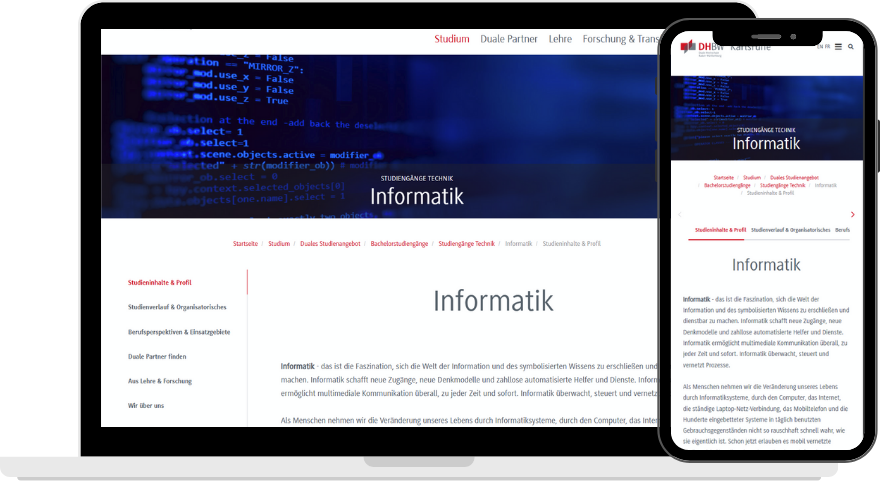

---
title: "Vorlesung Webengineering I - Einführung"
topic: "Webengineering_1_1"
author: "Lukas Panni"
theme: "Berlin"
colortheme: "dove"
fonttheme: "structurebold"
fontsize: 12pt
urlcolor: olive
linkstyle: boldslanted
aspectratio: 169
lang: de-DE
section-titles: true
plantuml-format: svg
...

# Organisatorisches

## Heute

- Organisatorisches
  - Vorstellung
  - Ablauf
  - Material
  - Prüfungsleistungen
- Vorlesungsinhalt & Lernziele
- Einführung Webengineering

## Vorstellung

### Dozent Semester 1: Silas Schnurr

- 2018: Ausbildung Fachinformatiker Anwendungsentwicklung
- 2021: _B.Sc._ Informatik - DHBW Karlsruhe
- 2023: _M.Sc._ Informatik - HKA
- Seit 2015 bei PeakAvenue (ehemals iqs Software GmbH) in Bühl
  - aktuell Softwarearchitekt & Teamleiter Softwareentwicklung

### Ihr

- Firma
- Programmiersprachen?
- Vorkenntnisse Webengineering?
  - Vorkenntnisse Tools: git, docker, VSCode?
- Erwartungen & Wünsche

## Ablauf

- Vorlesung: 66 Vorlesungseinheiten (VE)

  - Dieses Semester: 11 Termine, je 3 VE = 33 VE
    - Donnerstag 8:00 - 10:30 Uhr (3 VE + 15 Minuten Pause)
  - Rest (33 VE) im nächsten Semester bei Hr. Panni

- Vorlesung mit Programmieraufgaben
  - Keine Vorkenntnisse erforderlich
  - Tools: Texteditor, Browser, Terminal, Git, (evtl. Container-Tools, i.e. Docker)
    - Empfehlung: [VSCode](https://code.visualstudio.com/) / [WebStorm](https://www.jetbrains.com/de-de/webstorm/) (kostenlos für Studenten), Firefox, Docker-Desktop
  - kleine Hausaufgaben

## Material

- Vorlesungsfolien \rightarrow{} Slides
- Vorlesungsnotizen (gemeinsam Erarbeitetes) \rightarrow{} Notes
- Sonstiges (Anleitungen, Zusatzmaterial) \rightarrow{} Extra

\rightarrow{} alles auf GitHub [(DHBW-KA-Webengineering/Lecture_Webengineering_2025)](https://github.com/DHBW-KA-Webengineering/Lecture_Webengineering)

\rightarrow{} separates Repo für Code [(DHBW-KA-Webengineering/Lecture_Code)](https://github.com/DHBW-KA-Webengineering/Lecture_Code)

## Prüfungsleistungen

### Projektarbeit:

- Entwicklung einer (kleinen) Webanwendung mit hier gelernten Technologien
- Gruppenarbeit verpflichtend (3 - 5 Studierende)
- Bewertung mit Vorlesung Projektmanagement (Hr. Darwish)
- Note Projektmanagement: Projektmanagement, mehr dazu von Hr. Darwish

\rightarrow{} **Aufgabe bis in 2 Wochen (23.01.): Gruppen bilden & Thema aussuchen**

### Klausur:

- Klausur (60 min) am Ende von Semester 2 über die Themen **beider** Semester

### Note Webengineering:

- Kombinierte Prüfung:
  - 50 % Projekt (Details siehe Notes/Bewertung_Projektarbeit)
  - 50 % Klausur (60 min)

## Projektarbeit - Themenauswahl

- TODO-App
- Zeiterfassung ("Stechuhr")
- Karteikarten-Anwendung ("Anki")
- Snake
- Pac-Man
- API Dashboard

\rightarrow{} siehe [Projekt Themen](https://github.com/DHBW-KA-Webengineering/Lecture_Webengineering/blob/2025/Material/Notes/Projekt_Themen.md)

# Vorlesungsinhalt & Lernziele

## Ziele der Vorlesung

- Was ist eine "Webanwendung" und wie funktioniert sie?
- Grundlegende Architektur von Webanwendungen
- Erstellen einfacher Webanwendungen
- Grundlagen Webdesign & Mobile Webdesign

## Vorlesungsinhalt / Agenda (vorläufig)

- Grundlagen "Web" & Webanwendungen \rightarrow{} _ab heute_
  - HTTP & REST
- Einfache Webanwendungen
  - HTML
  - CSS
- Einführung Webdesign
- Dynamische Webanwendungen
  - JavaScript + Intro TypeScript
  - Interaktion Client/Server
- Fortgeschrittene Themen
  - Architektur moderner Webanwendungen
  - Security: Angriffe, Best-Practices

# Einführung: Webanwendungen

## Webanwendungen (1)

{width=70%}

## Webanwendungen (2)

> Eine **Webanwendung** (auch Online-Anwendung, Webapplikation oder kurz Web-App) ist ein Anwendungsprogramm nach dem **Client-Server-Modell**. Anders als klassische Desktopanwendungen werden Webanwendungen **nicht lokal** auf dem Rechner des Benutzers installiert. Die Datenverarbeitung findet **teilweise auf einem entfernten Webserver** statt. Die Ergebnisse der Datenverarbeitung werden an den lokalen Client-Rechner des Benutzers übertragen (Thin Client). Genutzt wird eine Webanwendung dabei zumeist über einen **Webbrowser**. Diese kommuniziert mit dem Webserver meist über das **HTTP**.
>
> -- [Wikipedia](https://de.wikipedia.org/wiki/Webanwendung)

\rightarrow{} zu komplex!

## Webanwendungen (3)

> Eine **Webanwendung** ist ein Programm, das über einen **Webbrowser** aufgerufen wird und teilweise auf einem **Server** ausgeführt wird.

- Auch nicht unbedingt korrekt
  - Progressive Web Apps (PWAs) können auch teilweise offline (ohne Server) ausgeführt werden
  - z.B. Electron-Anwendungen sind unabhängig von Browser und Server \rightarrow{} integrierte Browser-Engine

## Webanwendungen (4)

> Eine **Webanwendung** ist eine Anwendung, die Web-Technologien (_HTML_, _CSS_, _JavaScript_) verwendet

- Einfache und kurze, aber zyklische Definition
- HTML + CSS werden teilweise auch außerhalb von Webanwendungen benutzt
- JavaScript wird heute praktisch überall benutzt!

\rightarrow{} es gibt keine klare Definition! Das ist aber auch garnicht notwendig.

## Live-Demo: Webanwendungen

- Was passiert beim Abruf einer Webseite? z.B. "lukaspanni.de"

  - Auflösung des Namens zu einer IP-Adresse über DNS \rightarrow{} 37.120.173.24
  - HTTP-Anfrage an diese IP-Adresse an Port 80 (Standard für HTTP)
  - Antwort: 301 Moved Permanently; Location: https://lukaspanni.de/
  - HTTPS-Anfrage an gleiche IP-Adresse an Port 443 (Standard für HTTPS)
  - Antwort: 200 OK, HTML-Code, CSS-Code

- Was passiert bei komplexeren Websites?
