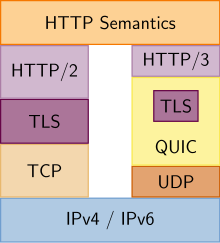
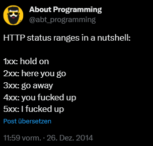
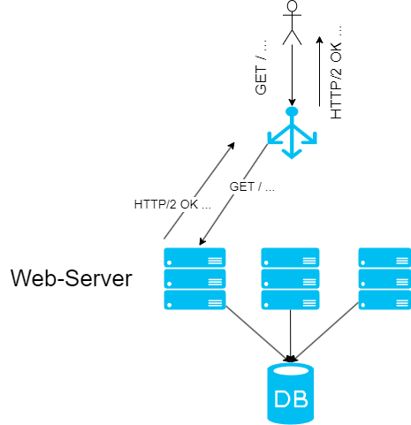
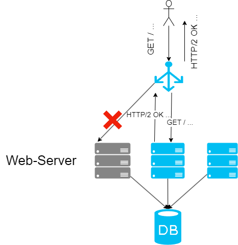

---
title: "Vorlesung Webengineering I - HTTP & REST"
topic: "Webengineering_1_2"
date: 2025-01-16
author: "Lukas Panni / Silas Schnurr"
theme: "Berlin"
colortheme: "dove"
fonttheme: "structurebold"
fontsize: 12pt
urlcolor: olive
linkstyle: boldslanted
aspectratio: 169
lang: de-DE
section-titles: true
plantuml-format: svg
...

# HTTP Grundlagen

## Hypertext Transfer Protocol (HTTP) - Grundlage des Web

- Übertragung von Daten zwischen Webbrowser und Webserver
- Textbasiertes Protokoll
- **Zustandsloses** Protokoll, Request-Response Prinzip
  - Protokoll speichert keine Informationen!
  - Jedes Request-Response-Paar ist unabhängig voneinander
  - Erhöht Skalierbarkeit \rightarrow{} dazu später mehr
  - ABER: Zustandsinformationen (z.B. Logindaten) müssen auf andere Art und Weise gespeichert werden

## Kurze Historie: HTTP-Versionen

- 1996: **HTTP/1.0**
- 1999: **HTTP/1.1**
  - Verschiedene Verbesserungen, z.B. Pipelining zur Reduktion von TCP-Verbindungen
  - Einführung von optionalem "Host"-Header
    - → ermöglicht Nutzung von einem physischen Server für mehrere Webseiten
- 2015: **HTTP/2**
  - **Ziel**: Performanceverbesserungen und Optimierungen
  - Volle Abwärtskompatibilität
  - Multiplexing: mehrere Anfragen über eine Verbindung
  - Server-initiierte Datenübertragung \rightarrow{} konnte sich nicht durchsetzen, seit Chrome 106 (September 2022) nicht mehr unterstützt

## HTTP-Versionen

- 2022: **HTTP/3**
  - Neues Übertragungsprotokoll: **QUIC**
  - Bei zuvor genutztem Multiplexing über TCP ist Head-of-Line-Blocking möglicht
    - Bei Paketverlust müssen alle folgenden Pakete (aller gemultiplexten Streams) auf erneute Übertragung des Verlorenen warten
  - Nutzt mehrere _unabhängige_ parallele Datenströme über UDP, Head-of-Line-Blocking betrifft jeweils nur einen Stream

## HTTP-Versionen - HTTP/3 vs. HTTP/2

{height=65%}

[_CC-BY-SA-4.0_](https://de.wikipedia.org/wiki/Hypertext_Transfer_Protocol#/media/Datei:HTTP-2_vs._HTTP-3_Protocol_Stack.svg)

# HTTP Request - Response

## HTTP Request - Response

**Request**:

```
GET / HTTP/1.1
Host: lukaspanni.de
Accept: */*

```

**Response**:

```
HTTP/1.1 200 OK
Content-Type: text/html
Date: Fri, 17 Nov 2023 12:26:59 GMT

<!DOCTYPE html>
...

```

## HTTP-Request - Aufbau

- Request besteht aus einzelnen Textzeilen (Header), jeweils mit `<CR><LF>` (Zeilenumbruch) getrennt

  - Header endet nach Leerzeile (= `<CR><LF><CR><LF>`)

- Erste Zeile "Request-Line": `<Methode> <Resource> <Protokoll><CR><LF>`
  - Methode: `GET`
  - Resource: `/` (Hauptseite)
  - Protokoll: `HTTP/1.1` (aktuellste Version 3, heute meist Version 2 eingesetzt)

## Verbreitung der HTTP-Versionen

{height=70%}

## HTTP Header

- Jede weitere Zeile im Request: `<Key>: <Value><CR><LF>`
- `Host: lukaspanni.de` \rightarrow{} Pflicht-Header ab HTTP/1.1
  - Erlaubt virtuelle Hosts: mehrere Webseiten auf einem physischen Server (und einer IP)
- `Accept: */*` \rightarrow{} Format der Antwort egal
- Viele weitere Standard Request-Header:
  - Authorization
  - User-Agent
  - Accept-Encoding
  - Accept-Language
  - Cookie
  - ...
- Steuern verschiedene Funktionen, dazu später mehr

## Adressierung im Web: Uniform Resource Locator (URL)

- Grundsätzlicher Aufbau: `<schema>:<schema-spezifisch>`
- HTTP: `http://<host>:<port>/<pfad>?<query>#<fragment>`
  - `<host>`: der Domainname / die IP des angefragten Servers \rightarrow{} Host-Header
  - `<port>`: TCP-Port des Webservers, HTTP 80 (HTTPS 443)
  - `<pfad>`: Pfad zur Ressource (konkrete "Seite") \rightarrow{} erste Zeile des Requests
  - `<query>`: Zusatzinformationen, z.B. Filter oder Anzeigeformate
  - `<fragment>`: Verweis auf bestimmten Abschnitt einer Webseite z.B. [wikipedia.org/wiki/URL#Fragment](https://de.wikipedia.org/wiki/URL#Fragment)

## HTTP Anfragemethoden

Verschiedene Methoden zum Ausdruck der _Semantik_

### Wichtige Methoden

| **Methode** | **Beschreibung**                  | **Idempotent** | **Safe** |
| ----------- | --------------------------------- | -------------- | -------- |
| **GET**     | Ressource abrufen                 | Ja             | Ja       |
| **HEAD**    | Header für Ressource abrufen      | Ja             | Ja       |
| **POST**    | Ressource erstellen               | Nein           | Nein     |
| **PUT**     | Ressource ersetzen                | Ja             | Nein     |
| **PATCH**   | Ressource teilweise aktualisieren | Nein           | Nein     |
| **DELETE**  | Resource löschen                  | Ja             | Nein     |
| **OPTIONS** | Liste erlaubter Methoden anfragen | Ja             | Ja       |

## HTTP Request-Body

- z.B. für _POST_ und _PUT_ weitere Informationen benötigt
- Übertragung im optionalen **Body**
- Beginnt nach einer Leerzeile
- Darf beliebigen _Text_ enthalten

## HTTP Request - Response

Request:

```
GET / HTTP/1.1
Host: lukaspanni.de
Accept: */*

```

**Response**:

```
HTTP/1.1 200 OK
Content-Type: text/html
Date: Fri, 17 Nov 2023 12:26:59 GMT

<!DOCTYPE html>
...

```

## HTTP-Response (Aufbau)

- Wie Request einzelne Textzeilen, jeweils mit `<CR><LF>` getrennt
- Erste Zeile "Status-Line": `<Version> <Status-Code><Status-Message>`
  - Version: `HTTP/1.1`
  - Status-Code: 200
  - Status-Message: OK
- Danach folgt der Response-Body, Aufbau wie Request-Body

## HTTP Status Codes (Antwort)

Aufgeteilt in 5 Gruppen:

| **Bereich** | **Kategorie** | **Zweck**                                                                       |
| ----------- | ------------- | ------------------------------------------------------------------------------- |
| 1xx         | Informational | Informationen über den aktuellen Stand, kaum relevant                           |
| 2xx         | Success       | Request war erfolgreich                                                         |
| 3xx         | Redirection   | Client muss andere Seite aufrufen, Server teilt dem Client mit welche / Auswahl |
| 4xx         | Client Error  | Fehler, der Client ist schuld                                                   |
| 5xx         | Server Error  | Fehler, der Server ist schuld                                                   |

## HTTP Status Codes

{height=70%}

## Wichtige HTTP Status Codes

- Erfolgreicher Request: 200 OK, enthält gewünschte Ressource
- Weiterleitung: 301 Moved Permanently, z.B. alte URL benutzt, HTTPS-Redirect
- Nicht erlaubt (Rechte nicht ausreichend): 403 Forbidden
- Nicht vorhanden: 404 Not Found

## HTTP Content Negotiation

- Feature das eine _automatische_ Einigung auf ein Ausgabeformt ermöglicht
- Ermöglicht verschiedene _Repräsentationen_ für die gleiche _Ressource_
- Weitere Header für Sprache (`Accept-Language`) und Kodierung `Accept-Encoding`
- Format der Antwort über `Content-Type`, `Content-Language`, `Content-Encoding` Header angegeben

- Server-driven (Server entscheidet):
  - Client sendet gewünschtes Format im `Accept`-Header
  - Angabe mehrerer Formate: z.B. `Accept: text/html,text/plain`
  - Server gibt die Antwort im ersten untertützten Format zurück

## HTTP Content Negotiation

```{.plantuml height=50%}
Client->Server : GET /; Accept: application/json, text/xml
Server->Client : 200 OK, Content-Type: application/json
```

## HTTP Content Negotiation

- Agent-driven (Client entscheidet)
  - Gleicher Beginn, Server antwortet mit Liste verfügbarer Repräsentationen
  - Client kann die am besten passende auswählen und anfragen

```{.plantuml height=50%}
Client->Server : GET /; Accept: application/json, text/xml
Server->Client : 300 Multiple Choices; ...
Client->Server : GET /r1; Accept: application/json
Server->Client : 200 OK, Content-Type: application/json
```

## HTTP Content Negotiation

- Beide Varianten haben Vor- und Nachteile

|               | **Nachteile**                                                         | **Vorteile**                                  |
| ------------- | --------------------------------------------------------------------- | --------------------------------------------- |
| Server-driven | Server kann nicht optimal entscheiden                                 | gute Unterstzützung                           |
| Agent-driven  | - kein einheitliches Format \newline - zusätzlicher Request notwendig | Client kann die optimale Entscheidung treffen |

# REST

## REST?

**Representational State Transfer**

- Architekturstil des Webs
- Geht auf Dissertation (2002) von Roy Fielding zurück:

  - "Architectural Styles and the Design of Network-based Software Architectures"
  - [Kapitel 5](https://ics.uci.edu/~fielding/pubs/dissertation/rest_arch_style.htm): REST

- Wichtige Kennzeichen
  - Skalierbare Interaktion
  - Generische Interfaces
  - Unabhängigkeit der Komponenten
  - Lose Kopplung

## REST Prinzipien

### Resources with unique Identifiers

Ressourcen und ihre Identifikation

### Links & Hypermedia

Beziehungen zwischen Ressourcen

### Uniform Interfaces

Einheitliche Schnittstellen für generische Clients

### Multiple Representations

Mehrere Repräsentationen / Formate

### Stateless Interactions

Zustandslosigkeit der _Interaktion_

## REST - Ressources with unique Identifiers

- Jede Webanwendung stellt verschiedene Ressourcen bereit

  - z.B. Produkte, Songs, User, ...
  - aber auch abstraktere Dinge: Prozesse, Anfragen, ...

- Ressourcen müssen eindeutig identifizierbar sein \rightarrow{} URIs
  - Uniform Resource Identifiers: ID einer Ressource
  - Ähnlich wie URL: aber URL verweist auf konkreten Ort ("**L**ocator")

## REST - Links & Hypermedia

- Beziehungen zwischen Ressourcen werden über (Hyper)Links ausgedrückt
- Server kann Folgeaktionen über Links ausdrücken
  - Damit einen Zustandsübergang ermöglichen
  - \rightarrow{} "HATEOAS: Hypertext as the engine of application state"

## REST - Uniform Interfaces

- Wichtig für Skalierbarkeit
- Ein einheitlicher Client kann alle Ressourcen nutzen
- \rightarrow{} **HTTP**
  - Klare Semantik der Methoden
  - Klare Semantik der Status-Codes

## REST - Multiple Representations

- Verschiedene Arten von Clients benötigen verschiedene Formate
- \rightarrow{} **HTTP Content-Negotiation**
  - Menschenlesbare und maschinenlesbare Repräsentationen der gleichen Ressource
  - Verschiedene Sprachen

## REST - Stateless Interactions

- Nicht zu verwechseln mit **zustandslosen Anwendungen**!
  - Nur die _Interaktion_ (Request-Response) ist zustandslos
- Zustand muss irgendwie anders verwaltet werden
  - Als Ressource
  - Auf dem Server
  - Im Client

## REST - Realisierung Zustand

### Zustand im Client

- Client für Verwaltung des Zustands verantwortlich
- Kein Aufwand für Server
- Keine volle Kontrolle über Client \rightarrow{} kann Zustand manipulieren

### Zustand im Server (in der Applikation)

- Server muss Zustand einem Client zuordnen können
- Wenn die Applikation ausfällt ist auch der Zustand verloren \rightarrow{} Verteilung auf mehrere Server schwer

## REST - Realisierung Zustand

#### Zustand als Ressource

- Zustand (z.B. Einkaufswagen im Online-Shop) wird als Ressource dargestellt
- Ressourcen können über mehrere Server verteilt werden \rightarrow{} horizontale Skalierung
- Ausfall der Applikation / des Servers leichter kompensierbar

## REST - Skalierbarkeit

{height=90%}

## REST - Skalierbarkeit

{height=90%}

# REST Alternativen

## gRPC

- Ein modernes Remote Procedure Call (RPC) Framework, entwickelt von Google, ermöglicht effiziente Kommunikation zwischen Diensten.
- Nutzt HTTP/2 für die Kommunikation und Protocol Buffers (Protobuf) für die Serialisierung von Daten.
- Binäre Serialisierung für geringe Latenz und hohe Performance im vergleich zu z. B. JSON.
- Bidirektionales Streaming.
- Strikt typisierte APIs mittels Interface Definition Language (IDL).

## gRPC - Vorteile und Herausforderungen

### Vorteile

- Sehr effizient bei der Kommunikation zwischen Diensten.
- Unterstützt Echtzeit-Datenstrom durch Streaming.
- Geringer Overhead dank binärem Datenformat.

### Nachteile / Herausforderungen

- Weniger flexibel als REST.
- Eingeschränkte Browser-Unterstützung (benötigt Proxy oder spezielle Implementierungen).

## gRPC - Anwendungsfälle (Beispiele)

- Microservice-Architekturen mit hohen Performance-Anforderungen.
- Backend-zu-Backend-Kommunikation.

## Graph QL

- Eine Abfragesprache und Laufzeitumgebung für APIs, entwickelt von Facebook, die Clients erlaubt, exakt die benötigten Daten anzufordern.
- Baut auf HTTP (meist POST-Anfragen), bietet jedoch mehr Flexibilität als REST.
- Hat nur einen Endpunkt
- Client-gesteuerte Datenabfragen (über GraphQL-Abfragen und -Schemas).
- Vermeidung von Overfetching und Underfetching.
- Selbstbeschreibendes Schema (Schema Definition Language, SDL).

## Graph QL - Vorteile und Herausforderungen

### Vorteile

- Clients erhalten exakt die benötigten Daten.
- Verbesserte API-Performance durch maßgeschneiderte Abfragen.
- Vereinfachte Versionierung durch Schema-Evolution.

### Nachteile / Herausforderungen

- Höherer Entwicklungsaufwand durch Resolver-Implementierung.
  - Ein Resolver ist für die Auflösung der in einer bestimmten Abfrage dargestellten Felder verantwortlich
- Schwierigere Caching-Strategien im Vergleich zu REST.
- Kann die Serverlast erhöhen (komplexe Abfragen, N+1-Problem bei verschachtelten Entitäten).

## Graph QL - Anwendungsfälle (Beispiele)

- Datenintensive Anwendungen
- APIs mit komplexen Datenstrukturen oder Beziehungen.

## WebSockets

- Ein Kommunikationsprotokoll, das eine dauerhafte, bidirektionale Verbindung zwischen Client und Server ermöglicht.
- Nutzt einen persistenten TCP-Kanal (ISO/OSI Schicht 4 statt 7 wie bei HTTP) und ermöglicht Echtzeit-Datenübertragung.
- Full-Duplex-Kommunikation.
- Echtzeitfähige Nachrichtenübertragung.
- Unterstützt ereignisgesteuerte Architekturen.

## WebSockets - Vorteile und Herausforderungen

### Vorteile

- Hervorragend für Echtzeit-Kommunikation.
- Verhindert ständigen Aufbau und Abbau von Verbindungen.
- Reduziert Latenzzeiten in Szenarien mit häufigen Updates.

### Nachteile / Herausforderungen

- Höherer Implementierungsaufwand auf Serverseite.
- Erfordert komplexere Skalierung und Infrastruktur.
- Sicherheitsaspekte, insbesondere bei Authentifizierung und Autorisierung.

## WebSockets - Anwendungsfälle (Beispiele)

- Chats, Online-Gaming, Live-Dashboards.
- Anwendungen, die schnelle Reaktionen auf Ereignisse benötigen (z. B. Börsendaten-Updates).
- Oft als Ergänzung (zu einer anderen Technologie wie z. B. REST ) für bestimmte Teile der Anwendung

## Server-Sent Events (SSE)

- Ein Kommunikationsprotokoll, das eine unidirektionale Verbindung vom Server zum Client ermöglicht.
- Nutzt Standard-HTTP für die Kommunikation und ermöglicht - Echtzeit-Datenübertragung vom Server zum Client.
- Einfache Implementierung basierend auf dem HTTP-Protokoll.
- Unterstützt automatische Wiederverbindung bei Verbindungsverlust.
- Ermöglicht das Senden von Ereignissen mit benutzerdefinierten Typen.

## SSE - Vorteile und Herausforderungen

### Vorteile

- Einfach zu implementieren und zu verwenden.
- Ideal für Szenarien, die hauptsächlich Server-zu-Client-Updates erfordern.
- Native Unterstützung in modernen Browsern.

### Nachteile / Herausforderungen

- Nur unidirektionale Kommunikation (Server zu Client).
- Begrenzte Anzahl gleichzeitiger Verbindungen pro Browser (in der Regel sechs).

## SSE - Anwendungsfälle (Beispiele)

- Live-Ticker, Benachrichtigungen, Social Media-Feeds.
- Echtzeit-Aktualisierungen für Nachrichten, Sportergebnisse, Aktienkurse, ...
