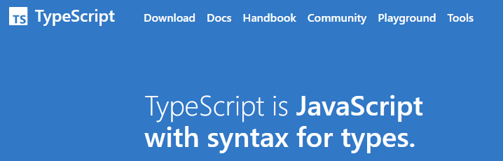
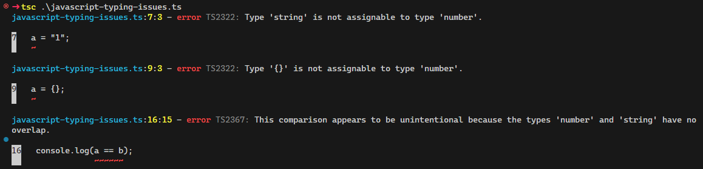
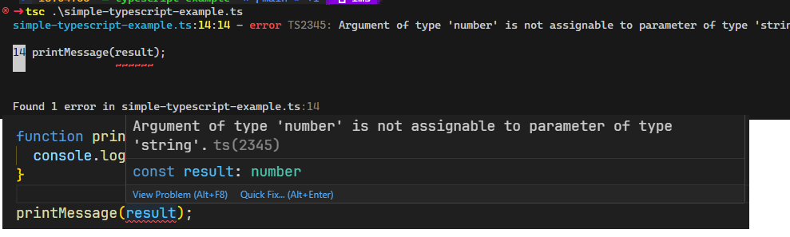
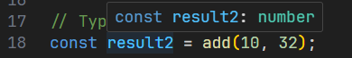

---
title: "Webengineering 1 - JavaScript"
subtitle: "Warum Informatikerinnen starke Typen lieben"
topic: "Webengineering_1_1_5"
author: "Silas Schnurr"
theme: "metropolis"
fonttheme: "structurebold"
fontsize: 12pt
urlcolor: BrickRed
linkcolor: BrickRed
aspectratio: 169
lang: de-DE
numbersections: true
plantuml-format: svg
toc: true
section-titles: true
...

# JavaScript Grundlagen

## Grundlagen

- Dynamisch schwach typisierte, objektorientierte Skriptsprache
- Kann in jedem modernen Browser ausgeführt werden
  - \rightarrow{} Clientseitige Programmierung
  - Wird heute auch häufig auf Serverseite eingesetzt (Node.js)

## Anwendungsfälle Clientseitig

- Dynamisches Verändern von HTML-Dokumenten \rightarrow{} Hinzufügen, Entfernen, Verändern von HTML-Elementen
  - Nachladen von Inhalten
  - Feedback an Nutzer ohne Neuladen der Seite
  - Eingabevorschläge
- Caching von Daten im Browser
- Ausführen von Berechnungen im Browser

## Anwendungsfälle Severseitig

- Dynamisches Erzeugen von HTML-Dokumenten
- Ausgabe von Daten in sonstigen Formaten (JSON, XML, ...) \rightarrow{} REST-APIs
  - Zugriff auf Datenbanken
- Vorteile durch gleiche Sprache auf Client- und Serverseite
  - Wiederverwendung von Code
  - Einfacher für Entwickler

## Ausführung im Browser

- JavaScript-Code wird im Browser ausgeführt
- Isolation über Browser-Sandbox
  - Zugriff auf HTML-Dokument
  - Zugriff auf Browser-APIs (DOM, Web Storage, ...)
  - **Kein Zugriff** auf andere Webserver, Dateisystem, Netzwerk, ...

## Ausführung auf dem Server

- JavaScript benötigt eine Runtime = Laufzeitumgebung, Code kann nicht nativ ausgeführt werden
- Typische Runtime: Node.js
  - Basiert auf der V8-Engine von Chromium (Chrome, Edge, ...)
  - Weniger Isolation als im Browser, Zugriff auf Dateisystem, Netzwerk, etc. möglich
- Andere Serverseitige Runtimes verfügbar
  - Deno: basiert auch auf V8, verschiedene Verbesserungen (z.B. TypeScript-Support, Sicherheitsfeatures)
  - Bun: sehr neu (Version 1.0 vom September 2023), basiert auf JavaScriptCore (Apple JS-Engine), kombiniert Bundler, Package Manager, Runtime, ...

# JavaScript Syntax

## Grundlegende Syntax - Variablen

- Deklaration mit `var`, `let` oder `const` oder komplett ohne Schlüsselwort (nicht zu empfehlen!)
- Typisierung _dynamisch_
- `var` und `let` können neu zugewiesen werden
- `const` kann nicht neu zugewiesen werden
- `let` und `const` sind Block-Scoped, `var` Funktions-Scoped

\rightarrow{} `let` und `const` sind vorzuziehen!

## Grundlegende Syntax - Variablen

```javascript
let a = 1;
const b = 2;
var c = 3;

a = 3; // ok
a = "Hallo"; // ok -> Typen sind dynamisch!!
b = 4; // TypeError: invalid assignment to const 'b'

let a = 4; // SyntaxError: redeclaration of let a
```

## Grundlegende Syntax - Datentypen

- Datentypen werden automatisch ermittelt und automatisch konvertiert!
- Folgende Datentypen gibt es:
  - `number` (Gleitkommazahl)
  - `string` (Zeichenkette)
  - `boolean` (Wahrheitswert)
  - `undefined` (nicht definiert)
  - `null` (nicht vorhanden)
  - `object` (Objekt)
  - `symbol` (Symbol)
  - `bigint` (Ganzzahl beliebiger größe, Größer als `number`)

## Grundlegende Syntax - Datentypen

### Automatische Typkonvertierung

- Die automatische Typkonvertierung kann zu unerwarteten Ergebnissen führen:

```javascript
let a = 1;
let b = "2";

console.log(a + b); // "12"
console.log(a - b); // -1
console.log(a * b); // 2
console.log(a / b); // 0.5
```

## Grundlegende Syntax - Operatoren

- Operatoren wie in vielen anderen Sprachen auch (C/C++, Java, C#, ...)
  - Arithmetische Operatoren: `+`, `-`, `*`, `/`, `%`
  - Vergleichsoperatoren: `==`, `!=`, `>`, `<`, `>=`, `<=`
    - Besonderheit: `===` und `!==` vergleichen **ohne** automatische Typkonvertierung!
    - Ansonsten wird bei unterschiedlichen Typen immer in `number` konvertiert
- Logische Operatoren: `&&`, `||`, `!`

## Grundlegende Synax - Strings (1)

- Deklaration mit `'` oder `"`
- Konkatenation (Zusammenfügen) mit `+`
- Eigenschaften / Funktionen:
  - `length`: Länge des Strings
  - `charAt(index)`: Zeichen an Position `index`
  - `indexOf(string)`: Position von `string` im String
  - `substring(start, end)`: Teilstring von `start` bis `end` (exklusive)
  - `split(separator)`: Zerlegen an `separator`, ergibt Array
- Interpolation mit Backticks: `` `Hallo ${name}` ``
  - Alles zwischen `${` und `}` wird als JavaScript-Code interpretiert und Ergebnis in String eingefügt

## Grundlegende Syntax - Schleifen

- `for`-Schleife: `for (let i = 0; i < 10; i++) { ... }`
- `for ... of`-Schleife: `for (let i of collection) { ... }`
  - Über **Werte** der collection
- `for ... in`-Schleife: `for (let i in {a: 1, b: 2}) { ... }`
  - Über **Schlüssel** der collection
- `while`-Schleife: `while (condition) { ... }`

## Exkurs: `for ... of` vs. `for ... in`

```javascript
let arr = [1, 2, 3, 4, 5]; // Array-Deklaration

for (let i of arr) {
  console.log("of", i);
}

for (let i in arr) {
  console.log("in", i);
}
```

### Ausgabe?

## Exkurs: `for ... of` vs. `for ... in`

### Ausgabe

```
of 1
of 2
of 3
of 4
of 5
in 0
in 1
in 2
in 3
in 4
```

### Warum?

## Exkurs: `for ... of` vs. `for ... in` Erklärung

- In JavaScript ist ein Array ein **Objekt**, Indizes sind die Schlüssel!

  ```
  Array(5) [1, 2, 3, 4, 5]
    0: 1
    1: 2
    2: 3
    3: 4
    4: 5
    length: 5
  ```

- `for ... of` iteriert über die **Werte** der collection \rightarrow{} gibt die Werte aus!
- `for ... in` iteriert über die **Schlüssel** der collection \rightarrow{} gibt also nur die Indizes aus!

## Grundlegende Syntax - Arrays

- Deklaration: `let arr = [1, 2, 3, 4, 5];`
  - Oder: `let arr = new Array(1, 2, 3, 4, 5);`
  - Oder natürlich auch ohne Initialisierung: `let arr = [];` / `let arr = new Array();`
- Zugriff auf Elemente: `arr[0]`
- Länge des Arrays: `arr.length`
- Typen der Elemente können unterschiedlich sein

## Grundlegende Syntax - If-Abfragen

- If-Abfragen wie in vielen anderen Sprachen auch (C/C++, Java, C#, ...)
  - `if (condition) { ... }`
  - `if (condition) { ... } else { ... }`
- `if (condition) { ... } else if (condition) { ... } else { ... }`

## Grundlegende Syntax - Funktionen

- Deklaration: `function name(parameter1, parameter2, ...) { ... }`
- Aufruf: `name(argument1, argument2, ...)`
- Anzahl der Parameter muss nicht mit Anzahl der Argumente übereinstimmen
  - Zu viele Argumente werden ignoriert (bzw. in implizitem Parameter `arguments` gespeichert)
  - Zu wenige Argumente werden mit `undefined` aufgefüllt
  - \rightarrow{} Kein Überladen von Funktionen möglich!
- Funktionsnamen sind optional (anonyme Funktionen)
  - Alternativ speichern der Funktion als Variable

## Grundlegende Syntax - Funktionen

```javascript
// "Normale" Funktionsdeklaration
function add(a, b) {
  return a + b;
}

// Anonyme Funktion
const add2 = function (a, b) {
  return a + b;
};
```

## Grundlegende Syntax - Funktionen

```javascript
// Arrow-Function / Lambda
const add3 = (a, b) => {
  return a + b;
};
// Noch kürzer schreiben (nur für einzelne Ausdrücke):
const add4 = (a, b) => a + b;
```

Syntax ist weitgehend Geschmackssache, aber:

- "Normale" Funktionsdeklarationen werden "gehoisted" (werden vom Interpreter an den Anfang des Scopes verschoben \rightarrow{} können vor der Deklaration aufgerufen werden)

## Grundlegende Syntax - Funktionen

```javascript
add(1, 2); // ok
add2(1, 2); // ReferenceError: can't access lexical declaration
// 'add2' before initialization

function add(a, b) {
  return a + b;
}

const add2 = function (a, b) {
  return a + b;
};
```

# JavaScript Objektorientierung

## Grundlagen

- Objekte sind eine Sammlung von Eigenschaften
  - Name-Wert-Paare
  - Kein Methodenkonzept: Eigenschaften vom Typ `function` können wie eine Methode genutzt werden
  - Können zur Laufzeit hinzugefügt werden

## Objekte erstellen

Objekte können auf verschiedene Arten erstellt werden:

```javascript
let obj = { a: 1, b: 2 }; // Objekt-Literal
let obj2 = new Object(); // Object-Konstruktor

// Konstruktor-Funktion
function Obj() {
  this.a = 1;
  this.b = 2;
}
let obj3 = new Obj();
```

## Klassen

Objekte können auch über Klassen erstellt werden:

```javascript
// Klasse (moderne JavaScript-Versionen)
class Obj2 {
  constructor() {
    this.a = 1;
    this.b = 2;
  }
}

let obj4 = new Obj2();
```

## Klassen

- Syntaxvereinfachung für Konstruktor-Funktionen
  - `typeof(Obj2)` = `"function"`
- "Methoden": ohne `function`-Schlüsselwort
  - `sum() { return this.a + this.b; }`
  - Oder anonyme Funktion in Objekt-Eigenschaft speichern
- Echte private Eigenschaften erst seit Mitte 2021 in Browsern unterstützt!
  - `#` vor Eigenschaftsnamen, Zugriff nur innerhalb der Klasse möglich

## Objekte nutzen

- Weitgehend wie in anderen Sprachen auch
  - Zugriff auf Eigenschaften: `obj.a`
  - Zugriff auf Methoden: `obj.sum()`
- Zusätzlich: Zugriff über `[]`-Operator
  - `obj["a"]`
  - `obj["sum"]()`

## Objekte verändern

```javascript
let obj = { a: 1, b: 2 };

// Achtung: geht nicht mit Arrow-Functions
// -> nutzen anderen Scope für `this`
obj.sum = function () {
  this.c = this.a + this.b;
};
obj.sum();
console.log(obj.c); // 3
```

## Vererbung

- In modernen JavaScript-Versionen kann das `extends`-Schlüsselwort genutzt werden
  - `class Obj2 extends Obj { ... }`
  - Erbt alle Eigenschaften und Methoden von `Obj`
- Alternativ: `Object.create(prototype)`
  - Erzeugt neues Objekt basierend auf `prototype` als **Prototyp**
  - \rightarrow{} "_In modern code, the class syntax should be preferred in any case._" (MDN)

## Vererbung

```javascript
// class Obj { constructor(a,b); a; b; sum() { return a+b };
//             print() { console.log(this.sum()); } }

class Obj2 extends Obj {
  constructor(a, b, c) {
    super(a, b); // Aufruf des Konstruktors der Elternklasse
    this.c = c;
  }

  sum() {
    return super.sum() + this.c;
  }
}
```

## Vererbung

```javascript
...

let obj = new Obj(10, 20);
console.log(obj); // Object { a: 10, b: 20 }
console.log(obj.sum()); // 30
obj.print(); // 30

let obj2 = new Obj2(1, 2, 3);
console.log(obj2); // Object { a: 1, b: 2, c: 3 }
console.log(obj2.sum()); // 6
obj2.print(); // 6
```

# JavaScript Fortgeschritten

## Destructuring

- JavaScript kann Objekte und Arrays automatisch in ihre Einzelteile "zerlegen"

```javascript
const obj = { a: 1, b: 2, c: 3 };
const arr = [1, 2, 3];

// komplett
var { a, b, c } = obj; // a = 1, b = 2, c = 3
var [a, b, c] = arr; // a = 1, b = 2, c = 3

// teilweise
var { a, ...rest } = obj; // a = 1, rest = {b: 2, c: 3}
var [a, ...rest] = arr; // a = 1, rest = [2, 3]
```

_Hier mit `var`, um alles in ein Beispiel zu packen, schlechter Stil!_

## Higher-Order Functions

- Funktionen können in JavaScript
  - Als Variable gespeichert werden
  - Als Parameter übergeben werden
  - Als Rückgabewert zurückgegeben werden
- _Higher-Order Functions_ = Funktionen, die selbst Funktionen als Parameter annehmen oder eine Funktion zurückgeben

## Higher-Order Functions - Beispiel

```javascript
const add = (a, b) => a + b;
const sub = (a, b) => a - b;

const calc = (a, b, op) => op(a, b);
calc(1, 2, add); // 3
calc(1, 2, sub); // -1
```

## `map` und `filter`

- Higher-Order Functions auf Arrays \rightarrow{} erleichtern die Arbeit mit Arrays
- `map`: erzeugt neues Array mit Ergebnis der Funktion für jedes Element des Arrays
- `filter`: erzeugt neues Array mit allen Elementen, für die die Funktion `true` zurückgibt

## `map` und `filter` - Beispiel

```javascript
const arr = [1, 2, 3, 4, 5];

const squareFn = (x) => x * x;
const isEvenFn = (x) => x % 2 == 0;

const squares = arr.map(squareFn); // [1, 4, 9, 16, 25]
const even = arr.filter(isEvenFn); // [2, 4]

const squaresEven = arr.filter(isEvenFn).map(squareFn); // [4, 16]
```

## Weitere Higher-Order Functions

- `forEach`: Führt Funktion für jedes Element aus
- `some`: Gibt `true` zurück, wenn Funktion für mindestens ein Element `true` zurückgibt
- `every`: Gibt `true` zurück, wenn Funktion für alle Elemente `true` zurückgibt
- `find`: Gibt erstes Element zurück, für das die Funktion `true` zurückgibt
- `reduce`: Reduziert Array auf einen Wert
- ...

\rightarrow{} Verwendung bei Bedarf nachschlagen

## Promises

- Asynchrone Programmierung in JavaScript
- Asynchrone Funktionen geben ein Promise zurück
  - Promise kann später einen Wert zurückgeben (oder nichts) oder fehlschlagen
  - Während der Ausführung können andere Code-Teile ausgeführt werden
- Nützlich für Operationen mit viel Wartezeit: Netzwerk, Dateisystem, ...

## Promises - Beispiel

```javascript
const promise = new Promise((resolve, reject) => {
  setTimeout(() => {
    resolve("World!"); // resolve() = Promise erfolgreich
  }, 1000); // 1000ms = 1s warten, bevor Code ausgeführt wird
});

promise.then((value) => {
  // Dieser Code wird erst nach Abschluss des Promises ausgeführt
  console.log(value);
});

// Ausführung geht direkt hier weiter!
console.log("Hello");
```

## Promises - `async` und `await`

- Syntaxerweiterung für einfachere Handhabung von Promises
- `async` Funktionen geben automatisch ein Promise zurück
- `await` blockiert Ausführung bis Promise fertig ist

## Promises - `async` und `await` - Beispiel

```javascript
async function greeting() {
  // setTimeout gibt kein Promise zurück! eigenes erzeugen
  await new Promise((resolve) => setTimeout(resolve, 1000));
  return "World!";
}

const promise = greeting();
console.log("Hello");
console.log(await promise);
```

# JavaScript und HTML

## JavaScript einbinden

- JavaScript-Code wird in HTML-Dokument eingebunden
  - entweder direkt im HTML-Code
  - oder in externer Datei

```html
<!-- direkt -->
<script>
  // JavaScript-Code
</script>

<!-- extern, beliebige URL zu einer JavaScript-Datei -->
<script src="script.js"></script>
```

## Clientseitige Dynamik mit JavaScript

- Manipulation des HTML-Dokuments
- Abruf von Daten vom Server
- Senden von Daten an den Server (ohne Neuladen der Seite)
- Animationen
- ...

## HTML Manipulation - DOM

### DOM = Document Object Model

- Baumstruktur für HTML-Dokumente \rightarrow{} Objektorientierte Repräsentation des Dokuments
- Für jedes Element (Tag) ein Node
- DOM-Methoden erlauben Zugriff auf Nodes und deren Attribute und Funktionen mit JavaScript
  - Ändern von Inhalten, HTML-Attributen, CSS-Eigenschaften, ...
  - Hinzufügen und Entfernen von Nodes und Kindern

## DOM - Beispiel

- Gelb: _element nodes_
- Blau: _attribute nodes_
- Rot: _text nodes_
- Grün: _comment nodes_

Beispiel von [SelfHTML Wiki](https://wiki.selfhtml.org/wiki/Datei:DOM-1.svg), CC-BY-SA-3.0

## DOM - Beispiel

{height=90%}

## DOM Zugriff

- Zugriff auf DOM-Elemente über `document`-Objekt
  - Bildet Wurzel des DOM-Baums
  - Alle anderen Elemente sind Nachfahren von `document`
- Verschiedene Zugriffsmethoden
  - `getElementById()`
  - `getElementsByClassName()`
  - `getElementsByTagName()`
  - `querySelector()` \rightarrow{} CSS-Selektor
  - `querySelectorAll()` \rightarrow{} CSS-Selektor, mehrere Elemente

## DOM Zugriff - Beispiel

```html
...
<article>
  <h1 id="title">Artikelüberschrift</h1>
  ...
</article>
...
```

```javascript
const title = document.getElementById("title");
console.log(title); // -> <h1 id="title">
console.log(title.innerHTML); // -> Artikelüberschrift
```

## DOM Zugriff - Beispiel

```html
...
<article><section id="s-1" class="intro">...</section></article>
<article><section id="s-2" class="intro">...</section></article>
...
```

```javascript
const intros = document.getElementsByClassName("intro");
console.log(intros); // -> HTMLCollection {0: section#s-1.intro,
// 1: section#s-2.intro, ...}
console.log(intros[0]); // -> <section id="s-1" class="intro">
```

## DOM Zugriff - Beispiel

```html
...
<article id="art-1">...</article>
<article id="art-2">...</article>
...
```

```javascript
const articles = document.getElementsByTagName("article");
console.log(articles); // -> HTMLCollection {0: article#art-1,
// 1: article#art-2, ...}
console.log(articles[0]); // -> <article id="art-1">
```

## DOM Zugriff - Beispiel

```html
...
<article>
  <section id="s-1">...</section>
  <section id="s-2">...</section>
  <section id="s-3">...</section>
</article>
```

```javascript
const s1 = document.querySelector("section:last-child");
console.log(s1); // -> <section id="s-3">
```

## DOM Zugriff - Beispiel

```html
...
<article>
  <h1 id="h-1">...</h1>
  <section id="s-1">...</section>
  <section id="s-2">...</section>
</article>
```

```javascript
const elements = document.querySelectorAll("article > *");
console.log(elements); // -> NodeList {0: h1#h-1, 1: section#s-1,
// 2: section#s-2}
// -> alle direkten Kinder von article
```

## DOM Traversierung

- DOM-Elemente sind miteinander verknüpft
  - Alle sind Nachfahren von `document`
  - Jedes Element hat 1 Elternelement und 0..\* Kindknoten
- Zugriff auf
  - Kindknoten über `node.childNodes`
  - Elternknoten über `node.parentNode`
  - Eigenschaften über `node.nodeName`, `node.nodeType`, `node.nodeValue`, `node.textContent`, `node.innerHTML`, ...

## DOM Manipulation

- Ändern von Inhalten, HTML-Attributen, CSS-Eigenschaften, ...
- Hinzufügen und Entfernen von Nodes

## DOM Manipulation Text

Über `textContent` kann Text auch geändert werden

```html
...
<article>
  <h1 id="h-1">...</h1>
  <section id="s-1">...</section>
  <section id="s-2">...</section>
</article>
```

```javascript
const h1 = document.getElementById("h-1");
h1.textContent = "Neuer Text";
```

## DOM Manipulation HTML

- Über `innerHTML` kann **HTML** geändert werden
- _ACHTUNG_: neues HTML wird interpretiert (betrifft auch eingefügte scripte)!

```javascript
const article = document.getElementByTagName("article")[0];
article.innerHTML = "<h1>Neuer Titel</h1>";
```

## DOM Manipulation Neue Elemente

- Besserer Weg für neue Elemente: `document.createElement()`
  - Neues Element muss erst noch in DOM eingefügt werden, z.B. mit `appendChild()` / `insertBefore()` / `replaceChild()` / ...
  - Mehr Code, aber sicherer!

```javascript
const element = document.createElement("h1");
element.textContent = "Neuer Titel";
article = document.getElementByTagName("article")[0];
article.insertBefore(element, article.childNodes[0]);
```

## DOM Manipulation Attribute

- Zugriff auf Attribute über `element.getAttribute()` und `element.setAttribute()`
  - Zugriff auf `id` und `class` aber auch über `element.id` und `element.className`
- Entfernen über `element.removeAttribute()`
- Zugriff auf CSS-Eigenschaften über `element.style`

```javascript
const article = document.getElementByTagName("article")[0];
article.setAttribute("id", "art-1"); // == article.id = "art-1"
```

# JavaScript Events

## Event-Handler

- Browser löst bei Benutzerinteraktion Events aus
  - z.B. Klick auf Button, Änderung eines Formularfeldes, ...
- JavaScript kann auf Events reagieren \rightarrow{} Event-Handler
- Event-Handler werden mit `element.addEventListener(type, handler)` registriert
  - `element` Element, das das Event auslöst
  - `event` Name des Events, z.B. `click`, `change`, `keyup`, ...
  - `handler` auszuführende Funktion

```javascript
document.getElementById("button").addEventListener("click", handler);
```

## Event-Handler

- Beim Auslösen des Events wird der Handler mit `event` Argument aufgerufen
  - `event.target` auslösendes Element
  - `event.type` Name des Events

```javascript
function handler(event) {
  console.log(event.target); // -> <button id="button">
  console.log(event.type); // -> click
}
```

## Event-Handler setzen

- Event-Handler können auch direkt im HTML-Code gesetzt werden
  - Attribute `onclick`, `onchange`, `onkeyup`, ...
  - `this` ist das auslösende Element

- Solche Vermischung von HTML und JavaScript ist aber nicht empfehlenswert!

# JavaScript `fetch` API

## Abruf externer Daten

- Moderne Browser unterstützen asynchrone HTTP-Requests über die `fetch` API
- Ersatz für die ältere `XMLHttpRequest` API
- Seit 2016 in allen gängigen Browsern verfügbar
- Immer vorzuziehen gegenüber `XMLHttpRequest`!

## `fetch` Funktion

- `fetch(resource, options): Promise<Response>`
  - `resource`: URL der abzurufenden Ressource
  - `options`: Optionen für den Request in Objektform
    - `method`, `headers`, `body`, ...
  - \rightarrow{} [Dokumentation](https://developer.mozilla.org/en-US/docs/Web/API/Fetch_API)

## `fetch` Beispiel: Abruf von Daten

```javascript
const websiteResponse = await fetch("https://lukaspanni.de/")
console.log(await websiteResponse.text()); // -> HTML-Code

const apiResponse = await fetch("https://api.github.com
				/users/lukaspanni")
const data = await apiResponse.json(); // -> Objekt
console.log(data.location); // -> "Karlsruhe, Germany"
```

## Einschub: JSON

= JavaScript Object Notation

- Format zur Beschreibung von (JavaScript)-Objekten
- Im Prinzip jedes gültige Objekt- (oder Array-) Literal in JavaScript
- Häufig als Datenaustauschformat im Web

```json
{
  "name": "Lukas Panni",
  "age": 23,
  "location": "Karlsruhe, Germany"
}
```

## JSON erzeugen und parsen

- Umwandlung von JavaScript-Objekt in JSON-String: `JSON.stringify()`
- Umwandlung von JSON-String in JavaScript-Objekt: `JSON.parse()`

## `fetch` Beispiel: Senden von Daten

```javascript
// httpbin.org spiegelt die empfangenen Daten zurück
const response = await fetch("https://httpbin.org/post", {
  method: "POST",
  headers: { "Content-Type": "application/json" },
  body: JSON.stringify({ name: "Lukas Panni", location: "Karlsruhe" }),
});

console.log(await response.json());
```

## `fetch` Beispiel: Fehlerbehandlung

- `fetch` schlägt nur bei Netzwerkfehlern fehl
- HTTP-Status muss manuell auf Erfolg geprüft werden

```javascript
const response = await fetch("https://httpbin.org/status/404");
console.log(response.ok); // -> false
console.log(response.status); // -> 404
```

# Web Components

## Motivation

Problem:

- HTML bietet nur Standard-Elemente (div, p, button, …)
- Wiederverwendbare UI-Komponenten nur mit Frameworks (React, Angular, Vue)

\rightarrow{} Frage: Wie können wir wiederverwendbare, gekapselte Komponenten ohne Framework erstellen?

## Definition

Web Components sind ein Webstandard zur Erstellung eigener HTML-Elemente.

Basierend auf:

- Custom Elements
- Shadow DOM
- HTML Templates
- ES Modules

## Custom Elements

Ermöglichen es, eigene HTML-Tags zu definieren:

**Registrierung in JavaScript**

```javaScript
class MyProductCard extends HTMLElement {
  connectedCallback() {
    this.innerHTML = "<p>Produkt</p>";
  }
}
customElements.define("my-product-card", MyProductCard);
```

**Verwendung in HTML**

```HTML
<my-product-card></my-product-card>
```

## Shadow DOM

Probleme beim erstellen von Komponenten mit Standard-HTML:

- CSS ist global
- Namenskonflikte möglich

Lösung: Verwendung des Shadow DOM

- Starke Isolation einer Komponente durch Kapselung von:
  - HTML
  - CSS
  - JavaScript
  - Keine Beeinflussung von außen

## Eigenschaften von Web Components

- Framework-unabhängig
- Standardisiert
- Wiederverwendbar
- Kapselbar

## Vorteile

- Kein Framework-Zwang
- Gute Wiederverwendbarkeit
- Integration in Microfrontends möglich
- Technologieneutral

## Nachteile

- Mehr Boilerplate-Code
- Komplexere Zustandsverwaltung
- Weniger Komfort als moderne Frameworks

## Einordnung

Web Components sind:

- Eine technische Modularisierungsmöglichkeit
- Keine vollständige Architektur
- Häufig Baustein in Microfrontend-Architekturen (dazu später mehr)

# JavaScript Frameworks

## Zielsetzung

- Steigerung der Effizienz und Produktivität
- Klare Anwendungsstruktur und Best Practices
- Wiederverwendbarkeit und Wartbarkeit, vermeidung von Redundanzen
- Leistungsoptimierung
- Skalierbarkeit

## Angular, React und Vue - Gemeinsamkeiten

- Komponentenbasierte Architektur: Sie alle nutzen Komponenten als Bausteine für die Benutzeroberfläche
- Reaktivität: Jedes Framework bietet Mechanismen zur automatischen Aktualisierung der Benutzeroberfläche bei Datenänderungen
- Virtual DOM oder ähnliche Optimierungen: alle Frameworks verwenden eine Form des Virtual DOM oder ähnliche Techniken zur Leistungsoptimierung

## Angular - Allgemein

- Entwickelt von Google
- Umfassendes Framework mit einer steilen Lernkurve, aber großer Leistungsfähigkeit für komplexe Anwendungen
- TypeScript als Hauptsprache
- Architektur: Folgt dem MVC-Muster (Model-View-Controller)
- Dependency Injection: Ein mächtiges Feature für die Verwaltung von Abhängigkeiten
- Angular Signals: Reaktivität durch primitive Werte, die sich im Laufe der Zeit ändern können und automatisch die Benutzeroberfläche aktualisieren

Angular ist ideal für große, komplexe Anwendungen

## Angular - Reaktivität mit signals

```typescript
import { Component, signal } from "@angular/core";

@Component({
  selector: "app-counter",
  template: ` <p>Count: {{ count() }}</p>
    <button (click)="increment()">Increment</button>`,
})
export class CounterComponent {
  count = signal(0);

  increment() {
    this.count.update((value) => value + 1);
  }
}
```

## Angular - Komponenten

```typescript
import { Component, signal } from "@angular/core";
import { CustomComponent } from "./custom";
@Component({
  selector: "app-counter",
  template: ` <p>Count: {{ count() }}</p>
    <button (click)="increment()">Increment</button>
    <app-custom-component></app-custom-component>`,
})
export class CounterComponent {
  count = signal(0);
  increment() {
    this.count.update((value) => value + 1);
  }
}
```

## Angular - Dependency Injection: data.service.ts

```typescript
import { Injectable } from "@angular/core";

@Injectable({
  providedIn: "root",
})
export class DataService {
  getData() {
    return "Hallo vom DataService!";
  }
}
```

## Angular - Dependency Injection: hello.component.ts

```typescript
import { Component } from "@angular/core";
import { DataService } from "./data.service";

@Component({
  selector: "app-hello",
  template: `<h1>Hallo!</h1>`,
})
export class HelloComponent {
  constructor(private service: DataService) {
    console.log(this.service.getData());
  }
}
```

## React - Allgemein

- Entwickelt von Facebook, wirbt mit Flexibilität und großem Ökosystem
- JavaScript Bibliothek, in Kombination mit Next.js ein vollwertiges Framework
- JSX: Ermöglicht das Schreiben von HTML-ähnlichem Code in JavaScript
- Hooks: Bieten eine mächtige Möglichkeit, Zustand und Nebeneffekte in funktionalen Komponenten zu verwalten
- Ökosystem: Hat eine große Auswahl an Drittanbieter-Bibliotheken

## React - Reaktivität mit Hooks

```jsx
import React, { useState } from "react";

function Counter() {
  const [count, setCount] = useState(0);

  return (
    <div>
      <p>Count: {count}</p>
      <button onClick={() => setCount(count + 1)}>Increment</button>
    </div>
  );
}
```

## React - Komponenten

```jsx
import React from "react";

function SimpleComponent() {
  const greeting = "Hallo, React!";
  return (
    <div>
      <h1>{greeting}</h1>
      <p>Dies ist eine einfache React-Komponente mit JSX.</p>
    </div>
  );
}
export default SimpleComponent;
```

## React - JSX

```jsx
import React, { useState } from "react";

function Counter() {
  const [count, setCount] = useState(0);

  return (
    <div>
      <p>Count: {count}</p>
      <button onClick={() => setCount(count + 1)}>Increment</button>
    </div>
  );
}
```

## Vue - Allgemein

- Wirbt mit Entwicklerfreundlichkeit durch Flexibilität
- Template-Syntax: Verwendet eine HTML-basierte Template-Syntax
- Reaktivität: Bietet ein einfaches, aber leistungsfähiges Reaktivitätssystem
- Composition API: Ähnlich wie React Hooks, ermöglicht eine bessere Organisation von Logik in Komponenten

## Vue - Reaktivität

```html
<script setup>
  import { ref } from "vue";
  const count = ref(0);
  function increment() {
    count.value++;
  }
</script>
<template>
  <button @click="increment">{{ count }}</button>
</template>
```

## Vue - Komponenten: Component.vue

```html
<script setup>
  const emit = defineEmits(["response"]);
  emit("response", "hello from component");
</script>
<template>
  <h2>Component</h2>
</template>
```

## Vue - Komponenten: App.vue

```html
<script setup>
  import { ref } from "vue";
  import Comp from "./Component.vue";
  const componentMsg = ref("No component msg yet");
</script>

<template>
  <Comp @response="(msg) => (componentMsg = msg)" />
  <p>{{ componentMsg }}</p>
</template>
```

# TypeScript Grundlagen

## Probleme von JavaScript

Dynamische Typisierung

- Variablen können jederzeit den Typ wechseln
- Typen werden erst zur Laufzeit geprüft
- Zusätzlich: **automatische** Typumwandlung (_type coercion_)

\rightarrow{} Eingabeabhängige Laufzeitfehler, schwer zu finden!

## Beispiel: Dynamische Typen

```javascript
let a = 1;
console.log(a, typeof a);
a = "1";
console.log(a, typeof a);
a = {};
console.log(a, typeof a);
```

## Beispiel: Type Coercion

```javascript
let a = 1;
let b = "1";
console.log(a == b);
let c = a + b;
console.log(c, typeof c);
let d = a - b;
console.log(d, typeof d);
console.log(++a, ++b);
```

## Beispiel: Dynamische Typen + Type Coercion bei Funktionsargumenten

```javascript
function add(a, b) {
  return a + b;
}

console.log(add(1, 2));
console.log(add("1", "2"));
console.log(add(undefined, 2));
console.log(add(null, 2));
```

## Lösung: Statische Typisierung

- Typprüfungen zur Entwicklungszeit \rightarrow{} Kompilationsschritt
- Keine Änderung von Typen zur Laufzeit

**Vorteil**: Typfehler werden frühzeitig erkannt und teilweise verhindert

## TypeScript

{width=80%}

## TypeScript Vorteile

- Typsicherheit
  - Vermeidung/Früherkennung von Typfehlern
- Verbesserte Codequalität
  - Bessere Verständlichkeit
  - Bessere Dokumentation
- Verbesserte Toolunterstützung
  - Codevervollständigung
  - Refactoring

## TypeScript - Grundsätzliches

- Erweiterung (Superset) von JavaScript: jedes JavaScript ist auch gültiges TypeScript
  - Statische Typisierung
  - Klassenfeatures \rightarrow{} Teilweise in ECMAScript 6 (=2015) (JavaScript-Standard)
- Kompiliert zu JavaScript
  - Browser können TypeScript nicht interpretieren
  - TypeScript-Compiler (`tsc`) erzeugt JavaScript \rightarrow{} zusätzlicher Schritt!

## TypeScript - Quickstart

- Webseite: [typescriptlang.org](https://typescriptlang.org)
- Installation TypeScript-Compiler
  - `npm install -g typescript` (global) oder `npm install typescript` (lokal)
- Kompilieren von TypeScript-Dateien
  - `tsc <dateiname.ts>` \rightarrow{} Erzeugt JavaScript-Datei `<dateiname.js>`
- Ausführen von erzeugtem JavaScript
  - `node <dateiname.js>`

## TypeScript Kompiler-Optionen (1)

- `tsc`-Compiler bietet viele Optionen zur Konfiguration
- Beispiel: `tsconfig.json`-Datei zur Konfiguration des Compilers
  - `tsc --init` erstellt eine `tsconfig.json`-Datei
  - Optionen sind mit Kommentaren gut erklärt
  - Oft reichen Standard-Einstellungen aus
    - Insbesondere wenn `tsconfig.json` von Framework oder Template vorgegeben!
- Hilfreichste Option `strict`: Aktiviert alle strikten Typenprüfungen für höchste Typsicherheit

## TypeScript Kompiler-Optionen (2)

- Häufige Optionen
  - `outDir`: Verzeichnis für Ausgabedateien
  - `include`: Dateien/Pattern, die kompiliert werden sollen
  - `exclude`: Dateien/Pattern, die nicht berücksichtigt werden sollen
  - `types`: Typdefinitionen für JavaScript-Bibliotheken (z.B. Standardmäßig alle NodeJS typen integrieren)

## TypeScript - Beispiel: Probleme von JavaScript

Kompilation der zuvor gezeigten Beispiele (gleicher Code, Dateiendung `.ts`):



## TypeScript Features - Type Annotations (1)

- Explizite Typangaben für Variablen, Funktionen, Parameter, Rückgabewerte

```typescript
let a: number = 1;
let b: number = 2;

function add(x: number, y: number): number {
  return x + y;
}
const result: number = add(a, b);
console.log(result);
```

## TypeScript Features - Type Annotations (2)

```typescript
...
function printMessage(message: string) {
  console.log(message);
}

printMessage(result);
```

## TypeScript Features - Type Annotations (3)

### Typfehler



## TypeScript Features - Type Inference

- Explizite Typangaben sind aufwändig
- Gewünschte Typen ergeben sich meist aus dem Kontext
  - TypeScript kann Typen ableiten \rightarrow{} **Type Inference** / Typinferenz



## TypeScript Features - Klassen (1)

- Mehr Klassenfeatures als in JavaScript (ECMAScript 6)
  - Zugriffsmodifier `public`, `private`, `protected`
  - _Accessors_: Getter und Setter
  - Statische Member (`static`)
  - Vererbungsfeatures
    - Abstrakte Klassen
    - Interfaces
  - **Generics**
  - ...

## TypeScript Features - Klassen (2)

Beispiel [`typescript-classes.ts`](https://github.com/TINF23B5-Webengineering/Lecture_Code/blob/2025/23_Typescript/typescript-example/typescript-classes.ts)

## TypeScript Features - weitere Typfeatures (1)

- Definition von neuen Typen (Typalias), insbesondere für komplexe Typen
  - `type <name> = <typ>`

- Kombination mehrerer Typen zu neuem komplexeren Typ
  - Union: `type1 | type2` \rightarrow{} Sowohl `type1` als auch `type2` erlaubt
  - String-Unions: `"text1" | "text2"` \rightarrow{} erlaubt nur bestimmte Strings als Werte
  - Intersection: `type1 & type2` \rightarrow{} Typ muss sowohl `type1` als auch `type2` erfüllen
    - z.B. `type1 = {a: string}` und `type2 = {b: number}` \rightarrow{} `type1 & type2 => {a: string, b: number}`

## TypeScript Features - weitere Typfeatures (2)

**Mapped Types**: dynamischer Typ aus bestehenden Typen, häufiges Beispiel: Readonly-Typ (Achtung: nur Typprüfung, keine echte Immutability!)

```typescript
type Readonly<T> = {
  // für alle Properties P in Typ T:
  //  eine readonly Property mit gleichem Typ
  readonly [P in keyof T]: T[P];
};
type ReadonlyPerson = Readonly<Person>;
```

## TypeScript Features - weitere Typfeatures (3)

**Type Guards**: Typprüfung zur Laufzeit

```typescript
export function isPerson(obj: any): obj is Person {
  return obj.name !== undefined && obj.age !== undefined;
}
```

- `isPerson(object) === true` \rightarrow{} danach kann `obj` wie vom Typ `Person` verwendet werden

## TypeScript Features - weitere Typfeatures (4)

[**Utility Types**](https://www.typescriptlang.org/docs/handbook/utility-types.html): vordefinierte, häufige Typtransformationen

- `Partial<T>`: Properties von `T` optional
- `Required<T>`: Properties von `T` erforderlich
- `Readonly<T>`: Wie oben schon gezeigt
- `Pick<T, K>`: Ausgewählte Properties von `T` (mit Namen in `K`)
- ...

## TypeScript

- **Was haben ein Frauenmarathon und TypeScript gemeinsam?**
-

## TypeScript

- **Was haben ein Frauenmarathon und TypeScript gemeinsam?**
- Es gibt zur Laufzeit keine Typen.

## TypeScript Ressourcen

- [TypeScript-Handbuch](https://www.typescriptlang.org/docs/handbook/intro.html)
- [TypeScript Playground](https://www.typescriptlang.org/play): Online-Editor zum Ausprobieren von TypeScript
- [TypeScript-Tutorial (Text)](https://learn.microsoft.com/en-us/training/paths/build-javascript-applications-typescript/)
- [TypeScript-Tutorial (Video)](https://www.youtube.com/watch?v=_CaGUZNEobk)
- [Typdefinitionen für JavaScript-Bibliotheken](https://github.com/DefinitelyTyped/DefinitelyTyped)
