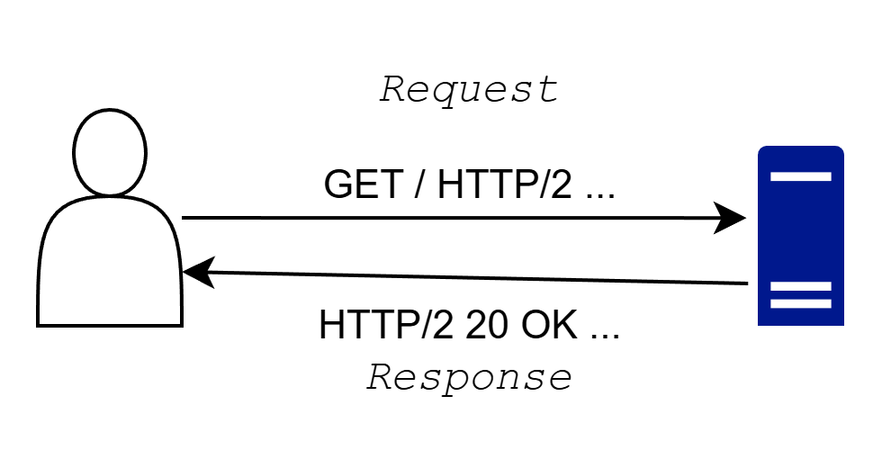
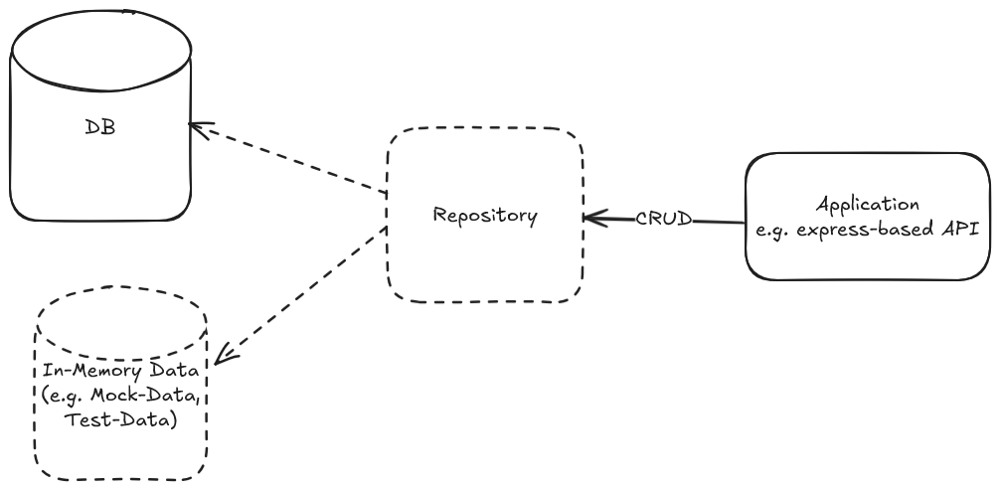
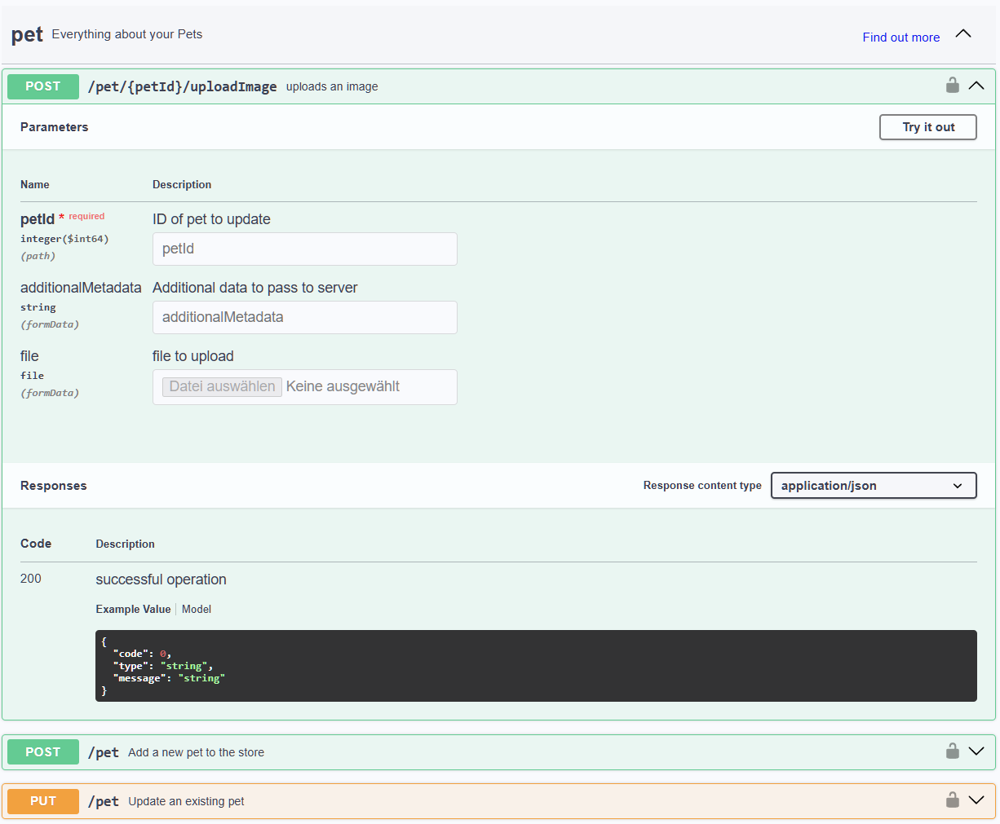

---
title: "Vorlesung Webengineering 1 - Grundlagen Backend"
topic: "Webengineering_1_2_3"
author: "Lukas Panni"
theme: "metropolis"
fonttheme: "structurebold"
fontsize: 12pt
urlcolor: BrickRed
linkcolor: BrickRed
aspectratio: 169
lang: de-DE
section-titles: true
plantuml-format: svg
...

# Grundlagen Backend


## Gruppenarbeit Online Shop

### Flow: Ich möchte ein neues MacBook kaufen

## Aufgaben Frontend Online Shop

- Produktliste anzeigen
- Produktbilder darstellen
- Suche & Filter bedienen
- Produkt konfigurieren (z. B. RAM, Speicher)
- Warenkorb anzeigen & aktualisieren
- Checkout-Formular darstellen
- Buttons & Interaktionen („Kaufen“)
- Ladezustände (Spinner)

## Aufgaben Backend Online Shop

- Produkte aus Datenbank laden
- Preise korrekt berechnen
- Verfügbarkeit prüfen
- Warenkorb serverseitig verwalten
- Bestellung speichern
- Zahlung verarbeiten (z.B. PayPal)
- Nutzer authentifizieren (Login)
- Bestellbestätigung versenden (E-Mail)

## Aufgaben Frontend allgemein

- Darstellung von Daten (UI)
- Benutzerinteraktion (Klicks, Eingaben)
- Formularverarbeitung (UX-seitig)
- Zustandsverwaltung (z. B. UI-State)
- Validierung (für schnelles Feedback)
- Kommunikation mit Backend (HTTP Requests)
- Anzeige von Lade- & Fehlerzuständen

=> Fokus: Benutzererlebnis (UX)

## Aufgaben Backend allgemein

- Daten persistent speichern (Datenbank)
- Geschäftslogik umsetzen
- Validierung & Sicherheit
- Authentifizierung & Autorisierung
- APIs bereitstellen
- Zustände verwalten (z. B. Sessions)
- Integration externer Services
- Skalierung & Performance

=> Fokus: Logik, Daten, Sicherheit

## Theoretische Fragen

- Erläutere die Aufgaben des Backends in einer Webanwendung
- Erläutere die Aufgaben des Frontends in einer Webanwendung

# Kommunikation Frontend - Backend

## Grundprinzip HTTP

- HTTP ist **zustandslos**
- Auf einen _Request_ folgt eine _Response_
- _Clients_ stellen Requests, _Server_ beantworten sie



## Request/Response Struktur

- Textbasiertes Protokoll
- Request: `<Methode> <Resource> <Protokoll><CR><LF>`
  - gefolgt von _Header_-Zeilen und optionalem _Body_
  - endet mit einer leeren Zeile (`<CR><LF>`)
- Response: `<Protokoll> <Status-Code> <Status-Text><CR><LF>`
  - gefolgt von _Header_-Zeilen und optionalem _Body_
  - endet mit einer leeren Zeile (`<CR><LF>`)

## Wichtige HTTP Methoden

| **Methode** | **Beschreibung**    | **Idempotent** | **Safe** |
| ----------- | ------------------- | -------------- | -------- |
| **GET**     | Ressource abrufen   | Ja             | Ja       |
| **POST**    | Ressource erstellen | Nein           | Nein     |
| **PUT**     | Ressource ersetzen  | Ja             | Nein     |
| **DELETE**  | Resource löschen    | Ja             | Nein     |

## HTTP Status Codes

Aufgeteilt in 5 Gruppen:

| **Bereich** | **Kategorie** | **Zweck**                                                                       |
| ----------- | ------------- | ------------------------------------------------------------------------------- |
| 1xx         | Informational | Informationen über den aktuellen Stand, kaum relevant                           |
| 2xx         | Success       | Request war erfolgreich                                                         |
| 3xx         | Redirection   | Client muss andere Seite aufrufen, Server teilt dem Client mit welche / Auswahl |
| 4xx         | Client Error  | Fehler, der Client ist schuld                                                   |
| 5xx         | Server Error  | Fehler, der Server ist schuld                                                   |

## REST (1)

> **Representational State Transfer**

Prinzipien:

- Ressources with unique Identifiers
- Links & Hypermedia
- Uniform Interfaces
- Multiple Representations
- Stateless Interactions

## REST (2)

- **Ressourcen** stehen im Mittelpunkt der Anwendung
  - z.B. Produkte, Nutzer, Prozesse, Bestellungen, ...
  - eindeutig identifizierbar und addressierbar
- Einheitliche Schnittstellen \rightarrow{} HTTP Methoden
  - Klare Semantik von Methoden und Status Codes

## Theoretische Fragen

- Erkläre den Aufbau eines HTTP-Requests
- Welche HTTP Methode sollte für das Aktualisieren einer Ressource genutzt werden
- Welche HTTP Methoden sind Idempotent? Welche Safe?

# REST API Design Grundlagen

## Grundlagen

- Design ausgehend von Ressourcen \rightarrow{} Daten
  - Welche Ressourcen gibt es?
  - In Welcher Beziehung stehen sie zueinander?
  - Welche Aktionen können auf Ressourcen ausgeführt werden?

## Beispiel Benutzerverwaltung

### Aufgabe 1 (15 min):

Dokumentiert in Kleingruppen (2-3 Personen) die grundlegenden Informationen für ein Standard-Benutzerverwaltungssystem für eine Webanwendung:

- Ressourcen und deren Eigenschaften (welche Daten gehören zu einer Ressource?)
- Beziehungen zwischen den Ressourcen
- Mögliche Aktionen auf den Ressourcen

## Besprechung Benutzerverwaltung

### Zwei Gruppen stellen ihre Ergebnisse vor

## Ressourcen auf HTTP Endpunkte abbilden (1)

- Ressourcen werden über HTTP Endpunkte adressiert
- Verwendung von Substantiven (englisch) im Plural für URL-Pfade
  - Benutzer \rightarrow{} `/users`
  - Produkte \rightarrow{} `/products`
- Eindeutige Identifikation einzelner Ressourcen durch IDs
  - z.B. `/users/123` für Benutzer mit ID 123
  - \rightarrow{} Datenmodell muss eindeutige IDs vorsehen
- Geschachtelte Pfade können für hierarchische Beziehungen genutzt werden
  - z.B. `/users/123/orders` für Bestellungen eines Benutzers

## Ressourcen auf HTTP Endpunkte abbilden (2)

- Verwendung von HTTP Methoden Semantik für Aktionen auf Ressourcen
- Unterscheidung zwischen Sammlung von Ressourcen (_Collection_ `/users`) und einzelnen Ressourcen (`/users/123`) beachten
  - `GET /users` \rightarrow{} Alle Benutzer abrufen
  - `GET /users/123` \rightarrow{} Benutzer mit ID 123 abrufen
- Typische Aktionen: **CRUD** (Create, Read, Update, Delete)

## Ressourcen auf HTTP Endpunkte abbilden (3)

- Erstellen einer neuen Ressource: `POST /users`
  - ID ist vor Erstellung noch nicht bekannt, wird vom Server generiert
  - Es gibt eine implizite Collection, API Consumer können keine neue Collection erstellen
- Neben der Semantik der HTTP Methoden sind auch die Eigenschaften _Idempotenz_ und _Safety_ wichtig

## Idempotenz

> Eine Operation ist idempotent, wenn sie 1 oder n mal ausgeführt werden kann, ohne dass sich das Ergebnis ändert

- Idempotente Methoden können sicher wiederholt werden, ohne unerwünschte Nebeneffekte zu verursachen
- Es ist immer mit Netzwerkfehlern zu rechnen, retries für idempotente Methoden sind unproblematisch
- Erleichtert Caching

## Safety

> Eine Operation ist safe, wenn sie 0 oder n mal ausgeführt werden kann, ohne dass sich das Ergebnis ändert

- Operation ohne Seiteneffekte
- Zustand der Ressource auf dem Server wird nicht verändert
- Safe Methoden können ohne Risiko ausgeführt werden, z.B. prefetching von Daten, Caching

## Idempotenz und Safety umsetzen

- Idempotenz und Safety werden nicht automatisch garantiert!
  - Entwickler müssen HTTP Semantik _aktiv_ umsetzen
- Auch bei `GET` kann der Server Seiteneffekte ausführen, z.B. logging
  - Unterscheidung zwischen _fachlichen_ und _technischen_ Seiteneffekten
- Retry-Mechanismen bei Implementierung beachten

## Aufgabe 2

Füllt die folgende Tabelle für eure Benutzerverwaltung aus:


| **Aktion** | **HTTP Methode** | **Endpunkt** |
| ------------ | ----------------- | ------------ |
| Alle Benutzer abrufen | `GET` | `/users` |
| ... | ... | ... |

Fokus auf CRUD Operationen.

**Zeit**: 10 Minuten.

## Theoretische Fragen

- Wie können hierarchische Beziehungen in API Pfaden abgebildet werden
- Welche Aktion verbirgt sich typischerweise hinter dem folgenden Request `POST /products`?
- Erläutere die Begriffe _idempotent_ und _safe_
- Warum ist auch bei korrekter Implementierung nicht garantiert, dass wiederholte Requests das gleiche Ergebnis liefern?

## Exkurs: APIs testen (1)

- APIs sind i.d.R. nicht direkt sichtbar
  - Interaktion über Frontend
- Wie können wir APIs ohne Frontend sinnvoll testen?
  - z.B. während der Entwicklung, Fehlersuche ...

## Exkurs: APIs testen (2)

- `curl`: Kommandozeilentool um HTTP Requests zu erstellen
  - GET: `curl https://api.example.com/users`
  - POST: `curl -X POST https://api.example.com/users -H "Content-Type: application/json" -d '{"name": "Max"}'`
  - Details: `-v` verbose \rightarrow{} zeigt Request/Response komplett an
- GUI Tools: [Postman](https://www.postman.com/downloads/), [Insomnia](https://insomnia.rest), [Bruno](https://www.usebruno.com)

## Aufgabe 3

> Stellt euch vor, ihr baut eine echte API für eure Benutzerverwaltung
> Was fehlt euch aktuell noch?

3 Minuten alleine, dann 3 Minuten Austausch mit Partner, dann gemeinsam sammeln.

# Fortgeschrittene Themen API Design

## Spezifischere Anfragen mit Query Parameter

- Query Parameter (in URL nach `?`, getrennt durch `&`) erlauben flexiblere Abfragen
- Erweiterung bestehender Endpunkte anstatt Einführung spezialisierter Endpunkte
  - Einfacher für Clients
  - Beispiel: Filtern `/users?role=admin` anstatt von `/admins`
  - \rightarrow{} kleiner Unterschied, was als Ressource angesehen wird!
- Verschiedene Queries können kombiniert werden, z.B. `/users?role=admin&loggedIn=true`

## Nutzung von Query Parametern

- Filterung: (siehe oben) `/users?role=admin`
- Suche: `/products?search=macbook`
  - Üblicherweise weniger streng als Filter (erzwingt keine exakte Übereinstimmung)
- Sortierung: `/users?sort=createdAt` / `/users?sort=createdAt&direction=desc`
- Kombination macht eine API sehr flexibel, erhöht aber auch den Implementierungsaufwand im Backend!

## Umgang mit großen Datenmengen - Pagination

- Große Collections sollten nicht auf einmal übertragen werden
  - z.B. fiktiver `/users` bei Instagram \rightarrow{} ~3 Milliarden aktive User
- Stattdessen kommt **Pagination** zum Einsatz
  - Daten werden in kleinere Teilmengen (_pages_) aufgeteilt
  - Umsetzung über Query Parameter z.B. oft `page`, `limit`

## Pagination Beispiel Request/Response

`GET /users?page=1&limit=10`

```json
{
  "items": [...],
  "meta": {
    "page": 1,
    "limit": 10,
    "total": 200
  }
}
```

## Pagination Umsetzung

- Häufig werden bei Pagination zusätzlich zu den Daten (`items` im Beispiel) Metadaten übergeben
  - Damit kann der Client abschätzen, wie viele Requests er machen muss, um alle abzufragen
- Ist aber nicht zwingend notwendig
- Andere Parameter und Ansätze sind möglich, z.B. `count` + `offset`

## Abbildung von Beziehungen (1)

- Beziehungen die auf Hierarchien gemappt werden können: Darstellung über verschachtelte Pfade
  - `/users/123/orders/815/products/XYZ`
  - Zugehörigkeit von Produkt zu Bestellung und Bestellung zu User eindeutig
  - Unübersichtlich bei tiefen Hierarchien
  - Funktioniert gut bei klaren Zugehörigkeiten
  - Schwer für n:m Beziehungen, z.B. User - Role

## Abbildung von Beziehungen (2)

- Für n:m Beziehungen gibt es keine klare Abbildung
  - Eigene Ressource: `/user-roles` \rightarrow{} passt gut zu REST, nicht intuitiv
  - Hierarchien: `/users/123/role` & `/roles/1/users` \rightarrow{} keine klare Richtung
  - Referenz: `/users/123`: `... "roles": [1] ...` \rightarrow{} einfach, kein direkter Zugriff auf andere Ressource!
- Auch hierarchische Beziehungen werden häufig auch über Referenzen abgebildet:
  - `users/123`: `... "orders": [815, ...] ...`
  - `orders/815`: `... "products": [...]`
  - \rightarrow{} Limitierung der Hierarchie-Tiefe

## Abbildung von Beziehungen (3)

- HATEOAS = Hypermedia as the engine of application state
  - 100% REST, in der Praxis aber wenig verbreitet
  - Client kann Endpunkte dynamisch discovern und muss sie nicht im Voraus kennen

`/users/123`

```json
{
  "id": 123, ...
  "links": {
    "orders": "/users/123/orders"
    ...
  }
```

## Wichtige HTTP Status Codes

- Grundlagen sollten bekannt sein
- Wichtige Erfolgs-Codes außer `200 OK`:
  - `201 Created`: Ressource erstellt
  - `204 No Content`: Erfolgreich, aber keine Antwort-Daten
- Wichtige Error-Codes:
  - `400 Bad Request`: Ungültige Anfrage (ohne genauen Grund)
  - `404 Not Found`: Ressource nicht gefunden
  - `500 Internal Server Error`: Serverfehler (ohne genauen Grund)
- [Viele weitere Codes](https://developer.mozilla.org/en-US/docs/Web/HTTP/Reference/Status)
  - Standards nutzen, wo möglich!

## Versionierung von APIs

- Software entwickelt sich stetig weiter
- Nicht immer sind alle Änderungen kompatibel zu älteren Versionen
- Komplexere APIs sollten versioniert werden!
  - Typischerweise über URL Pfad: `/v1/users/` und `/v2/users/`
  - Oder über Query-Parameter: `/users?apiVersion=1`
- Versionierung macht Implementierung deutlich komplexer!
  - Ein gutes API Design im Voraus minimiert spätere Breaking Changes

## Limitierungen von klassischen REST APIs

- Basiert auf **Request-Response Kommunikation**
  - Client sendet Request \rightarrow{} Server antwortet \rightarrow{} Verbindung endet
- Typische Limitierungen:
  - Keine Echtzeit-Updates (z.B. Chat, Live-Daten)
    - Bzw. ineffizient bei häufigen Updates (Polling notwendig)
  - Overfetching / Underfetching von Daten, insbesondere bei komplexen Ressourcen
  - Schwierige Abbildung komplexer Abfragen über Query-Parameter

## Fortgeschrittene Kommunikations-Konzepte

- HTTP bietet mehr als nur klassisches Request-Response!
  - Streaming: Antwort kommt nicht auf einmal, sondern Stück für Stück. z.B. LLM Responses
  - Server-Sent Events (SSE): Server kann einseitig Updates über offen gehaltene Verbindung schicken
- Websockets
- GraphQL

\rightarrow{} Siehe auch erstes Semester

## Theoretische Fragen

- Erläutere die Nutzung und die Vorteile von Query Parametern im Design von REST APIs.
- Erkläre, wie große Datenmengen (z.B. viele User) über eine REST API idealerweise bereitgestellt werden sollten.
- Erläutere verschiedene Wege zur Abbildung von Beziehungen zwischen Ressourcen in REST APIs.
- Warum ist Versionierung bei APIs sinnvoll?

# Praxis

## Mocking von Backend für Frontend-Entwicklung (1)

- Problem:
  - Frontend und Backend werden oft parallel entwickelt
  - Backend ist noch nicht fertig oder instabil
- Lösung:
  - API Mocks → simuliertes Backend
- Unabhängige Entwicklung Frontend/Backend
- Schnellere Iteration durch früheres Testen des Frontends

## Mocking von Backend für Frontend-Entwicklung (2)

- Meist statische Mock-Daten \rightarrow{} JSON-Dateien mit Beispiel-Daten
  - Bereitstellung über Mock-Server
  - Bereitstellung direkt im Frontend
- Datenstrukturen und API Design müssen vorhanden sein

## Mocking von Backend für Frontend-Entwicklung (3)

### Repository Pattern

- Abstraktion von Datenzugriff
  - Alle Datenzugriffe gegen ein zentrales _Repository_ mit CRUD Operationen
  - Entkoppelt Datenspeicherung von restlicher Logik
  - Ermöglicht Austausch der Implementierung: Mock zu realer DB, verschiedene DBs ...
- Siehe auch Code-Beispiel im Code Repo

## Beispiel: Repository Pattern mit TypeScript (1)

{height=80%}

## OpenAPI / Swagger (1)

- API ist die Schnittstelle zwischen Frontend + Backend
  - API muss gut dokumentiert sein, insbesondere, wenn verschiedene Teams beteiligt sind
- **OpenAPI** als standardisierte API-Beschreibung
  - Endpunkte, Methoden, Parameter, Datenstrukturen
  - Gängige Backend Frameworks können OpenAPI Beschreibungen exportieren
- **Swagger** ist das Tooling für die praktische OpenAPI Nutzung
  - UI + Editor

## OpenAPI / Swagger (2)

Beispiel Swagger UI: [https://petstore.swagger.io](https://petstore.swagger.io)
{height=60%}
