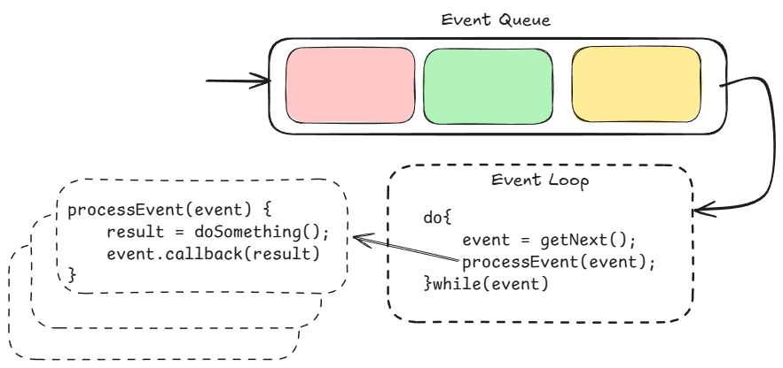
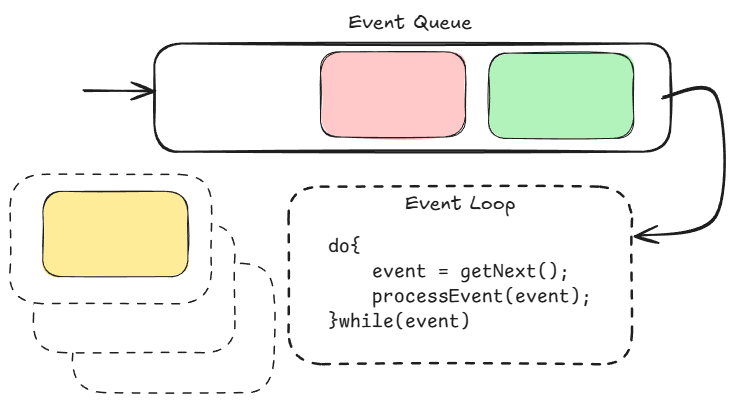
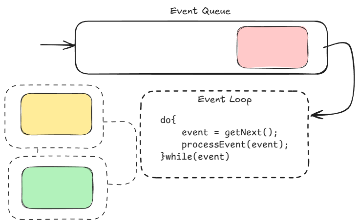
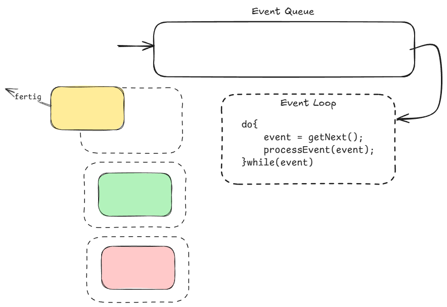
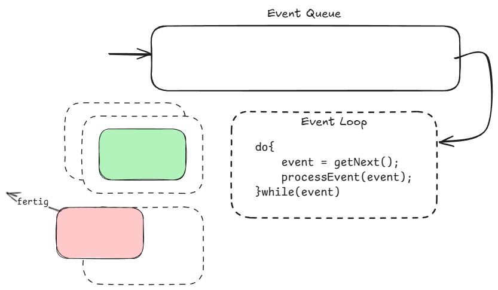

---
title: "Vorlesung Webengineering 1 - JavaScript Server Runtimes"
topic: "Webengineering_1_2_4"
author: "Lukas Panni"
theme: "metropolis"
fonttheme: "structurebold"
fontsize: 12pt
urlcolor: BrickRed
linkcolor: BrickRed
aspectratio: 169
lang: de-DE
section-titles: true
plantuml-format: svg
...


# JavaScript Server Runtimes

## Grundlagen - Motivation (1)

**Warum wollen wir überhaupt JavaScript auf dem Server verwenden?**


## Grundlagen - Motivation (2)

- Einheitliche Sprache: JavaScript sowohl im Frontend als auch im Backend
- Wiederverwendbarkeit von Code
- Wiederverwendbarkeit von **Entwicklern**

# Node.js 

- Veröffentlicht 2009 von Ryan Dahl
  - Kritik an Apache HTTP Server: schlechtes Handling von vielen parallelen Verbindungen
- Open Source (MIT Lizenz)
- **Ansatz**: Chromium V8 JavaScript Engine wiederverwenden, um JavaScript außerhalb des Browsers auszuführen
  - V8 ist gut gepflegt und leistungsstark, außerdem Open Source


## Node.js Installation

- Node.js kann über Installer oder Paketmanager installiert werden
  - [Windows Installer](https://nodejs.org/en/download/)
  - [Windows winget](https://winget.run/pkg/OpenJS/NodeJS) `winget install -e --id OpenJS.NodeJS`
  - [macOS Installer](https://nodejs.org/en/download/)
  - [macOS Homebrew](https://formulae.brew.sh/formula/node) `brew install node`
  - [Linux Package Manager](https://nodejs.org/en/download/package-manager/)


## Node.js Architektur

- Kombination aus V8 Engine, Event-Loop und Server-spezifischen APIs
- Nutzt Non-blocking I/O und Eventbasierte Architektur für hohe Skalierbarkeit

**Event-Loop** Konzept: Schleife die auf Ereignisse (Events) wartet und sie zur Verarbeitung verteilt

- Neue Events werden einer Warteschlange (Queue) hinzugefügt und vom Loop abgearbeitet
- Ersteller eines Events registriert eine Callback-Funktion, die aufgerufen wird, wenn das Event verarbeitet wurde

## Konzept Event-Loop (1)



## Konzept Event-Loop (2)




## Konzept Event-Loop (3)



## Konzept Event-Loop (4)



## Konzept Event-Loop (5)




## Zusammenfassung Event-Loop

- Events (z.B. HTTP Anfragen, Datei-Operationen) landen in einer Queue
- Event-Loop verteilt die Events zur Verarbeitung an Worker
- Event-Loop wartet nicht auf Ergebnis

- Stark vereinfacht
  - Tatsächlich gibt es mehrere Queues und der Event Loop ist in mehrere Phasen unterteilt
  - Darstellung reicht für Verständnis
  - Weitere Details zu Node.js Event Loop: [Node.js Dokumentation](https://nodejs.org/en/learn/asynchronous-work/event-loop-timers-and-nexttick)

# Node.js I/O


## Node.js Blocking I/O (1)

### Beispiel Synchron

```javascript
const fs = require("fs");

console.log("Start synchron");

const data = fs.readFileSync("./test.txt");
console.log("Daten synchron gelesen: ");
console.log(data.toString());

console.log("Ende synchron");
```

## Node.js Blocking I/O (2)

### Ausgabe

```text
Start synchron
Daten synchron gelesen:
Test-File Line 1
Test-File Line 2
Ende synchron
```

## Node.js Blocking I/O (3)

### Erklärung

- Modul `fs` (File System) wird über `require` eingebunden und ist über die Variable `fs` verfügbar
  - Mehr zu Modulen später
- Ausgabe wie wir erwarten würden

## Node.js Non-Blocking I/O (1)

```javascript
const fs = require("fs");

console.log("Start");

fs.readFile("./test.txt", (error, data) => {
  console.log("Daten gelesen: ");
  console.log(data.toString());
});

console.log("Ende");
```

## Node.js Non-Blocking I/O (2)

### Ausgabe

```text
Start
Ende
Daten gelesen:
Test-File Line 1
Test-File Line 2
```

## Node.js Non-Blocking I/O (3)

### Erklärung

- Ausgabe `console.log("Start")` wird sofort ausgeführt
- `fs.readFile` wird mit einer Callback-Funktion aufgerufen
  - Datei lesen ist aufwändig, daher standardmäßig asynchron
  - Aufgabe wird an das Betriebssystem übergeben \rightarrow{} Node.js kann weitere Aufgaben bearbeiten
  - Sobald das Betriebssystem fertig ist, wird die Callback-Funktion mit den Ergebnissen aufgerufen
- Ausgabe `console.log("Ende")` wird sofort ausgeführt

## Node.js Non-Blocking I/O (4)

- Viele Standardmodule für Dateisystem, Netzwerk, Timer usw. bieten asynchrone APIs
  - Ähnliche API wie bei `readFile` gezeigt
  - Beim Aufruf wird eine Callback-Funktion übergeben
  - Callback-Funktion wird aufgerufen, sobald die Aufgabe erledigt ist
- Meist zusätzlich auch synchroner Aufruf möglich
  - z.B. `fs.readFileSync` statt `fs.readFile`
  - \rightarrow{} Blockiert Node.js, bis die Aufgabe erledigt ist
  - \rightarrow{} Am besten vermeiden!


## Node.js Non-Blocking I/O mit Promises (1)

- Callbacks sind für Entwickler nicht so angenehm
  - Verschachtelte Callbacks sind schwer zu lesen
  - Fehlerbehandlung ist schwierig
  - \rightarrow{} Promises sind eine bessere Alternative
- Ab Node.js 10 ist für `fs` auch eine Promise-basierte API verfügbar
  - Import über `const fs = require("fs").promises;`
  - Um `await` zu nutzen, muss der Code in einem `async`-Kontext stehen oder als ES-Modul ausgeführt werden (z.B. über `{"type": "module"}` in `package.json`)


## Node.js Non-Blocking I/O mit Promises (3)

```javascript
const fs = require("fs");

fs.exists("./test.txt", (exists) => {
  if (exists) {
    fs.readFile("./test.txt", (error, data) => {
      if(error){
        fs.exists("./test2.txt", (exists) => {
          ...
        })
      }
      console.log("Daten gelesen: ");
      console.log(data.toString());
      
    });
  } 
});
```


## Node.js Non-Blocking I/O mit Promises (3)

```javascript
import { promises as fs } from "fs";
const exists = await fs.exists("./test.txt");
if (exists) {
    try { 
      const data = await fs.readFile("./test.txt");
      console.log("Daten gelesen: ");
      console.log(data.toString());
    }catch(error){
      const exists2 = await fs.exists("./test2.txt");
      ...
    }
} 
```

## Node.js HTTP-Server

```javascript
import { createServer } from "node:http";

createServer((request, response) => {
  response.writeHead(200, {
    "Content-Type": "text/html",
  });
  response.write(
    "<!DOCTYPE html>\n<html>\n<head>\n<title>Test</title>\
    \n</head>\n<body>\n<h1>Test</h1>\n</body>\n</html>\n"
  );
  response.end();
}).listen(80);
```


## Node.js Non-Blocking I/O mit Promises (4)

In diesem Beispiel ist der Unterschied noch nicht so groß, aber der Trend ist klar:

- je mehr Operationen, desto mehr Callbacks, desto mehr Verschachtelung, desto unleserlicher
- Promises ermöglichen eine flacheere Struktur, die leichter zu lesen und zu warten ist
  - \rightarrow{} ähnlicher zu synchronem Code, erleichtert intuitives Verständnis


## Aufgabe 1

Schreibt einen einfachen HTTP-Server, der HTML-, CSS- und JavaScript-Dateien ausliefern kann.
Der Server soll auf Port 80 laufen und bei einem Aufruf der URL `http://localhost/` oder `http://localhost/index.html` die Datei `index.html` ausliefern.
Bei einem Aufruf der URL `http://localhost/style.css` soll die Datei `style.css` ausgeliefert werden.
Analog auch für `/script.js`.
Bei allen anderen Anfragen soll ein Fehler ausgegeben werden.

Achtet auf die richtigen _Content-Types_ und _Status-Codes_!

Argumente von `createServer`: `request`: [http.IncomingMessage](https://nodejs.org/api/http.html#class-httpincomingmessage), `response`: [http.ServerResponse](https://nodejs.org/api/http.html#class-httpserverresponse)

**Zeit**: 20 min.

## Theoretische Fragen

- Was ist Node.js und wofür wird es verwendet?
- Erläutern Sie den Unterschied zwischen Blocking und Non-Blocking I/O. Welche Vorteile ergeben sich bei Non-Blocking I/O?


# Module und Packages

## Module in Node.js

- Einige Standard-Module sind in Node.js integriert: `fs`, `http`, `os`, `net` ...
- Ein Modul ist eine abgeschlossene Einheit mit **wiederverwendbarer Funktionalität**
  - Bessere Strukturierung von Code
  - Wird inzwischen auch in Browsern unterstützt
    - Bundling oft trotzdem notwendig/sinnvoll
- Historisch mehrere Modulsysteme für Node.js:
  - CommonJS (CJS)
  - ECMAScript Modules (ESM)

## CommonJS vs. ECMAScript Modules (1)

**CJS**: Historisch lange Standard in Node.js

- Import über `require()` Funktion
  - Import zur Laufzeit möglich (dynamisch)
- Export über `module.exports` Objekt

## CommonJS vs. ECMAScript Modules (2)

**ESM**: In Node.js über die Endung `.mjs` oder `{"type": "module"}` in `package.json` aktivierbar

- Import über `import XY` Statement
  - Statische `import`-Syntax; zusätzlich existiert `import()` für dynamische Importe
  - Import einzelner Teile möglich (z.B. `import { readFileSync } from "fs";`)
- Export über `export` Statement
  - Benannter Export möglich (z.B. `export function XY ...`)
- Moderner und heute empfohlen

## CommonJS vs. ECMAScript Modules (3)

```javascript
// CJS
const fs = require("fs");
const data = fs.readFileSync("./test.txt");
module.exports = data;
```

```javascript
// ESM
import { readFileSync } from "fs";
const data = readFileSync("./test.txt");
export default data;
```

## Eigene Module

- Wiederverwendbare Komponenten über `module.exports` (CJS) oder `export` (ESM) exportieren
  - Funktion, Klasse, Objekt, ...
  - Auch zur reinen Strukturierung von Code möglich
- In anderen Dateien über die jeweiligen Import-Mechanismen einbinden
  - In der Regel über relativen Pfad
    - `import XY from "./xy.js";` (ESM)
    - `const XY = require("./xy.js");` (CJS)

## Packages in Node.js

- **Module** = eine JavaScript-Datei
- **Package** = "A package is a folder tree described by a `package.json` file." ([Node.js Dokumentation](https://nodejs.org/api/packages.html))
  - Enthält mindestens ein Modul
  - Wird über Konfigurationsdatei `package.json` beschrieben
  - Umfasst alle Unterordner, die kein `package.json` oder einen Unterordner `node_modules` enthalten

## Package-Manager npm

- Node.js bringt einen **Package-Manager** mit: `npm`
- Installation von vorgefertigten Packages aus dem Internet
  - Standard-Registry: [npmjs.com](https://www.npmjs.com/)
  - Installation in `node_modules`-Ordner und Eintrag in `package.json`
  - Installation aller Abhängigkeiten
- Veröffentlichung eigener Packages
- Funktionen von Packages können über `require()` (CJS) oder `import` (ESM) importiert werden

## Arbeit mit npm

- Projekt initialisieren: `npm init`
  - Erstellt `package.json` mit Basisinformationen über das Projekt (Name, Version, ...)
- Package installieren: `npm install <package>` (kurz `npm i <package>`)
  - `--save-prod (-P)`: Package in `package.json` unter `dependencies` eintragen (default)
  - `--save-dev (-D)`: Package in `package.json` unter `devDependencies` eintragen
  - `--global (-g)`: Package global (nicht im aktuellen Projekt) installieren
- Package entfernen: `npm uninstall <package>`

## Risiken bei Verwendung von npm

- Packages können beliebigen Code ausführen (Zur Laufzeit **und** bei der Installation)
  - \rightarrow{} Sicherheitsrisiko!
- Packages können beliebige Abhängigkeiten haben
  - Kein (einfacher) Überblick über verwendeten Code
  - \rightarrow{} Erhöht das Sicherheitsrisiko: sogenannte Lieferkettenangriffe (Supply Chain Attacks)
- Lizenzrisiken
  - Packages können beliebige Lizenzen haben
  - Bei **Auslieferung** von Software (auch Bereitstellung im Internet)! müssen Bedingungen beachtet werden
  - \rightarrow{} rechtliche Folgen möglich, bis hin zu Verbreitungsverboten und Schadensersatzforderungen
- \rightarrow{} Packages nur von vertrauenswürdigen Quellen installieren!

## Best-Practices bei der Installation von npm Packages

- Nur vertrauenswürdige Quellen verwenden: npm-Registry, GitHub, firmeninterne Registries
  - ABER: jeder kann Packages in öffentliche Registries hochladen
- Package-Namen und -Versionen prüfen \rightarrow{} Vermeidung von Tippfehlern (sogenanntes _typosquatting_)
- Vertrauenswürdige Packages bevorzugen: komplexes Thema!
  - Popularität: Download-Zahlen, GitHub-Stars
  - Aktivität: Commits, Issues, Pull Requests, ... in den letzten Wochen/Monaten
    - Insbesondere Achtung vor Packages, die seit Jahren nicht mehr aktualisiert wurden
  - Bekante Schwachstellen: [npm audit](https://docs.npmjs.com/cli/v7/commands/npm-audit), [OSV](https://osv.dev/)


## npm Alternativen

- Verschiedene alternative Package Manager mit jeweils eigenen Stärken
  - [yarn](https://yarnpkg.com/)
    - Schneller
    - Besseres Caching
  - [pnpm](https://pnpm.io/)
    - Schneller
    - Weniger Speicherplatzverbrauch durch Teilen von Packages zwischen Projekten
    - Guter Monorepo support

## Theoretische Fragen

- Was ist ein _Module_ im Node.js Kontext?
- Was ist ein _Package_ im Node.js Kontext?
- Nennen Sie Vorteile bei der Verwendung von _Packages_ und _Modules_.
- Nennen Sie 2 Risiken bei der Verwendung von _npm_.
- Nennen Sie einen alternativen Package Manager zu npm und nennen Sie einen Vorteil gegenüber npm.


# Bun als moderne TypeScript-Runtime

## Bun (1)

[bun.sh](https://bun.sh/)

- Runtime + Bundler + Package Manager + Test-Runner für JavaScript und **TypeScript**
- Basiert auf `JavaScriptCore` Engine aus Apple WebKit
- idR. Performanter als Node.js
- Standardfunktionalität bereits eingebaut (z.B. HTTP-Server, S3 Client)
- Nutzung von NPM-Paketen mit eigenem NPM-Client

## Bun (2)

- [Installation](https://bun.sh/docs/installation):
  - MacOS/Linux: `curl -fsSL https://bun.sh/install | bash`
  - Windows: `powershell -c "irm bun.sh/install.ps1|iex"`


## Bun (3)

- Bun bringt einige Funktionen direkt mit:
  - Package Manager: `bun install/remove`
  - Test-Runner: `bun test`, oft trotzdem bekannte Testframeworks sinnvoll
  - Bundler: `bun build`, Unterstützt Browser und Server-Bundles
    - Erlaubt auch die Erstellung von ausführbaren Dateien, die ohne separate Runtime genutzt werden können
- Inzwischen aufgekauft von Anthropic, Bun ist die Basis für die Claude Code CLI


## Warum Bun?

- Für neue TypeScript-Projekte häufig sinnvoll
  - Keine Kompilation mit `tsc` notwendig
  - In Kombination mit `bun --watch` Funktionalität sehr angenehm für schnelle Iteration
  - Eigener Bundler und Test-Runner vereinheitlichen Toolchain
- Performance-Gewinne können für größere Projekte relevant sein

## Bun TypeScript Projekt-Setup (1)

{height=70%}

## Bun TypeScript Projekt-Setup (2)

- Erstellt automatisch alle nötigen Dateien
  - `package.json` mit Metadaten
  - `tsconfig.json` für TypeScript-Konfiguration \rightarrow{} erlaubt spätere Kompilation und IDE-Unterstützung
- `src/index.ts` als Einstiegspunkt

## Bun HTTP Server (1)

```typescript
Bun.serve({
  port: 8000,
  fetch(request) {
    return new Response("Welcome to Bun!");
  },
});
```
Ganz einfacher HTTP Server. 
`GET http://localhost:8000/` -> `HTTP/1.1 200 OK`
`Welcome to Bun!`

## Bun HTTP Server (2)

Ab Bun 1.2.3 bietet `Bun.serve` auch Unterstützung für Request-Handler für verschiedene Routen:

```typescript
Bun.serve({
  routes: {
    "/api/status": new Response("OK"),
    "/api/users/:id": req => {
      return new Response(`Hello User ${req.params.id}!`);
    },
...
```

## Bun HTTP Server (3)

Und auch Unterstützung für verschiedene HTTP-Methoden:
```typescript
    "/api/posts": {
      GET: () => new Response("List posts"),
      POST: async req => {
        const body = await req.json();
        return Response.json({ created: true, ...body });
      },
    },
```
## Bun HTTP Server (4)

- Reicht aus für einfache APIs
  - Route definiert als (vereinfacht): `Response | Function<Response> | Record<HTTPMethod, Response | Function<Response>>`
  - Pfad-Parameter werden über `:<VAR>` definiert und sind über `request.params.VAR` abrufbar

## Aufgabe 2

Schreibt einen HTTP-Server mit Bun, der eine einfache `count` API bereitstellt:

- GET `/api/count`: aktuelle Zahl (initial 0)
- POST `/api/count`: Zahl um 1 erhöhen und neue Zahl zurückgeben
- DELETE `/api/count`: Zahl auf 0 zurücksetzen und neue Zahl zurückgeben
- PUT `/api/count`: Zahl auf übergebenen Wert setzen und neue Zahl zurückgeben (z.B. `{"value": 42}`)

Zeit: 20 min.

## Bun HTML Server

- Über `Bun.serve` können auch HTML Dateien einfach ausgeliefert werden
- Unterstützt _Hot Module Replacement (HMR)_ für Entwicklung
  - Änderungen an HTML, CSS oder JavaScript Dateien werden automatisch erkannt und die Seite im Browser aktualisiert
- Import von HTML Dateien als Module: `import page from "./index.html";`
  - Direkt in route ausliefern: `"/": page`
- Erlaubt auch komplexere Setups, z.B. bereitstellen einer React-Anwendung
  - Schon gesehen bei [Repository Pattern](./22_Backend_Grundlagen.md#repository-pattern) in der letzten Einheit

## Bun Bundler (1)

- Frontend Frameworks und die Verwendung von TypeScript im Backend erfordern einen Build-Step damit sie im Browser oder in Node.js lauffähig sind
- Buns Bundler unterstützt sowohl Browser- als auch Server-Bundles (und auch Full-Stack Bundles)
  - TypeScript zu JavaScript Transpilation
  - Import-Auflösung (TypeScript-Module, npm Packages, ...)
  - Minifikation 
  - Auflösung von Bun spezifischen APIs für die Zielumgebung (nicht notwendig, wenn Ziel-Runtime=Bun)
- Erlaubt bundeln der Bun Runtime (`--compile`) \rightarrow{} ergibt standalone executable

## Bun Bundler (2)

- Einfaches bundeln `bun build src/index.ts --outdir dist`
  - Entrypoint `src/index.ts` wird gebaut und Ergebnisse (potenziell mehrere Dateien) im Ordner `dist` abgelegt
- Nur eine Ausgabedatei: `bun build src/index.ts --outfile dist/index.js`
- Kompilieren in ausführbare Datei: `bun build src/index.ts --outfile dist/index --compile`
