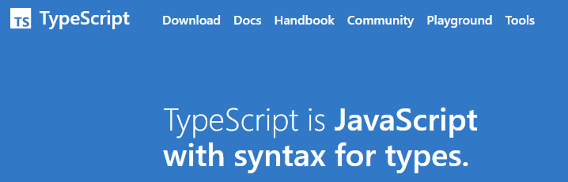
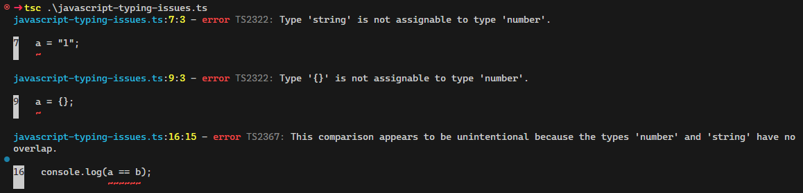
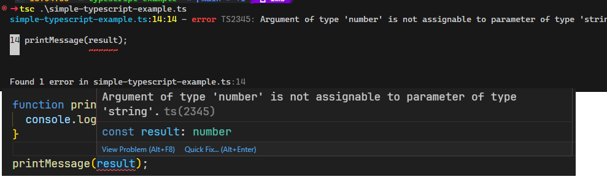
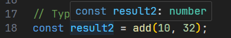
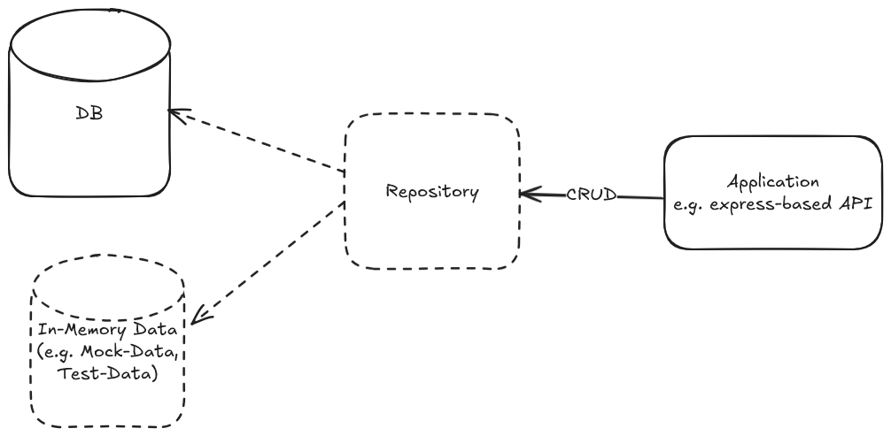
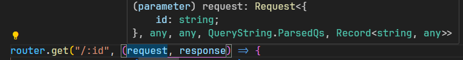

---
title: "Vorlesung Webengineering 1 - TypeScript"
topic: "Webengineering_1_2_4"
author: "Lukas Panni"
theme: "Berlin"
colortheme: "dove"
fonttheme: "structurebold"
fontsize: 12pt
urlcolor: olive
linkstyle: boldslanted
aspectratio: 169
lang: de-DE
section-titles: true
plantuml-format: svg
...

# TypeScript - das bessere JavaScript

## Probleme von JavaScript

Dynamische Typisierung

- Variablen können jederzeit den Typ wechseln
- Typen werden erst zur Laufzeit geprüft
- Zusätzlich: **automatische** Typumwandlung (_type coercion_)

\rightarrow{} Eingabeabhängige Laufzeitfehler, schwer zu finden!

## Beispiel: Dynamische Typen

```javascript
let a = 1;
console.log(a, typeof a);
a = "1";
console.log(a, typeof a);
a = {};
console.log(a, typeof a);
```

## Beispiel: Type Coercion

```javascript
let a = 1;
let b = "1";
console.log(a == b);
let c = a + b;
console.log(c, typeof c);
let d = a - b;
console.log(d, typeof d);
console.log(++a, ++b);
```

## Beispiel: Dynamische Typen + Type Coercion bei Funktionsargumenten

```javascript
function add(a, b) {
  return a + b;
}

console.log(add(1, 2));
console.log(add("1", "2"));
console.log(add(undefined, 2));
console.log(add(null, 2));
```

## Lösung: Statische Typisierung

- Typprüfungen zur Entwicklungszeit \rightarrow{} Kompilationsschritt
- Keine Änderung von Typen zur Laufzeit

**Vorteil**: Typfehler werden frühzeitig erkannt und teilweise verhindert

## TypeScript

{width=80%}

## TypeScript Vorteile

- Typsicherheit
  - Vermeidung/Früherkennung von Typfehlern
- Verbesserte Codequalität
  - Bessere Verständlichkeit
  - Bessere Dokumentation
- Verbesserte Toolunterstützung
  - Codevervollständigung
  - Refactoring


## TypeScript - Grundsätzliches

- Erweiterung (Superset) von JavaScript: jedes JavaScript ist auch gültiges TypeScript
  - Statische Typisierung
  - Klassenfeatures \rightarrow{} Teilweise in ECMAScript 6 (=2015) (JavaScript-Standard)
- Kompiliert zu JavaScript
  - Browser können TypeScript nicht interpretieren
  - TypeScript-Compiler (`tsc`) erzeugt JavaScript \rightarrow{} zusätzlicher Schritt!

## TypeScript - Quickstart

- Webseite: [typescriptlang.org](https://typescriptlang.org)
- Installation TypeScript-Compiler
  - `npm install -g typescript` (global) oder `npm install typescript` (lokal)
- Kompilieren von TypeScript-Dateien
  - `tsc <dateiname.ts>` \rightarrow{} Erzeugt JavaScript-Datei `<dateiname.js>`
- Ausführen von erzeugtem JavaScript
  - `node <dateiname.js>`

## TypeScript Kompiler-Optionen (1)

- `tsc`-Compiler bietet viele Optionen zur Konfiguration
- Beispiel: `tsconfig.json`-Datei zur Konfiguration des Compilers
  - `tsc --init` erstellt eine `tsconfig.json`-Datei
  - Optionen sind mit Kommentaren gut erklärt
  - Oft reichen Standard-Einstellungen aus
    - Insbesondere wenn `tsconfig.json` von Framework oder Template vorgegeben!
- Hilfreichste Option `strict`: Aktiviert alle strikten Typenprüfungen für höchste Typsicherheit

## TypeScript Kompiler-Optionen (2)

- Häufige Optionen
  - `outDir`: Verzeichnis für Ausgabedateien
  - `include`: Dateien/Pattern, die kompiliert werden sollen
  - `exclude`: Dateien/Pattern, die nicht berücksichtigt werden sollen
  - `types`: Typdefinitionen für JavaScript-Bibliotheken (z.B. Standardmäßig alle NodeJS typen integrieren)


## TypeScript - Beispiel: Probleme von JavaScript

Kompilation der zuvor gezeigten Beispiele (gleicher Code, Dateiendung `.ts`):



## TypeScript Features - Type Annotations (1)

- Explizite Typangaben für Variablen, Funktionen, Parameter, Rückgabewerte

```typescript
let a: number = 1;
let b: number = 2;

function add(x: number, y: number): number {
  return x + y;
}
const result: number = add(a, b);
console.log(result);
```

## TypeScript Features - Type Annotations (2)

```typescript
...
function printMessage(message: string) {
  console.log(message);
}

printMessage(result);
```

## TypeScript Features - Type Annotations (3)

### Typfehler



## TypeScript Features - Type Inference

- Explizite Typangaben sind aufwändig
- Gewünschte Typen ergeben sich meist aus dem Kontext
  - TypeScript kann Typen ableiten \rightarrow{} **Type Inference** / Typinferenz



## Praxisaufgabe 1

Erstellt ein neues TypeScript projekt (z.B. auf Basis von vorherigen JavaScript Praxisaufgaben) und zeigt mindestens 3 Beispiele für Vorteile der TypeScript Implementierung auf. Das Projekt soll über den Befehl `npm run build` kompiliert werden und über `npm run start` gestartet werden können (nutzt dazu "scripts" in der `package.json`, siehe Doku falls erforderlich). Bereitet eine kurze Präsentation dazu vor.


## TypeScript Features - Klassen (1)

- Mehr Klassenfeatures als in JavaScript (ECMAScript 6)
  - Zugriffsmodifier `public`, `private`, `protected`
  - _Accessors_: Getter und Setter
  - Statische Member (`static`)
  - Vererbungsfeatures
    - Abstrakte Klassen
    - Interfaces
  - **Generics**
  - ...

## TypeScript Features - Klassen (2)

Beispiel [`typescript-classes.ts`](https://github.com/TINF23B5-Webengineering/Lecture_Code/blob/2025/23_Typescript/typescript-example/typescript-classes.ts)


## Exkurs: Interfaces in der Praxis - Repository Pattern (1)

- Repository Pattern: Abstraktion von Datenzugriff
  - Ermöglicht Austausch von Datenquellen (z.B. verschiedene Datenbanksysteme, Mock-Implementierungen)
  - Entkoppelt Datenspeicherung von restlicher Logik
  - \rightarrow{} Einfaches Testen von Daten-abhängiger Logik ohne echte Datenbank

## Exkurs: Interfaces in der Praxis - Repository Pattern (2)

{height=80%}

## Exkurs: Interfaces in der Praxis - Repository Pattern (3)

```typescript
// user-repository.ts
export interface UserRepository {
  getUserById(id: number): User | undefined;
  addUser(user: User): void;
  ...
}
// index.ts
const userStore: UserRepository = new InMemoryUserRepository(); 
app.get("/user/:id", (req, response) => { 
  response.json(userStore.getUserById(req.params.id));
});
```

## Exkurs: Interfaces in der Praxis - Repository Pattern (3)

- Realistischere Implementierung
  - User-Routen werden z.B. über `createUserRouter(userStore: UserRepository)` erzeugt
  - Parameter `userStore` wird je nach Konfiguration entsprechend initialisiert
  - \rightarrow{} Einfacher Austausch von Datenquellen anhand von z.B. Umgebungsvariablen


## TypeScript Features - weitere Typfeatures (1)

- Definition von neuen Typen (Typalias), insbesondere für komplexe Typen
  - `type <name> = <typ>`

- Kombination mehrerer Typen zu neuem komplexeren Typ
  - Union: `type1 | type2` \rightarrow{} Sowohl `type1` als auch `type2` erlaubt
  - String-Unions: `"text1" | "text2"` \rightarrow{} erlaubt nur bestimmte Strings als Werte
  - Intersection: `type1 & type2` \rightarrow{} Typ muss sowohl `type1` als auch `type2` erfüllen
    - z.B. `type1 = {a: string}` und `type2 = {b: number}` \rightarrow{} `type1 & type2 => {a: string, b: number}` 
  
## TypeScript Features - weitere Typfeatures (2)

**Mapped Types**: dynamischer Typ aus bestehenden Typen,  häufiges Beispiel: Readonly-Typ (Achtung: nur Typprüfung, keine echte Immutability!)

```typescript
type Readonly<T> = {
    // für alle Properties P in Typ T:
    //  eine readonly Property mit gleichem Typ
    readonly [P in keyof T]: T[P]; 
}
type ReadonlyPerson = Readonly<Person>;
```

## TypeScript Features - Komplexere Typangaben (3)

**Type Guards**: Typprüfung zur Laufzeit

```typescript
export function isPerson(obj: any): obj is Person {
  return obj.name !== undefined && obj.age !== undefined;
}
```

- `isPerson(object) === true` \rightarrow{} danach kann `obj` wie vom Typ `Person` verwendet werden


## TypeScript Features - Komplexere Typangaben (4)

[**Utility Types**](https://www.typescriptlang.org/docs/handbook/utility-types.html): vordefinierte, häufige Typtransformationen

- `Partial<T>`: Properties von `T` optional
- `Required<T>`: Properties von `T` erforderlich
- `Readonly<T>`: Wie oben schon gezeigt
- `Pick<T, K>`: Ausgewählte Properties von `T` (mit Namen in `K`)
- ...

## TypeScript Ressourcen

- [TypeScript-Handbuch](https://www.typescriptlang.org/docs/handbook/intro.html)
- [TypeScript Playground](https://www.typescriptlang.org/play): Online-Editor zum Ausprobieren von TypeScript
- [TypeScript-Tutorial (Text)](https://learn.microsoft.com/en-us/training/paths/build-javascript-applications-typescript/)
- [TypeScript-Tutorial (Video)](https://www.youtube.com/watch?v=_CaGUZNEobk)
- [Typdefinitionen für JavaScript-Bibliotheken](https://github.com/DefinitelyTyped/DefinitelyTyped)

# TypeScript in der Praxis

## express mit TypeScript 

- [`DefinitelyTyped`-Projekt](https://github.com/DefinitelyTyped/DefinitelyTyped) stellt Typdefinitionen für viele JavaScript-Bibliotheken bereit
- Installation von typen für express
  - `npm install express @types/express`


## express mit TypeScript - Beispiel User Router (1)

```typescript
const users: User[] = [
  { id: 1, name: "Lukas" },
  { id: 2, name: "Silas" },
];

router.get("/", (_, response) => {
  response.json(users);
});

```

## express mit TypeScript - Beispiel User Router (2)

```typescript
router.get("/:id", (request, response) => {
  const id = parseInt(request.params.id);
  const user = users.find((user) => user.id === id);

  if (user) {
    response.json(user);
  } else {
    response.status(404).json({ message: "User not found" });
  }
});

```

## express mit TypeScript - Beispiel User Router (3)



## Praxisaufgabe 2

Erweitert den User Router um eine Implementierung des Repository pattern. Es sollen die klassischen CRUD Operationen implementiert werden. Als konkrete Implementierung des Repositories reicht ein In-Memory Speicher auf Basis eines Arrays aus.
  

## express mit TypeScript - Beispiel Caching Middleware

- Siehe [cache-middleware.ts](https://github.com/TINF23B5-Webengineering/Lecture_Code/blob/2025/23_Typescript/typescript-express/cache-middleware.ts)
- Vorteile:
  - Stellt kompatible `getCacheKey` Funktion zur Entwicklungszeit sicher
  - Typsicherheit bei Verwendung 
  - Allgemein bessere Developer Experience (DX)


## Input und Typ-Validierung zur Laufzeit mit zod

- [zod](https://zod.dev/) ist eine Bibliothek zur Input-Validierung
- Validierung basiert auf erwartetem _Schema_
- Erlaubt Validierung von primitiven Typen und komplexen Objekten zur Laufzeit
- Erzeugt aus Schema TypeScript-Typen zur statischen Typisierung zur Entwicklungszeit
- Installation: `npm install zod`

## zod - Beispiel Strings

```typescript

import { z } from "zod";

// String mit Länge 1-20
const helloWorldSchema = z.string().min(1).max(20); 
const string1 = helloWorldSchema.parse("Hello, World!"); // ok
const string2 = helloWorldSchema.parse(""); 
// Error: { code: 'too_small', message: ... }
const { success, data, error } = helloWorldSchema.safeParse(""); 
// ok, success = false 

```

## zod - Primitive Typen

- [Primitive-Typen](https://zod.dev/?id=primitives) 
  - `z.string()`
  - `z.number()`
  - `z.boolean()`
  - `z.date()`
  - ...
- Zusätzlich mit Support für Typumwandlung (Coercion) zur Laufzeit
  - `z.coerce.number().parse("1")` \rightarrow{} `1`
  - Keine vorherige Umwandlung von User-Input (strings) nötig

## zod - Einschränkungen für Primitive Typen (1)

- Einfache Einschränkungen für Wertebereiche möglich
- [Zahlen](https://zod.dev/?id=numbers)
  - Beispiel `z.number().gt(0).lte(100)` \rightarrow{} Zahl > 0 und <= 100
  - `gt`: greater than \rightarrow{} >
  - `gte`: greater than or equal \rightarrow{} >= alias `min`
  - `lt`: less than \rightarrow{} <
  - `lte`: less than or equal \rightarrow{} <= alias `max`
  - `int`: integer
  - `multipleOf`: Vielfaches von Zahl
  - `positive`, `negative`, `nonpositive`, `nonnegative` ...

## zod - Einschränkungen für Primitive Typen (2)


- [Strings](https://zod.dev/?id=strings) sehr viele Möglichkeiten, z.B.:
  - `min`, `max`: Länge
  - `email`: E-Mail-Adresse
  - `url`: URL
  - `uuid`: UUID
  - `ip`: IP-Adressen
  - `regex`: Validierung anhand von Regex
  - `includes`: String muss bestimmten Substring enthalten
  - `startsWith`, `endsWith`: String muss mit bestimmtem Substring beginnen/endigen
  - `trim`: Leerzeichen entfernen
  - `toLowerCase`, `toUpperCase`: Groß-/Kleinschreibung
  - `date`: ISO-Datum
  - ...


## zod - Enums, optionale und undefinierte Werte

- Feste Wertemengen mit `z.enum()`
  - `z.enum(["red", "green", "blue"])`
- Bei schon vorhandenem Enum-Typ: `z.nativeEnum(MyEnum)`
- Optionale Werte mit `z.optional()` und `schema.optional()`
  - `z.optional(z.string())` \rightarrow{} = `z.string().optional()`

## zod - Komplexe Typen (1)

- Arrays mit `z.array()`
  - `min`, `max`: Minimale / Maximale Länge
  - `length`: Exakte Länge
  - `nonempty`: Nicht leer
- Tupel mit `z.tuple()`
  - `z.tuple([...])`
  - Feste Anzahl von Elementen
  - Typen der Elemente können unterschiedlich sein

## zod - Komplexe Typen (2)

- Definition von [Objekten](https://zod.dev/?id=objects) mit `z.object()`
  - `z.object({ key1: <zodSchema>, key2: ... })`
- Beispiel:

```typescript
const userSchema = z.object({
  id: z.number(),
  name: z.string(),
  email: z.string().email(),
});
```

- zod Schema kann in TypeScript-Typ für Verwendung bei Parameter- und Rückgabetypen konvertiert werden
  - `type SchemaType = z.infer<typeof schema>`


## zod - Komplexe Typen (3)

- Weitere komplexe Typen:
  - [Unions](https://zod.dev/?id=unions)
  - [Discriminated Unions](https://zod.dev/?id=discriminated-unions) 
  - [Records](https://zod.dev/?id=records)
  - [Maps](https://zod.dev/?id=maps)


## zod - Komplexe Typen (4)

- Komplexe zod Schemata können verschachtelt werden
- Beispiel:

```typescript
const userSchema = z.object({
  ... 
  emails: z.array(z.string().email()),
  address: z.object({
    street: z.string(),
    city: z.string(),
  }),

});
```


## zod - Sonstiges

- Viele weitere hilfreiche Funktionen:
  - `transform`: Transformation von Werten
  - `refine`: Benutzerdefinierte Validierungsfunktionen
  - ...

- Wenn Input-Validierung benötigt wird, ist zod in der Regel einer eigenen Implementierung vorzuziehen!