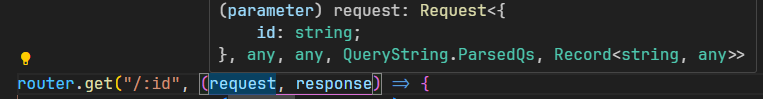

---
title: "Vorlesung Webengineering 1 - TypeScript"
topic: "Webengineering_1_2_4"
author: "Lukas Panni"
theme: "Berlin"
colortheme: "dove"
fonttheme: "structurebold"
fontsize: 12pt
urlcolor: olive
linkstyle: boldslanted
aspectratio: 169
lang: de-DE
section-titles: true
plantuml-format: svg
...

# Wiederholung TypeScript


## Basics

- Typprüfung zur Entwicklungszeit, keine Prüfung zur Laufzeit!
- TypeScript ist ein Superset von JavaScript
  - Gültiges JavaScript ist immer auch gültiges TypeScript
  - Explizite Typangaben sind optional
- TypeScript-Compiler `tsc` übersetzt TypeScript-Code in JavaScript-Code
- Vorteile
  - Vermeidung/Früherkennung von Fehlern
  - Verbesserung der Codequalität


## Type Annotations

Explizite Typangaben für Variablen, Funktionen, Parameter, Rückgabewerte, etc.

```typescript
const message: string = "Hello, World!";

function greet(name: string): string {
  return `Hello, ${name}!`;
}
```
Type-Inferenz sorgt dafür, dass viele Typangaben nicht notwendig sind und Typsicherheit trotzdem gegeben ist.


## Klassen und Interfaces 

- Klassen und Interfaces auch zur Strukturierung von Code
- Code-Beispiel: [`typescript-classes.ts`](https://github.com/TINF23B5-Webengineering/Lecture_Code/blob/2025/23_Typescript/typescript-example/typescript-classes.ts)
- Generics: Typen als Parameter
  - Beispiel: `class List<T> { ... }` zur Beschreibung einer Liste vom Typ `T`, der tatsächliche Typ (z.B. `number`) wird erst bei Instanziierung festgelegt (bzw. automatisch erkannt)
  - Beispiel: `type Result<T> = { success: true, data: T } | { success: false, error: Error }`


# TypeScript - Anwendung in der Praxis


## TypeScript in der Praxis

- Viele der TypeScript-Features sind in der Praxis sehr nützlich
  - Insbesondere durch steigende Verbreitung von TypeScript in Bibliotheken und Frameworks
- Es gibt aber auch praktische Probleme:
  - Konfiguration `tsconfig.json` ist nicht immer einfach 
    - Projekt-Templates helfen hier
  - Zusätzlicher Build-Schritt notwendig 
  - Typdefinitionen für Bibliotheken sind nicht immer vorhanden oder unvollständig


## express mit TypeScript

- [`DefinitelyTyped`-Projekt](https://github.com/DefinitelyTyped/DefinitelyTyped) stellt Typdefinitionen für viele JavaScript-Bibliotheken bereit
  - Viele Bibliotheken kommen inzwischen direkt mit TypeScript-Unterstützung
- Installation von typen für express
  - `npm install express @types/express`

## express mit TypeScript - Beispiel User Router (1)

```typescript
const users: User[] = [
  { id: 1, name: "Lukas" },
  { id: 2, name: "Silas" },
];

router.get("/", (_, response) => {
  response.json(users);
});
```

## express mit TypeScript - Beispiel User Router (2)

```typescript
router.get("/:id", (request, response) => {
  const id = parseInt(request.params.id);
  const user = users.find((user) => user.id === id);

  if (user) {
    response.json(user);
  } else {
    response.status(404).json({ message: "User not found" });
  }
});
```

## express mit TypeScript - Beispiel User Router (3)




## express mit TypeScript - Beispiel Caching Middleware

- Siehe [cache-middleware.ts](https://github.com/TINF23B5-Webengineering/Lecture_Code/blob/2025/23_Typescript/typescript-express/cache-middleware.ts)
- Vorteile:
  - Stellt kompatible `getCacheKey` Funktion zur Entwicklungszeit sicher
  - Typsicherheit bei Verwendung
  - Allgemein bessere Developer Experience (DX)

## Beispiel: Repository Pattern mit TypeScript (1)

- Eventuell relevant für Projektarbeit!
- Repository Pattern: Abstraktion von Datenzugriff
  - Ermöglicht Austausch von Datenquellen (z.B. verschiedene Datenbanksysteme, Mock-Implementierungen)
  - Entkoppelt Datenspeicherung von restlicher Logik
  - \rightarrow{} Einfaches Testen von Daten-abhängiger Logik ohne echte Datenbank

## Beispiel: Repository Pattern mit TypeScript (2)

{height=80%}

## Beispiel: Repository Pattern mit TypeScript (3)

```typescript
// user-repository.ts
export interface UserRepository {
  getUserById(id: number): User | undefined;
  addUser(user: User): void;
  ...
}
// index.ts
const userStore: UserRepository = new InMemoryUserRepository();
app.get("/user/:id", (req, response) => {
  response.json(userStore.getUserById(req.params.id));
});
```

## Beispiel: Repository Pattern mit TypeScript(4)

- Realistischere Implementierung
  - User-Routen werden z.B. über `createUserRouter(userStore: UserRepository)` erzeugt
  - Parameter `userStore` wird je nach Konfiguration entsprechend initialisiert
  - \rightarrow{} Einfacher Austausch von Datenquellen anhand von z.B. Umgebungsvariablen


## Praxisaufgabe 1

Erweitert den User Router um eine Implementierung des Repository Pattern. Es sollen die klassischen CRUD Operationen implementiert werden. Als konkrete Implementierung des Repositories reicht ein In-Memory Speicher auf Basis eines Arrays aus.


## Input und Typ-Validierung zur Laufzeit mit zod

- [zod](https://zod.dev/) ist eine Bibliothek zur Input-Validierung
- Validierung basiert auf erwartetem _Schema_
- Erlaubt Validierung von primitiven Typen und komplexen Objekten zur Laufzeit
- Erzeugt aus Schema TypeScript-Typen zur statischen Typisierung zur Entwicklungszeit
- Installation: `npm install zod`

## zod - Beispiel Strings

```typescript
import { z } from "zod";

// String mit Länge 1-20
const helloWorldSchema = z.string().min(1).max(20);
const string1 = helloWorldSchema.parse("Hello, World!"); // ok
const string2 = helloWorldSchema.parse("");
// Error: { code: 'too_small', message: ... }
const { success, data, error } = helloWorldSchema.safeParse("");
// ok, success = false
```

## zod - Primitive Typen

- [Primitive-Typen](https://zod.dev/?id=primitives)
  - `z.string()`
  - `z.number()`
  - `z.boolean()`
  - `z.date()`
  - ...
- Zusätzlich mit Support für Typumwandlung (Coercion) zur Laufzeit
  - `z.coerce.number().parse("1")` \rightarrow{} `1`
  - Keine vorherige Umwandlung von User-Input (strings) nötig

## zod - Einschränkungen für Primitive Typen (1)

- Einfache Einschränkungen für Wertebereiche möglich
- [Zahlen](https://zod.dev/?id=numbers)
  - Beispiel `z.number().gt(0).lte(100)` \rightarrow{} Zahl > 0 und <= 100
  - `gt`: greater than \rightarrow{} >
  - `gte`: greater than or equal \rightarrow{} >= alias `min`
  - `lt`: less than \rightarrow{} <
  - `lte`: less than or equal \rightarrow{} <= alias `max`
  - `int`: integer
  - `multipleOf`: Vielfaches von Zahl
  - `positive`, `negative`, `nonpositive`, `nonnegative` ...

## zod - Einschränkungen für Primitive Typen (2)

- [Strings](https://zod.dev/?id=strings) sehr viele Möglichkeiten, z.B.:
  - `min`, `max`: Länge
  - `email`: E-Mail-Adresse
  - `url`: URL
  - `uuid`: UUID
  - `ip`: IP-Adressen
  - `regex`: Validierung anhand von Regex
  - `includes`: String muss bestimmten Substring enthalten
  - `startsWith`, `endsWith`: String muss mit bestimmtem Substring beginnen/endigen
  - `trim`: Leerzeichen entfernen
  - `toLowerCase`, `toUpperCase`: Groß-/Kleinschreibung
  - `date`: ISO-Datum
  - ...

## zod - Enums, optionale und undefinierte Werte

- Feste Wertemengen mit `z.enum()`
  - `z.enum(["red", "green", "blue"])`
- Bei schon vorhandenem Enum-Typ: `z.nativeEnum(MyEnum)`
- Optionale Werte mit `z.optional()` und `schema.optional()`
  - `z.optional(z.string())` \rightarrow{} = `z.string().optional()`

## zod - Komplexe Typen (1)

- Arrays mit `z.array()`
  - `min`, `max`: Minimale / Maximale Länge
  - `length`: Exakte Länge
  - `nonempty`: Nicht leer
- Tupel mit `z.tuple()`
  - `z.tuple([...])`
  - Feste Anzahl von Elementen
  - Typen der Elemente können unterschiedlich sein

## zod - Komplexe Typen (2)

- Definition von [Objekten](https://zod.dev/?id=objects) mit `z.object()`
  - `z.object({ key1: <zodSchema>, key2: ... })`
- Beispiel:

```typescript
const userSchema = z.object({
  id: z.number(),
  name: z.string(),
  email: z.string().email(),
});
```

- zod Schema kann in TypeScript-Typ für Verwendung bei Parameter- und Rückgabetypen konvertiert werden
  - `type SchemaType = z.infer<typeof schema>`

## zod - Komplexe Typen (3)

- Weitere komplexe Typen:
  - [Unions](https://zod.dev/?id=unions)
  - [Discriminated Unions](https://zod.dev/?id=discriminated-unions)
  - [Records](https://zod.dev/?id=records)
  - [Maps](https://zod.dev/?id=maps)

## zod - Komplexe Typen (4)

- Komplexe zod Schemata können verschachtelt werden
- Beispiel:

```typescript
const userSchema = z.object({
  ...
  emails: z.array(z.string().email()),
  address: z.object({
    street: z.string(),
    city: z.string(),
  }),

});
```

## zod - Sonstiges

- Viele weitere hilfreiche Funktionen:

  - `transform`: Transformation von Werten
  - `refine`: Benutzerdefinierte Validierungsfunktionen
  - ...

- Wenn Input-Validierung benötigt wird, ist zod in der Regel einer eigenen Implementierung vorzuziehen!

## zod - Fehlerbehandlung

- `.parse()` wirft bei Fehlern Exceptions vom Typ `ZodError`
- `.safeParse()` gibt ein Objekt zurück mit Feldern `success`, `data` und `error`
  - `success`: `true` bei Erfolg, `false` bei Fehlern
  - `data`: Geparste Daten bei Erfolg
  - `error`: `ZodError` bei Fehlern
- `ZodError`: `issues` Array mit allen Fehlern in der Form
- Siehe [zod Dokumentation zu Error Handling](https://zod.dev/ERROR_HANDLING)

## Praxisaufgabe 2


Erweitert den User Router um eine Implementierung der Input-Validierung mit zod. Es sollen alle Daten, die vom Client kommen validiert werden. Gebt bei fehlerhaften Daten einen Statuscode _422 Unprocessable Entity_ mit Details zum Fehler und der erwarteten Eingabe zurück.
