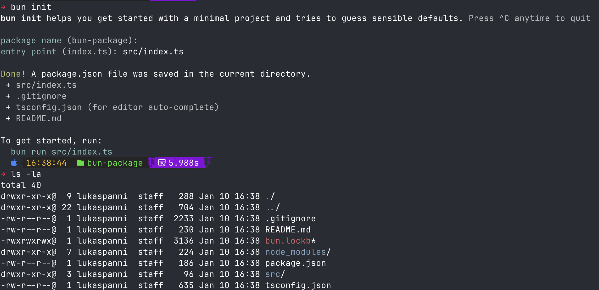

---
title: "Vorlesung Webengineering 1 - Alternative Runtimes, Bun"
topic: "Webengineering_1_2_5"
author: "Lukas Panni"
theme: "Berlin"
colortheme: "dove"
fonttheme: "structurebold"
fontsize: 12pt
urlcolor: olive
linkstyle: boldslanted
aspectratio: 169
lang: de-DE
section-titles: true
plantuml-format: svg
...

# Alternative Runtimes für JavaScript/TypeScript

## Deno Einführung (1)

[deno.land](https://deno.land)

- Runtime für JavaScript und TypeScript
- Basiert wie Node.js auf V8-Engine
- In der Regel performanter als Node.js
- Standardfunktionalität bereits eingebaut (z.B. HTTP-Server)
- Direkte Unterstützung von TypeScript
- Empfehlung: [VSCode-Plugin](https://marketplace.visualstudio.com/items?itemName=denoland.vscode-deno)
  - z.B. TypeScript-Unterstützung für Deno-Standardbibliothek
  - Erleichtert Arbeit mit Deno

## Deno Einführung (2)

- [Installation](https://docs.deno.com/runtime/#install-deno): `curl -fsSL https://deno.land/install.sh | sh` / `irm https://deno.land/install.ps1 | iex`
- Einfacher Webserver:

```typescript
Deno.serve((_req) => {
  return new Response("Hello, World!");
});
```

Ausführen: `deno run --allow-net server.ts`

## Deno Security

- Least-Privilege-Prinzip: standardmäßig keine Zugriffe auf Dateisystem, Netzwerk usw.
  - Benötigte Berechtigungen müssen explizit freigegeben werden
  - Dateisystemzugriff kann auch auf Pfade begrenzt werden
- Macht Ausnutzen von Schwachstellen für Angreifer schwieriger
- Nur als zusätzliche Maßnahme, kein Ersatz für die Entwicklung sicherer Software

## Deno Tools

- Deno bringt einige Standard-Tools mit:
  - Formatter: `deno fmt`
  - Linter: `deno lint`
  - Test-Runner: `deno test`, oft trotzdem bekannte Testframeworks sinnvoll
- Seit Deno v2 auch eigener Package Manager
  - Nicht unbedingt nötig, npm-Pakete können über `import ... from "npm:Package"` auch ohne explizite Installation eingebunden werden


## Bun (1)

[bun.sh](https://bun.sh/)

- Runtime + Bundler + Package Manager + Test-Runner für JavaScript und TypeScript
- Basiert auf `JavaScriptCore` Engine aus Apple WebKit
- idR. Performanter als Node.js und Deno
- Standardfunktionalität bereits eingebaut (z.B. HTTP-Server)
- Nutzung von NPM-Paketen mit eigenem NPM-Client

## Bun (2)

- [Installation](https://bun.sh/docs/installation):

  - MacOS/Linux: `curl -fsSL https://bun.sh/install | bash`
  - Windows: `powershell -c "irm bun.sh/install.ps1|iex"`

- Einfacher Webserver:

```typescript
const server = Bun.serve({
  port: 8000,
  fetch(request) {
    return new Response("Welcome to Bun!");
  },
});
```

## Bun Tools

- Auch Bun bringt einige Funktionen direkt mit:
  - Package Manager: `bun install/remove`
  - Test-Runner: `bun test`, oft trotzdem bekannte Testframeworks sinnvoll
  - Bundler: `bun build`, Unterstützt Browser und Server-Bundles
  

## Fazit Alternative Runtimes

- Alle Runtimes entwickeln sich ständig weiter
- Node-Ökosystem ist am größten: Pakete, Tools, Anleitungen, Stackoverflow-Beiträge, ...
- Bun etabliert sich aktuell immer mehr

\rightarrow{} Gerne alles ausprobieren und eigene Meinung bilden!

## Theoretische Fragen

- Nennen Sie zwei Runtimes für JavaScript/TypeScript auf dem Server.

# Bun als moderne TypeScript-Runtime

## Warum Bun?

- Für neue TypeScript-Projekte häufig sinnvoll
  - Keine Kompilation mit `tsc` notwendig
  - In Kombination mit `bun --watch` Funktionalität sehr angenehm für schnelle Iteration
  - Eigener Bundler und Test-Runner
- Performance-Gewinne können für größere Projekte relevant sein

## Bun TypeScript Projekt-Setup (1)

{height=70%}

## Bun TypeScript Projekt-Setup (2)

- Erstellt automatisch alle nötigen Dateien
  - `package.json` mit Metadaten
  - `tsconfig.json` für TypeScript-Konfiguration \rightarrow{} erlaubt spätere Kompilation und IDE-Unterstützung
- `src/index.ts` als Einstiegspunkt

## Elysia - express Alternative für Bun

- express lässt sich in Bun genauso nutzen wie in Node.js
- [Elysia](https://elysiajs.com/) nutzt Bun-APIs und Features um eine performantere Alternative zu express zu bieten
  - Einfache API
  - Bessere Typsicherheit und TypeScript-Unterstützung
  - Bessere Performance
  - Viele Funktionen out-of-the-box, weniger zusätzliche Pakete nötig
- Läuft auch unter Node.js, ist aber nicht unbedingt zu empfehlen

## Elysia Setup

- Neues Projekt auf Basis des offiziellen Templates: `bun create elysia app`
- Code Beispiel in [`elysia-sample`](https://github.com/TINF23B5-Webengineering/Lecture_Code/tree/2025/24_Alternative_Runtimes/elysia-sample)

## Sample Server Code

```typescript
import { Elysia } from "elysia";

const app = new Elysia()
  .get("/", () => "Hello Elysia") // Siehe Route Handler bei express
  .listen(3000);

console.log(`🦊 Elysia is running at ${app.server?.hostname}:${app.server?.port}`);
```

## express vs. Elysia

- Syntax ist allgemein sehr ähnlich zu express
  - Pfad-Parameter mit `:param`
  - HTTP-Methoden als Methoden des App-Objekts
- Verschiedene Verbesserungen
  - Pfad-Parameter sind Parameter der Route-Handler-Funktion
  - Einfacher Streaming-Support über generator Functions
- Typsicherheit allgemein besser
  - z.B. bei Pfad-Parametern

## Elysia Request Handler

Handler Funktionen werden mit einem context-Argument aufgerufen:

```typescript
{
  body: unknown;
  query: Record<string, string | undefined>; // Query-Parameter
  params: Record<string, string>; // Pfad-Parameter
  headers: Record<string, string | undefined>; // HTTP-Header
  request: object, // Request-Objekt
  store: Record<string, any>; // globaler Speicher für die gesamte Anwendung
  path: string;
  url: string;
};

```

## Zugriff auf Pfad-Parameter

- Einfach möglich über `context.params.paramName`
- Typsicherheit: Pfad-Parameter sind immer vorhanden und vom Typ `string`
- JavaScript-Feature [Destructuring](https://developer.mozilla.org/en-US/docs/Web/JavaScript/Reference/Operators/Destructuring_assignment) zur syntaktischen Vereinfachung

```typescript
app.get("/hello/:name", ({ params }) => {
  return `Hello ${params.name}`;
});
// Oder noch weiter vereinfacht:
app.get("/hello/:name", ({ params: { name } }) => {
  return `Hello ${name}`;
});
```

## Input-Validierung (1)

- Elysia unterstützt Input-Validierung mit [TypeBox](https://github.com/sinclairzx81/typebox)
  - allgemein ähnlich zu `zod`

```typescript
import { t } from "elysia";

app.get("/typesafe-id/:id", ({ params: { id } }) => id, {
  params: t.Object({
    id: t.Number(),
  }),
})
```

## Input-Validierung (2)

- Typen werden automatisch konvertiert
  - In diesem Beispiel: `id` von `string` zu `number`
  - IDE-Unterstützung für konvertierte Typen
- Bei fehlerhaften Parametern wird automatisch ein `422 Unprocessable Entity` zurückgegeben
  - Mit Fehler-Details, z.B. `"summary": "Property 'id' should be one of: 'numeric', 'number'",`
- Eigener Code kann von validen Parametern im richtigen Typ ausgehen


## Zugriff auf Query-Parameter

- Einfach möglich über `context.query.paramName`
- Query-Parameter sind vom Typ `string | undefined`, also nicht immer vorhanden

```typescript
app.get("/hello", ({ query: { name } }) => {
  return `Hello ${name}`;
});
```

## Input-Validierung für Query-Parameter

- Analog zu Pfad-Parametern
- Query-Parameter können so auch als verpflichtend definiert werden

```typescript
.get("/typesafe-query", ({ query: { referrer } }) => referrer, {
    query: t.Object({
      referrer: t.String(),
    }),
  })
```

## Einfaches Response-Streaming

- Response-Streaming bei express: `res.write()` (mehrfach), `res.end()`
- Bei Elysia: (asynchrone) Generator-Funktionen

```typescript
app.get("/stream", async function* () {
  yield "Hello ";
  await new Promise((resolve) => setTimeout(resolve, 1000)); // Pause für 1 Sekunde
  yield "World!";
})
```

Achtung: curl buffert standardmäßig, um Streaming zu testen: `curl -N http://localhost:3000/stream`


## Theoretische Fragen

- Nennen Sie drei Vorteile von Bun gegenüber Node.js.
