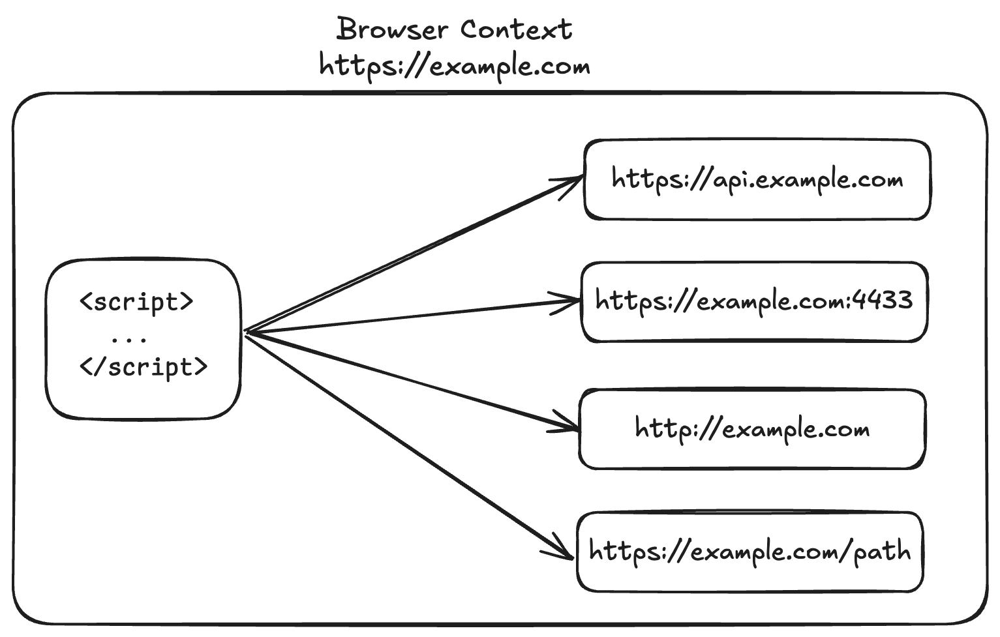
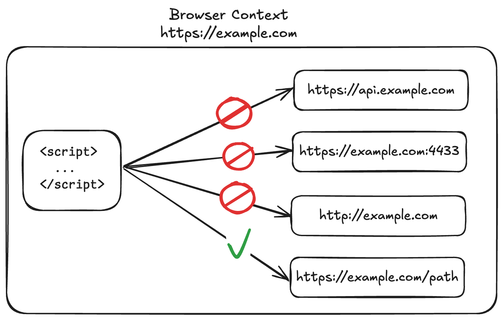
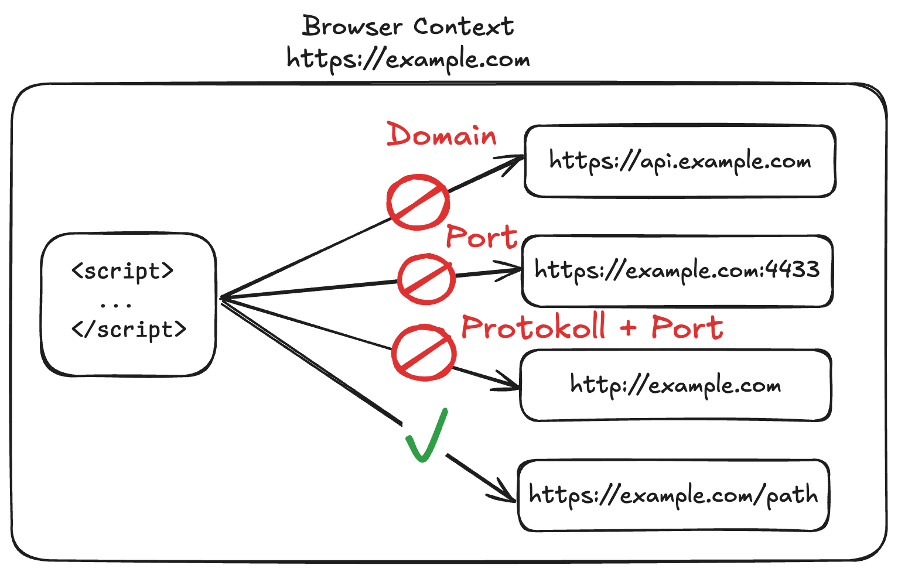

---
title: "Vorlesung Webengineering 1 - Backend Frameworks"
topic: "Webengineering_1_2_5"
author: "Lukas Panni"
theme: "metropolis"
fonttheme: "structurebold"
fontsize: 12pt
urlcolor: BrickRed
linkcolor: BrickRed
aspectratio: 169
lang: de-DE
section-titles: true
plantuml-format: svg
...


# Backend Frameworks

## Probleme bei selbst implementierten APIs

- Viel Boilerplate notwendig
- Schlechte Wiederverwendbarkeit
  - Viele Aufgaben wiederholen sich ständig: Parsen von Daten, Serialisierung, Fehlerbehandlung, ...
- Steigende Komplexität und schlechte Übersicht bei größeren Projekten

## Motivation für Backend-Frameworks

- Standardisierte Lösungen für wiederkehrende Aufgaben
- Schnellere Entwicklung
  - Fokus auf Anwendungslogik statt auf Infrastruktur
- Einfache Wartbarkeit
- Bessere Teamarbeit durch klare Konventionen

## Grundfunktionen (1)

- Routing: Zuordnung von eingehenden Requests zu einem Handler
  - Basierend auf HTTP-Methode & Pfad
- Middleware: Zentralfunktionen vor eigentlichen Request Handlern
  - Logging, Authentifizierung, Validierung, Error Handling
- Abstraktion von Request/Response Objekten
  - einfache APIs für Zugriff auf wichtige Daten und Formatierung von Antworten

## Grundfunktionen (2)

- Parsing und Serialisierung von Daten
  - Input + Output in verschiedenen Formaten (JSON, XML, Form-Data, ...)
- Error Handling
  - Einheitliche Status Codes und Fehlermeldungen
  - Trennung von technischen und fachlichen Fehlern
- Modularisierung und Strukturierung
  - Aufteilung in Module, z.B. für verschiedene Ressourcen oder Funktionalitäten

## Routing

**Route**: HTTP-Methode + Pfad  
**Handler**: Funktion, die ausgeführt wird, wenn Route aufgerufen wird
- Framework erleichtert Zuordnung von Route zu Handler, erzwingt aber noch nicht die Einhaltung von REST-Konventionen!
- Struktur der Routen sollte auf Ressourcen-zentriertem Design aufbauen

## Response Formate (1)

- Moderne APIs nutzen typischerweise JavaScript Object Notation (JSON) als Response-Format
  - Format sollte bekannt sein
  - Hauptgrund für Nutzung: sehr einfach in JavaScript/TypeScript zu nutzen
  - Für die meisten Anwendungsfälle gut geeignet
- **Wichtig**: HTTP korrekt nutzen
  - Content-Type Header setzen
  - Idealerweise: Content Negotiation unterstützen

## Response Formate (2)

- HTTP Content Negotiation (siehe 1. Semester) ermöglicht Client und Server das optimale Format auszuhandeln
  - Ermöglicht REST-Prinzip _Multiple Representations_
- Nur wenn ein Client im _Accept_ Header `application/json` angibt, soll eine API JSON zurückliefern
  - Server sollte sich nach Client richten wo möglich
  - z.B. Fehlerseite in HTML wenn Client kein JSON akzeptiert und API nur JSON ausgeben kann


## Beispiel Backend-Frameworks

- [express](https://github.com/expressjs/express) (68,9k Stars)
- [Fastify](https://github.com/fastify/fastify) (36k Stars)
- [Hono](https://github.com/honojs/hono) (30k Stars)
- [Elysia](https://github.com/elysiajs/elysia) (18k Stars)


## Theoretische Fragen

- Was ist ein Backend-Framework und wofür wird es verwendet?
- Nenne drei Grundfunktionen eines Backend-Frameworks
- Nenne zwei Backend-Frameworks für TypeScript/JavaScript


# express

- Open-Source-Webframework (MIT) für Node.js
  - Leichtgewichtig, flexibel, erweiterbar
  - Weit verbreitet (> 30.000.000 Downloads/Woche)
  - Besonders für APIs genutzt, kann aber auch als einfacher HTTP-Server verwendet werden

Ressourcen:

- [express Website](https://expressjs.com/)
- [express GitHub](https://github.com/expressjs/express)
- [express npm](https://www.npmjs.com/package/express)

## express Installation

**Installation**:
  - `npm install express`
  - `bun add express`
  - `pnpm install express`

**Import**:

- ~~CJS: `const express = require("express");`~~
- ESM: `import express from "express";`

## express Minimalbeispiel (1)

### package.json:

```json
{
  "type": "module",
  "dependencies": {
    "express": "*"
  }
}
```

## express Minimalbeispiel (2)

Siehe [express-basics](https://github.com/DHBW-Webengineering/Lecture_Code/tree/2026/24_Backend_Frameworks/express-basics)

### simple-express-server:

```javascript
import express from "express";

const app = express();
app.get("/", (request, response) => {
  response.send("Server funktioniert!");
});
app.listen(80, () => {
  console.log("Server gestartet");
});
```

## express Minimalbeispiel (3)

### Ausführen

```bash
$ npm install
$ node simple-express-server.js
> Server gestartet
```

### Aufruf

```bash
$ curl localhost
> Server funktioniert!
```

## express Minimalbeispiel (4)

{height=80%}

## express Request Handler (1)

Grundkonzept in express: **Request Handler** für bestimmte **Routen**

- Routen werden über **HTTP-Methoden** und **URL-Pfade** definiert
  - `app.METHOD(PATH, HANDLER)`, z.B. `app.get("/", ...)` oder `app.post("/users", ...)`
  - `METHOD`: HTTP-Methode (`GET`, `POST`, `PUT`, `DELETE`, ...)
  - `PATH`: relativer Pfad (`/`, `/users`, ...)
  - `HANDLER`: Funktion, die ausgeführt wird, wenn die Route aufgerufen wird

## express Request Handler (2)

- Parameter für Request Handler:

  - `request`: Anfrageobjekt (enthält z.B. URL-Pfad, HTTP-Methode und Request-Body)
  - `response`: Antwortobjekt (legt z.B. Status-Code, Header und Response-Body fest)
  - `next`: Führt den nächsten Request Handler aus

- \rightarrow{} Mehrere Request Handler pro Route sind möglich
  - Mit `next()` wird explizit an den nächsten Handler weitergegeben

## express Request Handler - Antwort erzeugen

- `response.write` schreibt Daten in den Antwort-Body (sendet direkt an Client!)
- `response.end` sendet die Antwort, danach kein `response.write` mehr möglich
- `response.send` = `response.write` + `response.end`
  - automatisches setzen von `Content-Type` und `Content-Length`-Header
  - automatisches Konvertieren von Objekten und Arrays zu JSON
  - \rightarrow{} `response.send` zu bevorzugen

## Mehrere Request Handler (1)

```javascript
app.get(
  "/",
  (request, response, next) => {
    response.write("Antwort von erstem Handler\n");
    next();
  },
  (request, response) => {
    setTimeout(() => {
      response.write("Antwort von zweitem Handler");
      response.end();
    }, 1000);
  }
);
```

## Mehrere Request Handler (2)

```javascript
app.get(
  "/",
  (request, response, next) => {
    response.locals.responseText = "Antwort von erstem Handler\n";
    next();
  },
  (request, response) => {
    setTimeout(() => {
      response.locals.responseText += "Antwort von zweitem Handler";
      response.send(response.locals.responseText);
    }, 1000);
  }
);
```

## Mehrere Request Handler (3)

- Antwort in `response.locals` speichern
  - Zugriff durch alle Request Handler
  - \rightarrow{} Schrittweiser Aufbau der Antwort
- `response.send` im letzten Request Handler, danach kann die Antwort nicht mehr verändert werden
  - Setzt Header automatisch und sendet Antwort an Client
- \rightarrow{} Besserer Ansatz, wenn Antwort schrittweise aufgebaut wird und kein Response streaming gewünscht ist.
  - Streaming (Antwort schrittweise senden) erfordert eventuell Anpassungen auf Client-Seite, kann aber vorteilhaft sein (z.B. wenn nicht alle Daten sofort verfügbar sind, bestes Beispiel: KI-Chat-Apps)

## express mit TypeScript

- TypeScript-Unterstützung durch Typ-Definitionen im Package `@types/express`
- Am einfachsten über Bun: `bun init ...; bun add express && bun add -D @types/express`
  - Für Node ist auch Setup von `tsc` notwendig und erfordert Kompilationsschritt
- Code bleibt gleich, alle weiteren Beispiele sind in TypeScript


## express Request Handler - Header (1)

```typescript
app.get("/", (request, response) => {
  response.set("Content-Type", "text/plain");
  response.set({
    "Content-Language": "de-DE",
    "X-Powered-By": "Test-Server",
  });
  response.send("Plaintext-Antwort");
});
```

## express Request Handler - Header (2)

- Header mit `response.set` setzen
  - Einzelne Header: `key, value` als Parameter
  - Mehrere Header: Objekt mit jeweils `key: value` als Parameter
  - Für häufige Header gibt es teilweise eigene Methoden, z.B. `response.type("text/html")`


## express Request Handler - Status-Code

```javascript
app.get("/test", (request, response) => {
  response.status(404).send("Nicht gefunden");
});
```

- Setzen mit `response.status`, bevor `response.send` / `response.end` aufgerufen wird
- Standard-Status-Code ist `200` (OK)
  - Bei Exception automatisch `500` (Internal Server Error) 


## express Request Handler - Request-Parameter

```typescript
app.get("users/:userid/items/{:itemid}?", (request, response) => {
  let responseText = `Empfangene User-ID: ${request.params.userid}`;
  responseText += `\nEmpfangene Item-ID: ${request.params.itemid ?? "NONE"}`;
  response.send(responseText);
});
```

- URL-Parameter werden über `:PARAMETERNAME` definiert
  - express parst die aufgerufene URL und extrahiert die Parameter
  - Zugriff im Handler über `request.params.PARAMETERNAME` als string
- Wenn Parameter optional sein sollen: `{:PARAMETERNAME}`
  - Ansonsten bei fehlendem Parameter: `404` (Not Found), da keine Route passt
  - Wenn nicht gesetzt: `undefined`
  - \rightarrow{} Hier bringt uns TypeScript einen Vorteil!
  

## express Request Handler - Query-Parameter

- Query-Parameter (z.B. `?key1=value1&key2=value2`) werden von express automatisch extrahiert
  - Zugriff über `request.query` Objekt
  - Zugriff auf einzelne Parameter: `request.query.PARAMETERNAME`
  - **Best-Practice**: Nicht von Vorhandensein der Parameter ausgehen
    - Vorhandensein mit `PARAMETERNAME in request.query` prüfen
    - Wert mit `request.query.PARAMETERNAME || DEFAULTWERT` auslesen
    - TypeScript zwingt uns sowieso dazu, mit den Fehlern umzugehen

## express Dateien ausliefern (1)

```javascript
app.get("/", (request, response) => {
  response.sendFile("./index.html", {root: ROOT_DIR});
});
```

- Relativer Pfad zu Datei, nur wenn `root`-Option gesetzt ist
  - Alle Pfade dann relativ zu `ROOT_DIR`
- Aktueller Ordner (ESM):
```javascript
import { fileURLToPath } from "url";
const folderPath = fileURLToPath(new URL(".", import.meta.url));
```


## Aufgabe 1

Überarbeitet euren HTTP-Server aus letzten [Vorlesungseinheit (Aufgabe 1)](./23_Node_Bun.md#aufgabe-1), sodass er express nutzt.
Die Funktionalität soll gleich bleiben.
Setzt den Server-Root auf einen Unterordner `public`, nur Dateien aus diesem Ordner sollen ausgeliefert werden können!
Ohne Dateiendung soll automatisch nach einem Unterordner mit dem angefragten Namen und einer Datei `index.html` gesucht werden.

**Zeit**: 20 min.

## Aufgabe 2

Implementiert die API aus der [vorletzten Vorlesungseinheit (Aufgabe 2)](./22_Backend_Grundlagen.md#aufgabe-2) mit express.
Nutzt ein lokales Array zur Speicherung von Objekten, Persistenz ist nicht notwendig.

**Zeit**: 20 min.

## Besprechung Aufgabe 2

- Tabelle mit Endpunkt, HTTP-Methode & Aktion sollte die Implementierung mit express erleichtern
  - Pfad + Methode sind schon bekannt
  - Aktion ist klar, muss nur noch in Code übersetzt werden
- \rightarrow{} Gute Planung erleichtert Implementierung enorm
  - Tabelle kann direkt express-Syntax für Pfad-Parameter nutzen, z.B. `users/:userid`, dann ist die Implementierung noch einfacher

## Theoretische Fragen 

- Was ist _express_ und wofür wird es verwendet?
- Was ist eine Route im Kontext eines _express_-Webservers? Welche Komponenten identifizieren eine Route?
- Gegeben folgende Route: `app.get("groups/:groupid/members/{:user}", (request, response) => ...)` und folgender HTTP Request `GET /groups/1/members?username=lukas`. Welche URL-Parameter und Query-Parameter sind verfügbar, welche Werte haben sie und wie kann im Request Handler darauf zugegriffen werden?
- Was muss beim Zugriff auf Query-Parameter generell beachtet werden?

## Beispiel Code-Aufgabe: express Code-Beispiel (1)

Gegeben folgender Code:
```javascript
import express from "express";

const app = express();
app.get("/health", (request, response) => {
  response.send('{ "healthy": true }');
});
app.listen(8080);
```
Der Code wird lokal auf Ihrem Rechner ausgeführt.
Welche Antwort erwarten Sie bei folgendem HTTP-Request: `GET localhost/health`?

## Beispiel Code-Aufgabe: express Code-Beispiel (2)

Gegeben folgender Code-Ausschnitt aus einem express-Server:
```javascript
app.get("users/:userid/", async (request, response) => {
  const user = await db.getUserById(request.params.userid)
  response.send(user);
});
```
Die Funktion `db.getUserById` erwartet eine User-ID (Zahl) und gibt ein User-Objekt zurück.
Nennen Sie zwei mögliche Verbesserungen für diesen Code-Ausschnitt.
Hinweis: Denken Sie auch an korrekte Verwendung von HTTP.

## express Middleware

## Middleware (1)

- express bringt nur wenig Funktionalität selbst mit
- Erweiterbar über sogenannte **Middleware**
  - Entspricht im Wesentlichen einem Request Handler: Parameter `request`, `response`, `next`
  - Wird **unabhängig** von HTTP-Methode **vor** Request Handlern ausgeführt
- Middleware kann z.B. für Logging, Authentifizierung, ... genutzt werden
  - Kann beliebigen Code ausführen
  - Kann Request und Response verändern (z.B. Header setzen oder Antwort senden)
- Wenn Middleware keine Antwort sendet, muss `next()` aufgerufen werden

## Middleware (2)

- Das express-Projekt spricht auch bei Request Handlern von Middleware
- Wir verwenden den Begriff **Middleware** für alle Funktionen, die keinen spezifischen Endpunkt (Methode + URL) behandeln
  - Stattdessen allgemeine Vorverarbeitung: z.B. Logging, Authentifizierung, ...
- Alles, was spezifische Endpunkte behandelt, bezeichnen wir als **Request Handler** oder **Route Handler**

Siehe dazu auch diese Antwort auf Stack Overflow: [a/58925330](https://stackoverflow.com/a/58925330)

## Middleware (3)

```typescript
app.use((request, response, next) => {
  console.log("Middleware aufgerufen");
  ...
  next();
});
```

- Registrieren auf Anwendungsebene mit `app.use(MIDDLEWARE)`
- Beschränken auf bestimmte Pfade mit `app.use(PATH, MIDDLEWARE)`


## static Middleware (1)

```typescript
import express from "express";
import { fileURLToPath } from "url";

const folderPath = fileURLToPath(new URL(".", import.meta.url));
const app = express();
app.use(express.static(folderPath));
app.listen(80, () => {
  console.log("Server gestartet");
});
```

## static Middleware (2)

- Erfüllt Aufgabe 1
- Built-In Middleware zur Auslieferung statischer Dateien
  - Kann auf bestimmten Request-Pfad beschränkt werden
- `express.static` liefert Dateien aus, wenn sie im angegebenen Ordner gefunden werden
  - Ansonsten wird der Request weitergegeben (nächste Middleware / Request Handler)


## Nützliche Middlewares (npm)

- [cookie-parser](https://www.npmjs.com/package/cookie-parser) (`npm install cookie-parser`)
  - Parst Cookies aus Request-Header, Ergebnis in `request.cookies`
- [body-parser](https://www.npmjs.com/package/body-parser) (`npm install body-parser`)
  - Parst Request-Body in verschiedenen Formaten und Codierungen
- [cors](https://www.npmjs.com/package/cors) (`npm install cors`)
  - Ermöglicht Cross-Origin Resource Sharing (CORS)
  - Konfiguration: [Express cors middleware](https://expressjs.com/en/resources/middleware/cors.html)

## Cross-Origin Resource Sharing (CORS)

- **Same-Origin-Policy**: JavaScript auf Website kann nur auf Ressourcen mit gleichem Origin zugreifen
  - Same Origin: gleiches **Protokoll**, gleicher **Port** und gleiche **Domain**
  - z.B. JavaScript-Code von `https://example.com` darf nicht auf Ressourcen von `https://example.org` zugreifen
- **CORS**: Möglichkeit, Same-Origin-Policy (beschränkt) aufzuweichen
  - Angefragter Server kann Zugriff erlauben
  - Steuerung über HTTP-Header `Access-Control-Allow-*`

## Same Origin Policy - Beispiel (1)

{height=80%}

## Same Origin Policy - Beispiel (2)

{height=80%}

## Same Origin Policy - Beispiel (3)

{height=80%}

## Same Origin Policy Anwendung

- Findet nicht für jeder Interaktion zwischen Origins Anwendung
  - Links, Redirects, Formulare sind nicht betroffen
  - Einbettung von Ressourcen (z.B. ``, `<link rel="stylesheet">`, `<video>`) ist i.d.R. nicht betroffen

Siehe auch [Same Origin Policy - MDN](https://developer.mozilla.org/en-US/docs/Web/Security/Defenses/Same-origin_policy#cross-origin_network_access)

## CORS Header (1)

- `Access-Control-Allow-Origin`: Von welchen (anderen) Origins aus, darf auf diese Ressource zugegriffen werden?
  - `ORIGIN` / `*`: Nur Zugriffe von `ORIGIN` / Alle Zugriffe erlaubt \rightarrow{} **vorsichtig einsetzen**
- `Access-Control-Allow-Methods`: Welche HTTP-Methoden sind für CORS erlaubt?
  - `METHOD` / `*`: Analog zu `Access-Control-Allow-Origin`

## CORS Header (2)

- `Access-Control-Allow-Credentials`: Dürfen Authentifizierungsdaten (z.B. Cookies) von anderen Origins mitgeschickt werden?
  - `true` / `false`
  - Auf Client Seite (`fetch`-API) muss zusätzlich `credentials: "include"` gesetzt werden
  - Gefahr von [CSRF](https://developer.mozilla.org/en-US/docs/Glossary/CSRF)-Angriffen \rightarrow{} **vorsichtig einsetzen**

## express CORS Middleware

```typescript
import cors from "cors";
...
// Access-Control-Allow-Origin: *
app.use(cors())

// Besser: explizite Konfiguration
app.use(cors({
  origin: "https://example.com",
  methods: ["GET", "POST"],
  credentials: true,
}))
```

## express mehrere Middlewares (1)

{height=80%}

## express mehrere Middlewares (2)

{height=80%}


## express Router

- express Router ermöglichen das Gruppieren von Routen
  - Router können in eigenen Dateien definiert werden 
  - Schachtelung von Routern möglich
  - Registrieren von Middleware auf Router-Ebene möglich 
- Erstellen eines Routers: `const router = express.Router();`
  - Registrieren von Middleware und Request Handlern: `router.use(PATH, MIDDLEWARE)`, `router.METHOD(PATH, HANDLER)`
- Registrieren von Router in App: `app.use(PATH, ROUTER)`

## express Router Beispiel

app-router.ts
```typescript
import { router as userRouter } from "./user-router.js";
app.use("/users", userRouter);
```

user-router.ts
```typescript
import express from "express";
export const router = express.Router();

router.get("/", (request, response) => {
   response.send([{ id: 1, name: "Lukas" }, ...]);
});
```

## express Router Vorteile

- Bessere Strukturierung & Trennung von Verantwortlichkeiten
- Skalierbarkeit
  - Neue Features lassen sich einfacher hinzufügen, ohne bestehende Logik zu verändern
- Middleware auf Gruppen anwenden
  - Gemeinsame Logik (z.B. Logging, Authentifizierung) nur einmal definieren
  - Nicht notwendige Middleware für andere Routen weglassen \rightarrow{} bestimmte Routen authentifizieren, andere nicht

## Best Practices für express Router

- Klare Trennung nach Domänen
  - z.B. `user-router`, `product-router`
  - Jeder Router sollte nur eine Verantwortlichkeit haben
- Fehlerbehandlung zentralisieren
  - Gemeinsame Error-Handler verwenden
- Einheitliche Pfadstruktur \rightarrow{} Konsistente API-Designs & REST-Konventionen einhalten
- Validierung auslagern
  - Request-Validierung in Middleware oder separate Module verschieben

## Aufgabe 3

Baut eure Lösung von [Aufgabe 2](#aufgabe-2) um, damit alle `/users` routen in einem _User Router_ in einer separaten Datei implementiert sind.

**Zeit**: 10 Minuten.


## Theoretische Fragen

- Was versteht man unter Middleware im Kontext von _express_?
  - Wann wird Middleware im Vergleich zu Request Handlern ausgeführt?
- Was sagt die _Same-Origin-Policy_ aus?
- Was versteht man unter _Same Origin_? (Was macht den Origin aus?)
- Für was steht das Akronym _CORS_? Und was versteht man darunter?
- Wie wird CORS gesteuert? (Welche HTTP-Header sind relevant?)
- Was sind _express Router_ und wofür werden sie verwendet?

# Input Validierung mit Zod


## Input und Typ-Validierung zur Laufzeit mit zod

- [zod](https://zod.dev/) ist eine Bibliothek zur Input-Validierung
- Validierung basiert auf erwartetem _Schema_
- Erlaubt Validierung von primitiven Typen und komplexen Objekten zur Laufzeit
- Erzeugt aus Schema TypeScript-Typen zur statischen Typisierung zur Entwicklungszeit
- Installation: `npm install zod` / `bun add zod` / `pnpm install zod`

## Warum Typ-Validierung zur Laufzeit?

- TypeScript bietet statische Typisierung **nur** zur Entwicklungszeit
- Code interagiert zur Laufzeit häufig mit externen Datenquellen (APIs, User-Input, Dateisystem, ...)
  - Daten externer Datenquellen sind immer als _untrusted input_ anzusehen!
  - Man kann sich nicht auf die Datentypen verlassen
- Typ-Validierung hilft, unerwartete Daten zu erkennen und entsprechend zu behandeln
  - \rightarrow{} Vermeidung von Laufzeitfehlern

## zod - Beispiel Strings

```typescript
import { z } from "zod";

// String mit Länge 1-20
const helloWorldSchema = z.string().min(1).max(20);
const string1 = helloWorldSchema.parse("Hello, World!"); // ok
const string2 = helloWorldSchema.parse("");
// Error: { code: 'too_small', message: ... }
const { success, data, error } = helloWorldSchema.safeParse("");
// ok, success = false
```

## zod - Primitive Typen

- [Primitive-Typen](https://zod.dev/?id=primitives)
  - `z.string()`
  - `z.number()`
  - `z.boolean()`
  - ...
- Zusätzlich mit Support für Typumwandlung (Coercion) zur Laufzeit
  - `z.coerce.number().parse("1")`
  - Keine vorherige Umwandlung von User-Input (strings) nötig

## zod - Einschränkungen für Primitive Typen (1)

- Einfache Einschränkungen für Wertebereiche möglich
- [Zahlen](https://zod.dev/?id=numbers)
  - Beispiel `z.number().gt(0).lte(100)` \rightarrow{} Zahl > 0 und <= 100
  - `gt`: greater than \rightarrow{} >
  - `gte`: greater than or equal \rightarrow{} >= alias `min`
  - `lt`: less than \rightarrow{} <
  - `lte`: less than or equal \rightarrow{} <= alias `max`
  - `int`: integer
  - `multipleOf`: Vielfaches von Zahl
  - `positive`, `negative`, `nonpositive`, `nonnegative` ...

## zod - Einschränkungen für Primitive Typen (2)

- [Strings](https://zod.dev/api?id=strings) sehr viele Möglichkeiten, z.B.:
  - `min`, `max`: Länge
   - `regex`: Validierung anhand von Regex
  - `includes`: String muss bestimmten Substring enthalten
  - `startsWith`, `endsWith`: String muss mit bestimmtem Substring beginnen/endigen
  - `trim`: Leerzeichen entfernen
  - `toLowerCase`, `toUpperCase`: Groß-/Kleinschreibung
- Spezielle Strings (direkt auf `z` Objekt seit zod v4)
  - `email`: E-Mail-Adresse
  - `url`: URL
  - `uuid`: UUID
  - `ipv4`: IP-Adressen
  - `iso.date`: ISO-Datum
 
## zod - Enums, optionale und undefinierte Werte

- Feste Wertemengen mit `z.enum()`
  - `z.enum(["red", "green", "blue"])`
- Bei schon vorhandenem Enum-Typ: `z.nativeEnum(MyEnum)`
- Optionale Werte mit `z.optional()` und `schema.optional()`
  - `z.optional(z.string())` \rightarrow{} = `z.string().optional()`

## zod - Komplexe Typen (1)

- Arrays mit `z.array()`
  - `min`, `max`: Minimale / Maximale Länge
  - `length`: Exakte Länge
  - `nonempty`: Nicht leer
- Tupel mit `z.tuple()`
  - `z.tuple([...])`
  - Feste Anzahl von Elementen
  - Typen der Elemente können unterschiedlich sein

## zod - Komplexe Typen (2)

- Definition von [Objekten](https://zod.dev/?id=objects) mit `z.object()`
  - `z.object({ key1: <zodSchema>, key2: ... })`

```typescript
const userSchema = z.object({
  id: z.number(),
  name: z.string(),
  email: z.string().email(),
});
```

- Ein zod-Schema kann in einen TypeScript-Typ fuer Parameter- und Rueckgabetypen umgewandelt werden
  - `type SchemaType = z.infer<typeof schema>`
- Durch Type-Inference oft nicht nötig

## zod - Komplexe Typen (3)

- Weitere komplexe Typen:
  - [Unions](https://zod.dev/?id=unions)
  - [Discriminated Unions](https://zod.dev/?id=discriminated-unions)
  - [Records](https://zod.dev/?id=records)
  - [Maps](https://zod.dev/?id=maps)

## zod - Komplexe Typen (4)

- Komplexe zod Schemata können verschachtelt werden
- Beispiel:

```typescript
const userSchema = z.object({
  ...
  emails: z.array(z.email()),
  address: z.object({
    street: z.string(),
    city: z.string(),
  }),

});
```

## zod - Sonstiges

- Viele weitere hilfreiche Funktionen:

  - `transform`: Transformation von Werten
  - `refine`: Benutzerdefinierte Validierungsfunktionen
  - ...

- Wenn Input-Validierung benoetigt wird, ist zod in der Regel einer eigenen Implementierung vorzuziehen

## zod - Fehlerbehandlung

- `.parse()` wirft bei Fehlern Exceptions vom Typ `ZodError`
- `.safeParse()` gibt ein Objekt zurück mit Feldern `success`, `data` und `error`
  - `success`: `true` bei Erfolg, `false` bei Fehlern
  - `data`: Geparste Daten bei Erfolg
  - `error`: `ZodError` bei Fehlern
- `ZodError`: `issues` Array mit allen Fehlern in der Form
- Siehe [zod Dokumentation zu Error Handling](https://zod.dev/ERROR_HANDLING)

## zod in express (1)

- Jede API Route, die Daten vom User annimmt **muss** diese Validieren
  - zod ist nur eine von vielen Optionen. Alternativen wie `typebox` oder `joi` sind auch nutzbar
- Validierung kann direkt im Request Handler oder in Middleware erfolgen
  - Middleware ermöglicht Wiederverwendbarkeit und saubere Trennung von Validierungs- und Anwendungslogik
  - z.B. eine Middleware-Funktion für alle Routen, die User-Input annehmen

## zod in express (2)

```typescript
const userSchema = z.object({
  name: z.string(),
  email: z.string().email(),
});

app.post("/users", (request, response) => {
  const { success, data, error } = userSchema.safeParse(request.body);
  if (!success) {
    return response.status(400).json({ error: error.issues });
  }
  // Weiterverarbeitung von validierten Daten in `data`
});
```

## Aufgabe 4

Erweitert den User Router Input-Validierung mit zod. Es sollen _alle_ Daten, die vom Client kommen validiert werden. Gebt bei fehlerhaften Daten den Statuscode _422 Unprocessable Entity_ mit Details zum Fehler und der erwarteten Eingabe zurück.

**Zeit**: 20 Minuten.

## Theoretische Fragen

- Welche Aufgabe(n) erfuellt die Bibliothek _zod_?
- Erstellen Sie ein einfaches _zod_-Schema für _Message_-Objekte. Jedes Objekt hat eine positive Ganzzahl als _id_ einen nichtleeren Text (_content_) optional einen Liste von Autor-Namen (_authors_) und ein Erstellungsdatum (_createdAt_), das als string übermittelt wird.
- Warum sollten trotz Verwendung von TypeScript die Datentypen zur Laufzeit validiert werden?
- Für welche Art von Daten ist Typ-Validierung zur Laufzeit besonders wichtig?
- Wie kann ein _zod_-Schema in einen TypeScript-Typen umgewandelt werden?

# express Alternativen

## Fastify (1)

- Web-Framework mit Fokus auf Geschwindigkeit
- Ähnliche Konzepte wie Express
  - Routing
  - Middleware (Hooks)
- Starke TypeScript-Unterstützung
- Eingebaute Features:
  - JSON-Schema-basierte Input-Validierung
  - Logging
  - ...

## Fastify (2)

```typescript
import Fastify from "fastify";
const app = Fastify({logger: true});

app.get("/users", async (request, reply) => {
  return [{ id: 1, name: "Lukas" }];
});
```

## Hono (1)

- Leichtgewichtiges Framework mit Fokus auf Performance und Web Standards
- Läuft auf verschiedenen Plattformen
  - Node.js, Deno, Bun, Cloudflare Workers
- Starke TypeScript-Unterstützung
- Integrierte Middlewares für häufige Aufgaben (z.B. CORS, Authentifizierung, Cookies, ...)

## Hono (2)

```typescript
import { Hono } from "hono";
import { cors } from "hono/cors";

const app = new Hono();
app.use("*", cors()); // CORS-Middleware für alle Routen
app.get("/users", (c) => {
  return c.json([{ id: 1, name: "Lukas" }]);
});
```

## Vergleich mit express

- Alternative Frameworks nutzen sehr ähnliche Syntax und vergleichbare Grundkonzepte
- Verbesserungen in Performance, Typsicherheit, integrierten Funktionen, ...
  - auf Kosten geringerer Popularität und kleinerem Ökosystem
- Wahl des Frameworks stark von individuellen Anforderungen und Präferenzen abhängig
  - z.B. Plattform, benötigte Funktionen, Erfahrung mit bestimmten Frameworks, ...

Alle hier vorgestellten Frameworks sind gut für die Praxis geeignet.


# Elysia - express Alternative für Bun

- express lässt sich in Bun genauso nutzen wie in Node.js
- [Elysia](https://elysiajs.com/) nutzt Bun-APIs und Features um eine performantere Alternative zu express zu bieten
  - Einfache API
  - Sehr gute TypeScript-Unterstützung
  - Bessere Performance
  - Viele Funktionen out-of-the-box, weniger zusätzliche Pakete nötig
- Läuft auch unter Node.js, diese Kombination ist aber nicht unbedingt zu empfehlen

## Elysia Setup

- Neues Projekt auf Basis des offiziellen Templates: `bun create elysia app`
- Code Beispiel in [`elysia-sample`](https://github.com/DHBW-Webengineering/Lecture_Code/tree/2026/Backend/24_Backend_Frameworks/elysia-sample)

## Sample Server Code

```typescript
import { Elysia } from "elysia";

const app = new Elysia()
  .get("/", () => "Hello Elysia") 
  .listen(3000);

console.log(`🦊 Elysia is running at ${app.server?.hostname}:${app.server?.port}`);
```

## express vs. Elysia

- Syntax ist allgemein sehr ähnlich zu express
  - Pfad-Parameter mit `:param`
  - HTTP-Methoden als Methoden des App-Objekts (erstellt hier mit `new Elysia()`)
- Verschiedene Verbesserungen
  - Pfad-Parameter sind Parameter der Route-Handler-Funktion
  - Einfacher Streaming-Support über generator-Functions
- Input Validation built in
- Typsicherheit allgemein besser
  - z.B. bei Pfad-Parametern

## Elysia Request Handler

Handler Funktionen werden mit einem context-Argument aufgerufen:

```typescript
{
  body: unknown;
  query: Record<string, string | undefined>; // Query-Parameter
  params: Record<string, string>; // Pfad-Parameter
  headers: Record<string, string | undefined>; // HTTP-Header
  request: object, // Request-Objekt
  store: Record<string, any>; // globaler Speicher für die gesamte Anwendung
  path: string;
  url: string;
};

```

## Zugriff auf Pfad-Parameter

- Einfach möglich über `context.params.paramName`
- Typsicherheit: Pfad-Parameter sind immer vorhanden und vom Typ `string`
- JavaScript-Feature [Destructuring](https://developer.mozilla.org/en-US/docs/Web/JavaScript/Reference/Operators/Destructuring_assignment) zur syntaktischen Vereinfachung

```typescript
app.get("/hello/:name", ({ params }) => {
  return `Hello ${params.name}`;
});
// Oder noch weiter vereinfacht:
app.get("/hello/:name", ({ params: { name } }) => {
  return `Hello ${name}`;
});
```

## Serialisierung

- Elysia serialisiert Return-Values automatisch
  - String, Primitive Typen (z.B. `number`, `boolean`), Objekte, Arrays, ...
  - Auch für Dateien

```typescript
new Elysia()
  .get("/string", () => "Hello World")
  .get("/object", () => ({ message: "Hello World" }))
  .get("/file", () => file('test.txt'))
```

## Input-Validierung (1)

- Elysia unterstützt Input-Validierung mit [TypeBox](https://github.com/sinclairzx81/typebox) und allen Bibliotheken, die die [StandardSchema](https://standardschema.dev) Spezifikation erfüllen (z.B. Zod)

```typescript
import { t } from "elysia";

app.get("/typesafe-id/:id", ({ params: { id } }) => id, {
  params: t.Object({
    id: t.Number(),
  }),
})
```

## Input Validierung (2)

```typescript
import { z } from "zod";

.get("/typesafe-id-zod/:id", ({ params: { id } }) => id, {
    params: z.object({
      id: z.number().int(),
    }),
  })
```

## Input-Validierung (3)

- Typen werden automatisch konvertiert
  - In diesem Beispiel: `id` von `string` zu `number`
  - IDE-Unterstützung für konvertierte Typen
- Bei fehlerhaften Parametern wird automatisch ein `422 Unprocessable Entity` zurückgegeben
  - Mit Fehler-Details, z.B. `"summary": "Property 'id' should be one of: 'numeric', 'number'",`
- Eigener Code kann von validen Parametern im richtigen Typ ausgehen


## Zugriff auf Query-Parameter

- Einfach möglich über `context.query.paramName`
- Query-Parameter sind vom Typ `string | undefined`, also nicht immer vorhanden

```typescript
app.get("/hello", ({ query: { name } }) => {
  return `Hello ${name}`;
});
```

## Input-Validierung für Query-Parameter

- Analog zu Pfad-Parametern
- Query-Parameter können so auch als verpflichtend definiert werden

```typescript
.get("/typesafe-query", ({ query: { referrer } }) => referrer, {
    query: t.Object({
      referrer: t.String(),
    }),
  })
```

## Einfaches Response-Streaming

- Response-Streaming bei express: `res.write()` (mehrfach), `res.end()`
- Bei Elysia: (asynchrone) Generator-Funktionen (JavaScript Feature)
  - Jedes `yield` sendet Daten direkt an Client, beendet aber den Handler noch nicht

```typescript
app.get("/stream", async function* () {
  yield "Hello ";
  await new Promise((resolve) => setTimeout(resolve, 1000)); // Pause für 1 Sekunde
  yield "World!";
})
```

## Integrierter Websocket-Support

- Mit `app.ws(PATH, HANDLER)` können Websocket-Endpunkte definiert werden
- `message` callback wird bei jeder eingehenden Nachricht aufgerufen

```typescript
app.ws("/realtime", {
    message(ws, message) {
      ws.send("got:" + message);
    },
  })
```

## OpenAPI Generierung

- Integrierte OpenAPI Middleware
- Dokumentation verfügbar unter `/openapi`

```typescript
import { openapi, fromTypes } from '@elysiajs/openapi'

app.use(
		openapi({
			references: fromTypes()
		})
	)
```

## Exkurs: Fullstack Type Safety

- Elysia bietet mit `Eden` einen Frontend-Client, der sich typsicher mit einem Elysia-Backend verbinden kann
  - Ermöglicht typsichere Remote Procedure Calls (RPC) über "Eden Treaty" oder eine typsichere REST über "Eden Fetch"
- Erfordert im Frontend Zugriff auf die Typdefinitionen des Backends
  - \rightarrow{} Ideal in Monorepos
- Vermeidet Typfehler bei der Kommunikation zwischen Frontend und Backend komplett
- Macht parsen von Return-Values im Frontend überflüssig!

## Eden Fetch Beispiel

```typescript
import { edenFetch } from "@elysiajs/eden";
import { type App } from "../elysia-sample/src/index";

const fetch = edenFetch<App>("http://localhost:3000");

const { data: id } = await fetch("/typesafe-id-zod/:id", {
  params: {
    id: 42,
  },
});
```
