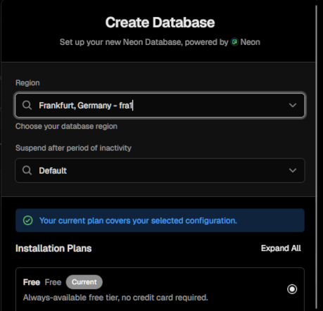
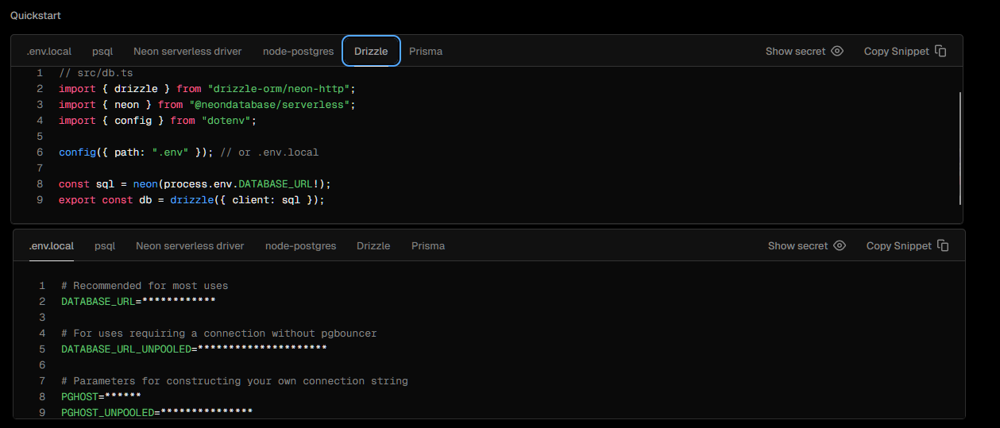

---
title: "Vorlesung Webengineering 1 - Datenbanken"
topic: "Webengineering_1_2_7"
author: "Lukas Panni"
theme: "Berlin"
colortheme: "dove"
fonttheme: "structurebold"
fontsize: 12pt
urlcolor: olive
linkstyle: boldslanted
aspectratio: 169
lang: de-DE
section-titles: true
plantuml-format: svg
...

# Crashkurs Relationale Datenbanken

## Was ist eine relationale Datenbank?

- Speicherung und Verwaltung von Daten organisiert in Tabellen
  - Tabellen bestehen aus Zeilen und Spalten
  - Zeile = **Datensatz**
  - Spalte = **Attribut**
- Attribute haben einen Datentyp (z.B. Text, Zahl, Datum)

## Beispiel: User-Tabelle

| ID  | Vorname | Nachname | GitHub-Username |
| --- | ------- | -------- | --------------- |
| 1   | Lukas   | Panni    | lukaspanni      |
| 2   | Silas   | Schnurr  | pa-ssch         |

- Attribute: `ID`, `Vorname`, `Nachname`, `GitHub-Username`
  - **Primärschlüssel**: `ID`, eindeutige Identifikation von Datensätzen
- Datensätze: `(1, Lukas, Panni, lukaspanni)`, `(2, Silas, Schnurr, pa-ssch)`

## Beispiel: Post-Tabelle

| ID  | Titel                                 | Autor | Inhalt |
| --- | ------------------------------------- | ----- | ------ |
| 1   | Vorlesung Webengineering I - Frontend | 2     | ...    |
| 2   | Vorlesung Webengineering I - Backend  | 1     | ...    |

## Beziehungen zwischen Tabellen - Fremdschlüssel

- Beziehungen zwischen Tabellen werden durch **Fremdschlüssel** definiert
- Fremdschlüssel verweist auf Primärschlüssel einer anderen Tabelle
  - Beispiel: `Autor` in Post-Tabelle verweist auf `ID` in User-Tabelle
  - Daten müssen nicht mehrfach gespeichert werden (Redundanz vermeiden)
  - Mehrfache Speicherung macht Updates fehleranfällig!

## Einfache lokale Datenbank: SQLite

- [SQLite](https://www.sqlite.org/index.html): Einfache relationale Datenbank ohne Server
- Daten werden in einer Datei gespeichert, erlaubt einfache Verwaltung von vielen einzelnen Datenbanken
- Erstellen neuer Datenbank: `sqlite3 mydatabase.db`
  - Noch einfacher mit GUI-Tools wie [DB Browser for SQLite](https://sqlitebrowser.org/)

## Praxisaufgabe 1

Installiert den SQLite-Browser und erstellt eine neue Datenbank mit den oben gezeigten Tabellen.
Falls ihr schon SQL Kenntnisse habt, könnt ihr die Datenbank auch über SQL-Befehle erstellen.
Erstellt zusätzlich eine Tabelle `comment`, die zu jedem Post Kommentare speichert.

## SQL (1)

- SQL (Structured Query Language) zur Verwaltung und Manipulation von Daten
- **Abfragen (SELECT)**:
  ```sql
  SELECT * FROM user;
  ```
- **Abfragen mit Filter (WHERE)**:
  ```sql
  SELECT * FROM user WHERE id = 1;
  ```
- **Einfügen (INSERT)**:
  ```sql
  INSERT INTO user (name, username) VALUES ('Lukas Panni',
  'lukaspanni');
  ```

## SQL (2)

- **Aktualisieren (UPDATE)**:
  ```sql
  UPDATE user SET username = 'lpanni' WHERE id = 1;
  ```
- **Löschen (DELETE)**:
  ```sql
  DELETE FROM user WHERE id = 1;
  ```

## SQL - Joins

- Häufig werden Daten aus mehreren Tabellen benötigt
- **Joins** verbinden Daten aus mehreren Tabellen
- Einfacher Join über WHERE Bedingung:
  ```sql
  SELECT user.name, post.title FROM user, post
  WHERE user.id = post.author;
  ```

## Praxisaufgabe 2

Schreibt einige SQL-Abfragen für die oben erstellte Datenbank:

- Ausgabe aller Posts mit Autorname und GitHub Benutzernamen.
- Ausgabe aller Kommentare zu einem Post.
- Ausgabe aller Kommentare zu Posts eines bestimmten Autors.

# Datenbanken in Webanwendungen

## Motivation

- Datenbanken erlauben eine effiziente und strukturierte Speicherung von Daten
- Trennung von Daten und Anwendungslogik ist grundsätzlich sinnvoll
- Wie bei Serverless-Deployment gesehen: Anwendung braucht einen Weg, Daten persistent zu speichern
  - Ermöglicht auch mehrere Instanzen der Anwendung

**Viele Backend-APIs sind nur ein dünner Wrapper um eine Datenbank**

- Mapping von HTTP-Requests auf SQL-Abfragen + ein bisschen Logik und Validierung
- Eure Projekt-Backends sind vermutlich auch simpel

## Anbindung von Datenbanken

- Datenbanken können auf verschiedenen Ebenen angesprochen werden

  - Direkt über SQL-Abfragen
  - Über ORM (Object-Relational Mapping) Bibliotheken

- Wenn möglich, sind ORM Bibliotheken zu bevorzugen
  - Abstraktion von Datenbank-Details \rightarrow{} DB leichter austauschbar
  - Weitgehender Schutz vor SQL-Injection
  - Definition von Datenmodellen im Code statt in SQL
  - Arbeit mit Objekten oft einfacher als SQL-Abfragen

## Drizzle ORM für TypeScript

- [Drizzle](https://orm.drizzle.team) ist ein leichtgewichtiges ORM für JavaScript und TypeScript
  - TypeScript ist definitiv zu bevorzugen, die Integration von Datenbanktypen in TypeScript funktioniert gut
- Unterstützt viele der gängigen Datenbanken (PostgreSQL, MySQL, SQLite, ...)
  - Auch gute Unterstützung für Serverless-Datenbankdienste wie [Neon](https://neon.tech), [Nile](https://www.thenile.dev/) oder [Supabase](https://supabase.io/)

## Drizzle Setup SQLite Node

- Siehe [Dokumentation](https://orm.drizzle.team/docs/get-started/sqlite-new)
- Installation benötigter Packages: `npm i drizzle-orm @libsql/client dotenv; npm i -D drizzle-kit tsx`
- Verbindungsdetails in `.env` speichern: `DB_FILE_NAME=file:mydatabase.db`
- Aufbauen einer Datenbankverbindung
  ```typescript
  import { drizzle } from "drizzle-orm/libsql";
  const db = drizzle(process.env.DB_FILE_NAME!);
  ```

## Drizzle Setup SQLite Bun

- Siehe [Dokumentation](https://orm.drizzle.team/docs/get-started/bun-sqlite-new)
- Bun hat eigenen performanten sqlite-Client, der in Drizzle verwendet werden kann
- Installation benötigter Packages: `bunn add drizzle-orm; bun add -D drizzle-kit @types/bun`
- Ansonsten analog zum Node-Setup, einziger Unterschied ist `import { drizzle } from 'drizzle-orm/bun-sqlite'`
- Für bun immer zu empfehlen

## Drizzle Setup andere Datenbanken

- Je nach Datenbank sind andere Client Libraries notwendig
- Außerdem sind häufig weitere Konfigurationen der Verbindungsdetails erforderlich
- [Get Started](https://orm.drizzle.team/docs/get-started) Dokumentation gibt eine gute Übersicht

## Drizzle - Schema definieren

- Definition von Tabellen in Drizzle erfolgt über TypeScript-Code
- Für jede Datenbank (bei SQLite `drizzle-orm/sqlite-core`) gibt es eigene Methoden zur Definition von Tabellen und Datentypen der Attribute
  - Datentypen unterscheiden sich je nach verwendeter Datenbank

```typescript
import { int, text, sqliteTable } from "drizzle-orm/sqlite-core";

export const user = sqliteTable("user", {
  id: int().primaryKey({ autoIncrement: true }),
  name: text(),
  github_username: text().unique(),
});
```

## Drizzle - Konfigurationsdatei drizzle.config.ts (1)

```typescript
import "dotenv/config";
import { defineConfig } from "drizzle-kit";

export default defineConfig({
  out: "./drizzle",
  schema: "./src/db/schema.ts",
  dialect: "sqlite",
  dbCredentials: {
    url: process.env.DB_FILE_NAME!,
  },
});
```

## Drizzle - Konfigurationsdatei drizzle.config.ts (2)

- Ort des Datenbank-Schemas (Tabellenstruktur)
- Angabe des Datenbanktyps (hier SQLite) und Verbindungsdetails
- Konfiguration wird für Drizzle Kit benötigt
  - Tool für Datenbankmigrationen und direkter Interaktion mit der Datenbank
  - `npx drizzle-kit push` wendet das aktuelle Schema auf die Datenbank an, _ACHTUNG bei Produktivdatenbanken!_
  - Weitere features für Datenbankmigrationen, siehe [Dokumentation](https://orm.drizzle.team/docs/migrations)

## Drizzle Schema - Beziehungen

- Drizzle unterscheidet zwischen One-to-One, One-to-Many und Many-to-Many Beziehungen
- Alle Beziehungsarten können über die `relations` Methode definiert werden
  - `relations` sind keine klassischen Fremdschlüsselbeziehungen, sondern ORM-Beziehungen!
  - Höhere Abstraktionsebene, erlauben einfachere Abfragen
- Reine Fremdschlüsselbeziehungen werden über die `.references` Methode auf den Attributen definiert
  - Konsistenz auf Datenbankebene
- Beides kann auch kombiniert werden

## Drizzle Schema - One-to-One

```typescript
export const githubAccount = sqliteTable("github_account", {
  username: text().primaryKey(),
});

export const userRelations2 = relations(user, ({ one }) => ({
  githubAccount: one(githubAccount, { fields: [user.github_username], references: [githubAccount.username] }),
}));
```

## Drizzle Schema - One-to-One mit Fremdschlüssel

```typescript
export const user = sqliteTable("user", {
  id: int().primaryKey({ autoIncrement: true }),
  name: text(),
  github_username: text().references(() => githubAccount.username),
});
```

## Drizzle Schema - One-to-Many

```typescript
import { relations } from "drizzle-orm";
export const userRelations = relations(user, ({ many }) => ({
  posts: many(post),
}));

export const postRelations = relations(post, ({ one }) => ({
  author: one(user, { fields: [post.author], references: [user.id] }),
}));
```

## Drizzle Schema - Many-to-Many (1)

- Many-to-Many Beziehungen erfordern eine Zwischentabelle
  - Mapping von IDs der beiden Tabellen
- Beispiel User und Gruppen, Zwischentabelle `user_group` mit `user_id` und `group_id`

## Drizzle Schema - Many-to-Many (2)

```typescript
export const userGroup = sqliteTable("user_group", {
  user_id: int().references(() => user.id),
  group_id: int().references(() => group.id),
});

export const userRelations = relations(user, ({ many }) => ({
  userGroups: many(userGroup),
}));


```

## Drizzle Schema - Many-to-Many (3)

```typescript
export const groupRelations = relations(group, ({ many }) => ({
  userGroups: many(userGroup),
}));

export const userGroupRelations = relations(userGroup, ({ one }) => ({
  group: one(group, { fields: 
  [userGroup.group_id], references: [group.id] }),
  user: one(user, { fields: 
  [userGroup.user_id], references: [user.id] }),
}));
```

## Drizzle Schema - Beziehungen Fazit

- `relations` werden benötigt, um einfachere Abfragen zu ermöglichen
  - Drizzle erlaubt Zugriff auf referenzierte Objekte ohne manuelle JOINs
- `references` sind optional, aber empfohlen für Konsistenz auf Datenbankebene
  - Sichergestellt, dass Änderungen auch korrekt in referenzierten Tabellen durchgeführt werden


## Drizzle - Abfragen

- Drizzle hat 2 Wege Abfragen zu erstellen
  - `query` Query-Builder für relationale Abfragen, gut für mehrfach verschachtelte Abfragen
    - Gut für komplexe Objektstrukturen
    - Stark von SQL abstrahiert
  - SQL-nahe Syntax mit `.select()`, `.insert()`, `.update()`, `.delete()` etc.

## Drizzle - Query-Builder 

- Beim Erstellen des DB-Objekts kann das Schema übergeben werden, um die `.query` Methode verwenden zu können
  ```typescript
  import * as schema from "./db/schema";
  const db = drizzle(process.env.DB_FILE_NAME!, { schema });
  ```
- Typsicherheit bei der Abfrage, dadurch gute IDE Unterstützung auch bei verschachtelten Anfragen
- Siehe [Dokumentation](https://orm.drizzle.team/docs/rqb) für weitere Details
- Verwendung von Beziehungen über `with` erfordert `relations` im Schema

## Drizzle - Query-Builder Beispiel (1)

```typescript
const results = await db.query.user.findFirst({
// angeben, welche referenzierten Objekte geladen werden sollen
    with: { 
      githubAccount: true,
      posts: true,
// auch verschachtelt möglich
      userGroups: {
        with: {
          group: true,
        },
      },
    },
  });
```

## Drizzle - Query-Builder Beispiel (2)

```typescript
db.query.user.findMany({
// nur den Namen des Autors laden
    columns: { name: true },
    with: {
// die Posts referenzieren
      posts: {
// nur Posts, bei denen die Bedingung zutrifft
        where: (posts, { like }) => like(posts.title, "Hello*"),
      },
    },
  });
```

## Drizzle - SQL-nahe Syntax

- Relativ selbsterklärende Syntax auf Basis bekannter Keywords
  - `SELECT * FROM user WHERE user.id = 1`
  - \rightarrow{} `db.select().from(user).where(eq(user.id, 1))`
  - Nur die Filter über `.where` sind etwas anders: Methoden `eq`, `gt`, `lt`, `like` etc., müssen von Drizzle importiert werden


## Praxisaufgabe 3

Erstellt ein Drizzle Schema für die Datenbank aus Praxisaufgabe 1 mit allen Beziehungen. Übertragt dann die SQL-Abfragen aus Praxisaufgabe 2 in Drizzle-Abfragen entweder über den Query-Builder oder die SQL-nahe Syntax.

Tipp: `drizzle-kit` bringt eine [Web-UI](https://orm.drizzle.team/drizzle-studio/overview) mit, die es deutlich erleichtert die Datenbank zu verwalten und Abfragen (SQL und Drizzle-Syntax) zu testen. Dazu einfach `npx drizzle-kit studio` ausführen.


# Exkurs: Vercel mit Neon Serverless PostgreSQL

## Motivation

- Für Serverless-Deployment auf Vercel oder Netlify ist Standard-SQLite leider nicht wirklich geeignet
- Es gibt einige Dienste, die Datenbanken wie PostgreSQL auch serverless anbieten
  - keine Verwaltung von Datenbank-Server nötig
  - oft kostenlose Tarife für kleine Projekte
  - Datenbankverbindung i.d.R. über HTTP
- Bei Vercel sind Dienste wie [Neon](https://neon.tech) oder [Supabase](https://supabase.io) gut integriert

## Neon Setup in Vercel (1)

- Projekt > Storage > Create Database

{height=70%}

## Neon Setup in Vercel (2)

{height=70%}

## Neon Setup in Vercel (3)

- Drizzle-Code kopieren und in Projekt einfügen
- Umgebungsvariablen in lokale `.env` Datei einfügen
- Installation von `@neondatabase/serverless` 
- Fertig!
