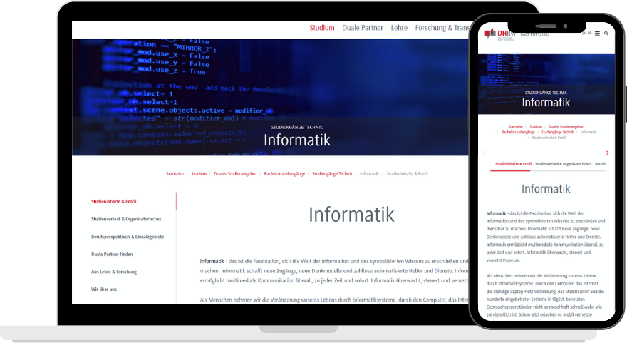

---
title: "Vorlesung Webengineering I - Einführung"
topic: "Webengineering_1_1"
date: 2024-01-08
author: "Lukas Panni"
theme: "Berlin"
colortheme: "dove"
fonttheme: "structurebold"
fontsize: 12pt
urlcolor: olive
linkstyle: boldslanted
aspectratio: 169
lang: de-DE
section-titles: true
toc: true
numbersections: true
...


# Organisatorisches

## Heute

- Organisatorisches
  - Vorstellung
  - Ablauf
  - Prüfungsleistung
- Vorlesungsinhalt & Lernziele
- Einführung Webengineering


## Vorstellung

### Dozent: Lukas Panni 
- 2021: _B.Sc._ Informatik - DHBW Karlsruhe
- 2023: _M.Sc._ Informatik - HKA
- Seit 2018 bei SEW-EURODRIVE in Bruchsal
    - aktuell Softwareentwickler mit Fokus auf Open Source Compliance & Security


### Ihr
- Firma
- Programmiersprachen?
- Vorkenntnisse Webengineering?
    - Vorkenntnisse Tools: git, docker, VSCode?
- Erwartungen & Wünsche


## Ablauf

- Vorlesung: 44 Vorlesungseinheiten (VE)
  - Dieses Semester: 8 Termine, je 3 VE = 24 VE
    - Montag 8:30 - 11:00 Uhr (3 VE + 15 Minuten Pause)
  - Rest (20 VE) im nächsten Semester

- Vorlesung mit Programmieraufgaben
  - Keine Vorkenntnisse erforderlich
  - Tools: Texteditor, Browser, Terminal, Git, (evtl. Container-Tools, i.e. Docker)
    - Empfehlung: [VSCode](https://code.visualstudio.com/) / [WebStorm](https://www.jetbrains.com/de-de/webstorm/) (kostenlos für Studenten), Firefox, Docker-Desktop
  - kleine Hausaufgaben

## Material

- Vorlesungsfolien \rightarrow{} Slides 
- Vorlesungsnotizen (gemeinsam Erarbeitetes) \rightarrow{}  Notes
- Sonstiges (Anleitungen, Zusatzmaterial) \rightarrow{} Extra


\rightarrow{}  alles auf GitHub [(lukaspanni/Lecture_Webengineering_2024)](https://github.com/lukaspanni/Lecture_Webengineering_2024)

\rightarrow{}  separate Repos für Code 


## Prüfungsleistung

### Projektarbeit:

- Entwicklung einer (kleinen) Webanwendung mit hier gelernten Technologien
- Gruppenarbeit möglich (<=4 Studierende)
- Bewertung mit Vorlesung Projektmanagement (Hr. Merkel)
  - Note Webengineering: 
    - Konzept & Umsetzung der Webanwendungen
    - Einhaltung vorgestellter Best-Practices
    - Regelmäßige Vorstellung aktueller Zwischenstände
  - Note Projektmanagement: Projektmanagement, mehr dazu von Hr. Merkel


# Vorlesungsinhalt & Lernziele

## Ziele der Vorlesung
- Was ist eine "Webanwendung" und wie funktioniert sie?
- Grundlegende Architektur von Webanwendungen
- Erstellen einfacher Webanwendungen
- Grundlagen Webdesign & Mobile Webdesign


## Vorlesungsinhalt / Agenda (vorläufig)

- Grundlagen "Web" & Webanwendungen \rightarrow{} _ab heute_
  - HTTP & REST
- Einfache Webanwendungen
  - HTML
  - CSS
- Einführung Webdesign
- Dynamische Webanwendungen
  - JavaScript + Intro TypeScript
  - Interaktion Client/Server
- Fortgeschrittene Themen
  - Architektur moderner Webanwendungen
  - Security: Angriffe, Best-Practices


# Einführung: Webanwendungen, HTTP

## Webanwendungen (1)

{width=70%}


## Webanwendungen (2)

> Eine **Webanwendung** (auch Online-Anwendung, Webapplikation oder kurz Web-App) ist ein Anwendungsprogramm nach dem **Client-Server-Modell**. Anders als klassische Desktopanwendungen werden Webanwendungen **nicht lokal** auf dem Rechner des Benutzers installiert. Die Datenverarbeitung findet **teilweise auf einem entfernten Webserver** statt. Die Ergebnisse der Datenverarbeitung werden an den lokalen Client-Rechner des Benutzers übertragen (Thin Client). Genutzt wird eine Webanwendung dabei zumeist über einen **Webbrowser**. Diese kommuniziert mit dem Webserver meist über das **HTTP**.
>
> -- [Wikipedia](https://de.wikipedia.org/wiki/Webanwendung)

\rightarrow{} zu komplex!  

## Webanwendungen (3)

> Eine **Webanwendung** ist ein Programm, das über einen **Webbrowser** aufgerufen wird und meist teilweise auf einem **Server** ausgeführt wird.


## Hypertext Transfer Protocol (HTTP) - Grundlage des Web 

- Übertragung von Daten zwischen Webbrowser und Webserver 
- Textbasiertes Protokoll
- **Zustandsloses** Protokoll, Request-Response Prinzip
  - Protokoll speichert keine Informationen!
  - Jedes Request-Response-Paar ist unabhängig voneinander
  - Erhöht Skalierbarkeit \rightarrow{} dazu später mehr
  - Zustandsinformationen (z.B. Logindaten) müssen auf andere Art und Weise gespeichert werden

## HTTP Request - Response 

**Request**:

```
GET / HTTP/1.1
Host: lukaspanni.de
Accept: */*

```
**Response**:

```
HTTP/1.1 200 OK
Content-Type: text/html
Date: Fri, 17 Nov 2023 12:26:59 GMT

<!DOCTYPE html>
...

```

## HTTP-Request - Aufbau

- Request besteht aus einzelnen Textzeilen, jeweils mit `<CR><LF>` (Zeilenumbruch) getrennt
  - Request endet nach Leerzeile (= `<CR><LF><CR><LF>`)

- Erste Zeile: `<Methode> <Resource> <Protokoll><CR><LF>`
  - Methode: `GET`
  - Resource: `/` (Hauptseite)
  - Protokoll: `HTTP/1.1` (aktuellste Version 3, heute meist Version 2 eingesetzt)


## Verbreitung der HTTP-Versionen
{height=95%}


## HTTP Header

- Jede weitere Zeile im Request: `<Key>: <Value>`
  - `Host: lukaspanni.de` \rightarrow{} Pflicht-Header ab HTTP/1.1 
  - `Accept: */*` \rightarrow{} Format der Antwort egal

- Viele weitere Standard Request-Header:
  - User-Agent
  - Accept-Encoding
  - Accept-Language
  - Cookie
  - ...


## Exkurs HTTP Content Negotiation

- Feature das eine *automatische* Einigung auf ein Ausgabeformt ermöglicht
- Client sendet gewünschtes Format im `Accept`-Header
  - Angabe mehrerer Formate: z.B. `Accept: text/html,text/plain`
  - Server gibt die Antwort im ersten untertützten Format zurück
- Format der Antwort über `ContentType`-Header angegeben

```{.plantuml height=35%}
Client->Server : Accept: application/json, text/xml
Server->Client : ContentType: application/json
```
